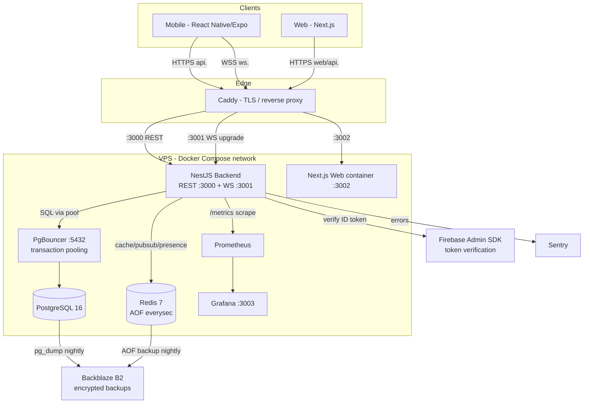
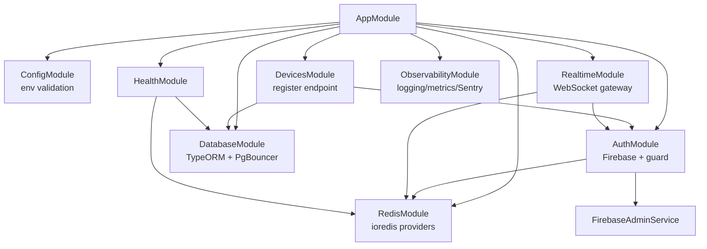
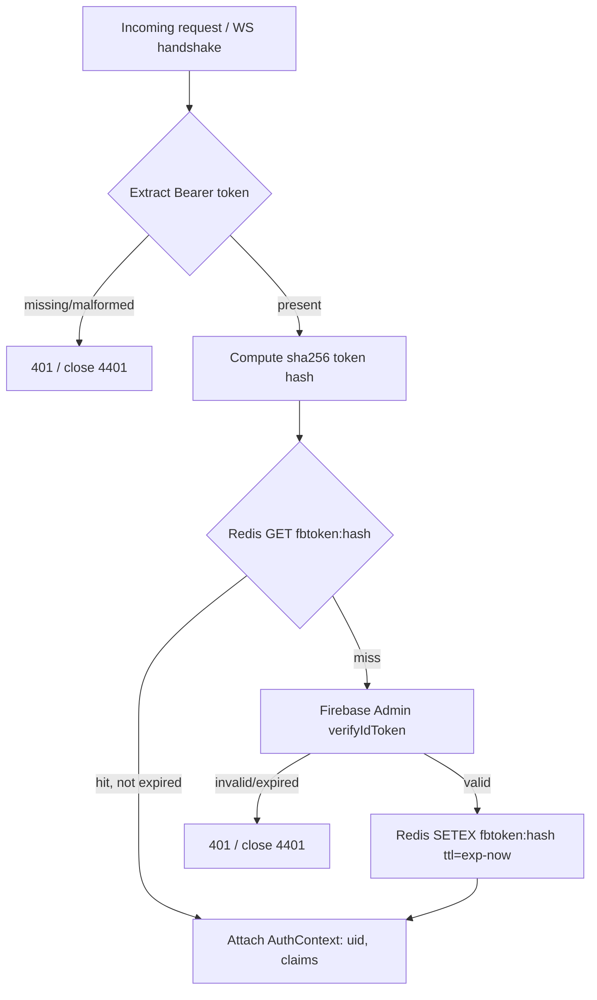
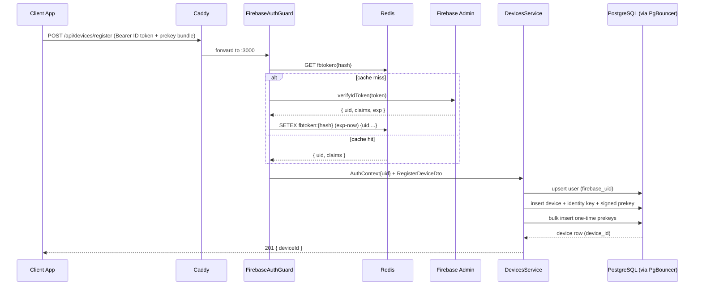
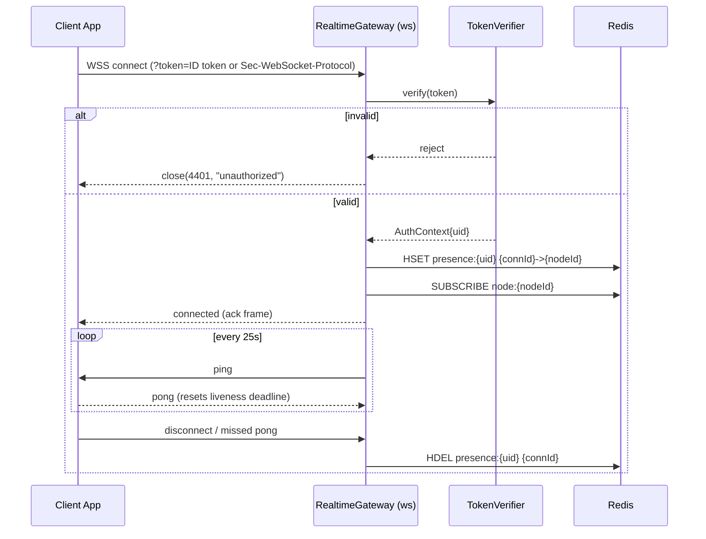

# Design Document: Phase 0 — Infrastructure, CI/CD & Auth Foundation

## Overview

Phase 0 establishes the production-grade foundation for the privacy chat application. It delivers the
monorepo skeleton, the NestJS backend boundary (Firebase token verification, device registration, health),
a WebSocket gateway that authenticates and tracks connections (but does not yet route messages), the
durable PostgreSQL schema for users/devices/prekeys with the critical indexes, the Redis speed layer wiring,
and the full self-hosted infrastructure: Docker Compose, Caddy, GitHub Actions pipelines, Firebase Auth
backend integration, and observability (Prometheus, Grafana, Sentry, structured JSON logging).

The guiding principle for this phase is "production quality from day one, but only the foundation." Every
component is built to its final architectural shape, but the messaging payload, the seven signature
features, group messaging, media pipeline, and client UI screens are explicitly deferred. The WebSocket
gateway maintains a connection registry and a Redis pub/sub backbone so Phase 1 can plug full E2E message
routing in without re-architecting. Likewise, the device-registration endpoint stores public libsignal
prekey bundles so Phase 1's E2E key exchange has the server-side prekey store ready.

This design honors the confirmed stack exactly (Section 13): NestJS, PostgreSQL + PgBouncer, Redis 7,
the `ws` library (not Socket.IO), Firebase Authentication, libsignal prekey storage, Backblaze B2 for
backups, Caddy for TLS/reverse-proxy, Docker Compose on a single VPS, GitHub Actions for all builds/deploys,
and TypeScript end-to-end. All code in this document is TypeScript, matching the chosen stack.

### Security posture at a glance

- **Every state-changing or connection-establishing entry point requires a valid Firebase ID token.** The
  device-registration REST endpoint (`POST /api/devices/register`) and the WebSocket handshake both verify
  the Firebase JWT before doing any work. Only `/health` and the Prometheus `/metrics` scrape endpoint are
  unauthenticated (and `/metrics` is network-restricted to the monitoring stack).
- **The server stores public key material only** — public identity keys, signed prekeys, and one-time
  prekeys. Private keys never leave the device. This is a hard requirement carried from Section 13.3.
- **Token verification is cached in Redis** for the token's lifetime to eliminate a Firebase Admin API call
  on every request/message, but the cache key is bound to a hash of the token so a forged or expired token
  can never hit a cached "valid" result.
- **All secrets come from GitHub Secrets** (Section 14.3) and are injected as environment variables at
  deploy time. Zero plaintext secrets in code or committed config.

## Architecture

### System topology (single VPS, Docker Compose)



### Backend module structure (NestJS)



### Request authentication flow (cross-cutting)

Both the REST guard and the WebSocket handshake share one verification path so the cache and security
semantics are identical:



## Sequence Diagrams

### Device registration (`POST /api/devices/register`)



### WebSocket connection lifecycle (Phase 0 — registry only)



> Note: In Phase 0 the gateway only authenticates, registers the connection in Redis, runs the heartbeat,
> and subscribes to its node's pub/sub channel. It does not relay chat messages — that is Phase 1. The
> Redis pub/sub backbone and connection registry exist now so Phase 1 routing is a drop-in addition.

## Components and Interfaces

### Component 1: FirebaseAdminService

**Purpose**: Wraps the Firebase Admin SDK. Single place that initializes the app from injected credentials
and verifies ID tokens. Keeps Firebase usage testable and mockable.

**Interface**:
```typescript
interface FirebaseAdminService {
  /** Verifies a Firebase ID token. Throws UnauthorizedError if invalid/expired/revoked. */
  verifyIdToken(idToken: string): Promise<DecodedFirebaseToken>;
}

interface DecodedFirebaseToken {
  uid: string;            // canonical user id across all backend services (§15.2)
  email?: string;
  phoneNumber?: string;
  exp: number;            // unix seconds — drives Redis cache TTL
  authTime: number;
}
```

**Responsibilities**:
- Initialize the Admin SDK exactly once from `FIREBASE_PROJECT_ID`, `FIREBASE_CLIENT_EMAIL`,
  `FIREBASE_PRIVATE_KEY` (Section 14.3 Category B).
- Verify tokens with revocation checking enabled.
- Translate Firebase errors into a domain `UnauthorizedError`, never leaking SDK internals to clients.

### Component 2: TokenVerificationService (Redis-cached)

**Purpose**: The shared verification path used by both the REST guard and the WebSocket gateway. Adds the
Redis cache layer on top of `FirebaseAdminService` to satisfy the Section 12.3 "JWT token cache" hot path.

**Interface**:
```typescript
interface TokenVerificationService {
  /** Returns AuthContext from cache when possible, else verifies via Firebase and caches the result. */
  verify(idToken: string): Promise<AuthContext>;
}

interface AuthContext {
  uid: string;
  email?: string;
  phoneNumber?: string;
  tokenExp: number;
}
```

**Responsibilities**:
- Compute a SHA-256 hash of the raw token to use as the cache key (never store the raw token).
- On cache hit, return the cached `AuthContext` without calling Firebase.
- On cache miss, verify via `FirebaseAdminService`, then `SETEX` with TTL = `exp - now` (clamped to a small
  positive minimum), so a cached entry can never outlive the token.
- Treat any verification failure as `UnauthorizedError`.

### Component 3: FirebaseAuthGuard

**Purpose**: NestJS guard applied to protected REST routes (the device registration endpoint, and every
future authenticated endpoint).

**Interface**:
```typescript
interface FirebaseAuthGuard {
  canActivate(context: ExecutionContext): Promise<boolean>;
}
```

**Responsibilities**:
- Extract the Bearer token from the `Authorization` header.
- Delegate to `TokenVerificationService.verify`.
- Attach `AuthContext` to the request object for controllers to consume.
- Reject with `401 Unauthorized` on any missing/invalid token.

### Component 4: DevicesController + DevicesService

**Purpose**: Implements `POST /api/devices/register` (Section 15.3). Creates the user record if new and
stores the device's public libsignal prekey bundle.

**Interface**:
```typescript
interface DevicesController {
  // Guarded by FirebaseAuthGuard
  register(auth: AuthContext, dto: RegisterDeviceDto): Promise<RegisterDeviceResponse>;
}

interface DevicesService {
  registerDevice(uid: string, dto: RegisterDeviceDto): Promise<RegisterDeviceResponse>;
}

interface RegisterDeviceResponse {
  deviceId: string;        // server-issued, used for WebSocket identification (§15.3 step 5)
}
```

**Responsibilities**:
- Upsert the `users` row keyed by Firebase UID (idempotent for returning users).
- Persist the device, its public identity key, the signed prekey (with signature), and the batch of
  one-time prekeys in a single transaction.
- Return the server-issued `device_id`.

### Component 5: RealtimeGateway (WebSocket)

**Purpose**: The `ws`-based gateway (`@nestjs/websockets` + `ws` adapter, Section 12.1). Authenticates the
handshake, registers the connection, runs the heartbeat, and wires the Redis pub/sub backbone.

**Interface**:
```typescript
interface RealtimeGateway {
  handleConnection(socket: WsClient, request: IncomingMessage): Promise<void>;
  handleDisconnect(socket: WsClient): Promise<void>;
  // Phase 0: heartbeat only. Phase 1 will add message handlers.
}

interface ConnectionRegistry {
  add(uid: string, connId: string, nodeId: string): Promise<void>;
  remove(uid: string, connId: string): Promise<void>;
  nodeFor(uid: string): Promise<NodeLocation[]>;   // used by Phase 1 routing
}
```

**Responsibilities**:
- Verify the Firebase token from the handshake (query param or `Sec-WebSocket-Protocol`) via
  `TokenVerificationService`. Close with code `4401` if invalid.
- Register `{uid, connId} -> nodeId` in the Redis presence/session registry (Section 12.3 "Session state").
- Subscribe the node to its Redis pub/sub channel so Phase 1 cross-node delivery works without changes.
- Send `ping` every 25 seconds; terminate the socket if a `pong` is not received within the liveness window
  (Section 12.1).
- Clean up the registry entry on disconnect.

### Component 6: RedisModule (ioredis providers)

**Purpose**: Provides configured `ioredis` clients. Pub/sub requires a dedicated subscriber connection
separate from the command connection.

**Interface**:
```typescript
interface RedisProviders {
  client: Redis;        // commands: cache, presence, rate-limit counters
  subscriber: Redis;    // dedicated pub/sub subscriber
  publisher: Redis;     // dedicated pub/sub publisher
}

interface RateLimiter {
  /** Fixed-window counter in Redis. Returns false when the limit is exceeded. */
  hit(key: string, limit: number, windowSeconds: number): Promise<RateLimitResult>;
}

interface RateLimitResult {
  allowed: boolean;
  remaining: number;
  resetSeconds: number;
}
```

**Responsibilities**:
- Construct clients from `REDIS_URL` with sensible retry/backoff.
- Expose the token cache, presence registry, and rate-limit counter helpers (Section 12.3).
- Keep publisher/subscriber connections distinct from the command client (ioredis requirement).

### Component 7: HealthController

**Purpose**: Liveness/readiness endpoint used by the deploy pipeline health check
(`curl https://api.yourdomain.com/health`, Section 14.2) and by container orchestration.

**Interface**:
```typescript
interface HealthController {
  // Unauthenticated by design — exposes no sensitive data.
  health(): Promise<HealthReport>;
}

interface HealthReport {
  status: 'ok' | 'degraded';
  checks: { postgres: 'up' | 'down'; redis: 'up' | 'down' };
  uptimeSeconds: number;
  version: string;
}
```

**Responsibilities**:
- Ping Postgres (via PgBouncer) and Redis.
- Return `200` with `status: ok` only when both dependencies are reachable; otherwise `503` with
  `degraded` so the deploy pipeline fails fast.

### Component 8: ObservabilityModule

**Purpose**: Wires structured JSON logging, Prometheus metrics, and Sentry from day one (Section 13.1).

**Responsibilities**:
- Configure a JSON logger (request id, uid when present, latency) — never logs token values or secrets.
- Expose a Prometheus `/metrics` endpoint (default + custom counters/histograms) restricted to the
  monitoring network.
- Initialize the Sentry SDK from `SENTRY_DSN_BACKEND` and capture unhandled errors.

## Data Models

### PostgreSQL schema (Phase 0)

Phase 0 creates `users`, `devices`, `signed_prekeys`, and `one_time_prekeys`. The `messages`-related
indexes from Section 12.4 (`idx_messages_thread_id_created`, `idx_messages_expires_at`,
`idx_messages_recipient_read`) belong to the `messages` table, which is a Phase 1 deliverable; they are
documented here as the forward contract but the migration that creates them ships with the `messages`
table in Phase 1. The prekey lookup index `idx_prekeys_user_device` IS created in Phase 0 because the
prekey tables exist now.

```sql
-- USERS: one row per Firebase-authenticated account. firebase_uid is the canonical id (§15.2).
CREATE TABLE users (
  id             UUID PRIMARY KEY DEFAULT gen_random_uuid(),
  firebase_uid   TEXT NOT NULL UNIQUE,
  phone_number   TEXT,                  -- nullable; never the discovery surface (hashed elsewhere)
  email          TEXT,
  created_at     TIMESTAMPTZ NOT NULL DEFAULT now(),
  updated_at     TIMESTAMPTZ NOT NULL DEFAULT now()
);

-- DEVICES: each linked device for a user. One identity key + registration id per device (§13.3).
CREATE TABLE devices (
  id                 UUID PRIMARY KEY DEFAULT gen_random_uuid(),
  user_id            UUID NOT NULL REFERENCES users(id) ON DELETE CASCADE,
  registration_id    INTEGER NOT NULL,            -- libsignal registration id
  identity_key       BYTEA NOT NULL,              -- PUBLIC identity key only
  device_name        TEXT,
  last_seen_at       TIMESTAMPTZ,
  created_at         TIMESTAMPTZ NOT NULL DEFAULT now(),
  UNIQUE (user_id, registration_id)
);

-- SIGNED PREKEYS: one active signed prekey per device, rotated periodically (§13.3).
CREATE TABLE signed_prekeys (
  id              UUID PRIMARY KEY DEFAULT gen_random_uuid(),
  device_id       UUID NOT NULL REFERENCES devices(id) ON DELETE CASCADE,
  key_id          INTEGER NOT NULL,               -- libsignal signed prekey id
  public_key      BYTEA NOT NULL,                 -- PUBLIC signed prekey
  signature       BYTEA NOT NULL,                 -- signature over public_key by identity key
  created_at      TIMESTAMPTZ NOT NULL DEFAULT now(),
  UNIQUE (device_id, key_id)
);

-- ONE-TIME PREKEYS: consumed one per session by senders (§13.3). Public only.
CREATE TABLE one_time_prekeys (
  id              UUID PRIMARY KEY DEFAULT gen_random_uuid(),
  device_id       UUID NOT NULL REFERENCES devices(id) ON DELETE CASCADE,
  key_id          INTEGER NOT NULL,
  public_key      BYTEA NOT NULL,                 -- PUBLIC one-time prekey
  consumed_at     TIMESTAMPTZ,                    -- null until claimed by a sender (Phase 1)
  created_at      TIMESTAMPTZ NOT NULL DEFAULT now(),
  UNIQUE (device_id, key_id)
);

-- CRITICAL INDEX (§12.4) — created in Phase 0 because prekey tables exist now.
-- Supports prekey bundle lookup for E2E key exchange.
CREATE INDEX idx_prekeys_user_device ON devices(user_id, id);
CREATE INDEX idx_onetime_prekeys_device_unconsumed
  ON one_time_prekeys(device_id) WHERE consumed_at IS NULL;
CREATE INDEX idx_signed_prekeys_device ON signed_prekeys(device_id);

-- FORWARD CONTRACT (Phase 1, documented here per §12.4 — NOT created in Phase 0):
-- CREATE INDEX idx_messages_thread_id_created  ON messages(thread_id, created_at DESC);
-- CREATE INDEX idx_messages_expires_at         ON messages(expires_at) WHERE expires_at IS NOT NULL;
-- CREATE INDEX idx_messages_recipient_read     ON messages(recipient_id, is_read) WHERE is_read = false;
```

### TypeORM entity (representative — User and Device)

```typescript
@Entity('users')
export class UserEntity {
  @PrimaryGeneratedColumn('uuid') id: string;
  @Index({ unique: true }) @Column({ type: 'text', name: 'firebase_uid' }) firebaseUid: string;
  @Column({ type: 'text', nullable: true, name: 'phone_number' }) phoneNumber?: string;
  @Column({ type: 'text', nullable: true }) email?: string;
  @CreateDateColumn({ name: 'created_at' }) createdAt: Date;
  @UpdateDateColumn({ name: 'updated_at' }) updatedAt: Date;
  @OneToMany(() => DeviceEntity, (d) => d.user) devices: DeviceEntity[];
}

@Entity('devices')
@Unique(['user', 'registrationId'])
export class DeviceEntity {
  @PrimaryGeneratedColumn('uuid') id: string;
  @ManyToOne(() => UserEntity, (u) => u.devices, { onDelete: 'CASCADE' }) user: UserEntity;
  @Column({ type: 'int', name: 'registration_id' }) registrationId: number;
  @Column({ type: 'bytea', name: 'identity_key' }) identityKey: Buffer; // PUBLIC only
  @Column({ type: 'text', nullable: true, name: 'device_name' }) deviceName?: string;
  @Column({ type: 'timestamptz', nullable: true, name: 'last_seen_at' }) lastSeenAt?: Date;
  @CreateDateColumn({ name: 'created_at' }) createdAt: Date;
}
```

### DTOs and validation rules

```typescript
class SignedPreKeyDto {
  @IsInt() @Min(0) keyId: number;
  @IsBase64() publicKey: string;   // public signed prekey, base64
  @IsBase64() signature: string;   // signature over publicKey
}

class OneTimePreKeyDto {
  @IsInt() @Min(0) keyId: number;
  @IsBase64() publicKey: string;
}

class RegisterDeviceDto {
  @IsInt() @Min(1) registrationId: number;
  @IsBase64() identityKey: string;               // public identity key, base64
  @ValidateNested() @Type(() => SignedPreKeyDto) signedPreKey: SignedPreKeyDto;
  @IsArray() @ArrayMinSize(1) @ArrayMaxSize(200)
  @ValidateNested({ each: true }) @Type(() => OneTimePreKeyDto)
  oneTimePreKeys: OneTimePreKeyDto[];
  @IsOptional() @IsString() @MaxLength(64) deviceName?: string;
}
```

**Validation Rules**:
- `firebase_uid` is unique; a returning user reuses their row (upsert, never duplicate).
- `identityKey`, signed prekey `publicKey`/`signature`, and one-time prekey `publicKey` MUST be valid
  base64 and represent PUBLIC key material only. The server never accepts or stores private keys.
- `registrationId` is unique per user; re-registering the same `(user, registrationId)` updates the
  existing device rather than creating a duplicate.
- One-time prekey batch size is bounded (`1..200`) to prevent unbounded inserts from a single request.
- All key IDs are non-negative integers.

### Redis key model

| Key pattern | Type | Purpose | TTL |
|-------------|------|---------|-----|
| `fbtoken:{sha256(token)}` | string (JSON AuthContext) | Cached Firebase verification result (§12.3) | `exp - now` |
| `presence:{uid}` | hash `{connId -> nodeId}` | Connection/session registry (§12.3) | none; cleaned on disconnect |
| `node:{nodeId}` | pub/sub channel | Cross-node routing backbone (Phase 1 ready) | n/a |
| `ratelimit:{scope}:{id}` | string counter | Fixed-window rate-limit counter (§12.3) | window seconds |

## Algorithmic Pseudocode

### Cached token verification

```typescript
async function verify(idToken: string): Promise<AuthContext> {
  // Preconditions: idToken is a non-empty string extracted from the request.
  const cacheKey = `fbtoken:${sha256(idToken)}`;

  const cached = await redis.get(cacheKey);
  if (cached !== null) {
    // Loop invariant (cache layer): a cached entry only exists while TTL > 0,
    // and TTL was set to (exp - now), so a cached hit is necessarily unexpired.
    return JSON.parse(cached) as AuthContext;
  }

  // Cache miss → authoritative verification.
  const decoded = await firebaseAdmin.verifyIdToken(idToken); // throws on invalid/expired/revoked
  const ctx: AuthContext = {
    uid: decoded.uid,
    email: decoded.email,
    phoneNumber: decoded.phoneNumber,
    tokenExp: decoded.exp,
  };

  const ttl = Math.max(1, decoded.exp - nowSeconds());
  await redis.setex(cacheKey, ttl, JSON.stringify(ctx));

  // Postconditions: returns AuthContext with a non-empty uid; cache entry TTL never exceeds token lifetime.
  return ctx;
}
```

**Preconditions**: `idToken` is present and well-formed (non-empty). Redis and Firebase Admin are reachable.
**Postconditions**: Returns an `AuthContext` whose `uid` is non-empty for valid tokens; throws
`UnauthorizedError` for invalid/expired/revoked tokens. Any cache entry's TTL ≤ remaining token lifetime.
**Loop invariants**: N/A (no loops). The cache invariant is: a present cache entry implies an unexpired
token, because TTL = `exp - now`.

### Device registration (transactional)

```typescript
async function registerDevice(uid: string, dto: RegisterDeviceDto): Promise<RegisterDeviceResponse> {
  // Preconditions: uid comes from a verified token; dto passed class-validator checks.
  return dataSource.transaction(async (tx) => {
    // 1. Upsert user (idempotent for returning users).
    const user = await tx.upsert(UserEntity, { firebaseUid: uid }, ['firebaseUid']);

    // 2. Upsert device by (user, registrationId).
    const device = await tx.upsert(DeviceEntity, {
      user, registrationId: dto.registrationId,
      identityKey: Buffer.from(dto.identityKey, 'base64'),
      deviceName: dto.deviceName,
    }, ['user', 'registrationId']);

    // 3. Replace the device's signed prekey.
    await tx.save(SignedPreKeyEntity, {
      device, keyId: dto.signedPreKey.keyId,
      publicKey: Buffer.from(dto.signedPreKey.publicKey, 'base64'),
      signature: Buffer.from(dto.signedPreKey.signature, 'base64'),
    });

    // 4. Insert one-time prekeys.
    //    Loop invariant: every prekey inserted so far belongs to `device` and is public-only.
    for (const pk of dto.oneTimePreKeys) {
      await tx.insert(OneTimePreKeyEntity, {
        device, keyId: pk.keyId, publicKey: Buffer.from(pk.publicKey, 'base64'),
      });
    }

    // Postconditions: exactly one user row for uid; device persisted; all keys are public; atomic.
    return { deviceId: device.id };
  });
}
```

**Preconditions**: `uid` is from a verified Firebase token; `dto` is validated; key material is public-only.
**Postconditions**: Exactly one `users` row exists for `uid`; the device and its prekey bundle are
persisted atomically; on any failure the whole transaction rolls back (no partial device state).
**Loop invariants**: Each one-time prekey inserted in the loop references the just-created `device` and
contains only public key bytes.

### WebSocket heartbeat liveness

```typescript
// Per the §12.1 strategy: ping every 25s; terminate sockets that miss a pong.
function startHeartbeat(gateway: RealtimeGateway): void {
  setInterval(() => {
    for (const socket of gateway.connections) {
      // Loop invariant: a socket marked !isAlive failed to pong since the previous tick → terminate.
      if (socket.isAlive === false) {
        gateway.handleDisconnect(socket);  // also removes from Redis registry
        socket.terminate();
        continue;
      }
      socket.isAlive = false;
      socket.ping();
    }
  }, 25_000);
}

// pong handler resets liveness.
function onPong(socket: WsClient): void { socket.isAlive = true; }
```

**Preconditions**: The gateway holds the live set of authenticated connections.
**Postconditions**: Any connection that did not answer a ping within one interval is terminated and removed
from the Redis presence registry; live connections have `isAlive` reset to `true` on pong.
**Loop invariants**: After each tick, every retained socket has been pinged exactly once and any socket that
missed the prior pong has been terminated.

## Key Functions with Formal Specifications

### Function: FirebaseAuthGuard.canActivate()

```typescript
canActivate(context: ExecutionContext): Promise<boolean>
```

**Preconditions**: `context` wraps an HTTP request that may or may not carry an `Authorization` header.
**Postconditions**: Resolves `true` and attaches `AuthContext` to the request iff the Bearer token verifies;
otherwise throws `UnauthorizedException` (HTTP 401). No side effects on the database.
**Loop invariants**: N/A.

### Function: ConnectionRegistry.add()

```typescript
add(uid: string, connId: string, nodeId: string): Promise<void>
```

**Preconditions**: `uid` is from a verified token; `connId` is unique for the lifetime of the socket;
`nodeId` identifies this backend node.
**Postconditions**: `presence:{uid}` hash contains `connId -> nodeId`. Idempotent — re-adding the same
`connId` overwrites with the same value.
**Loop invariants**: N/A.

### Function: RateLimiter.hit()

```typescript
hit(key: string, limit: number, windowSeconds: number): Promise<RateLimitResult>
```

**Preconditions**: `limit > 0`, `windowSeconds > 0`.
**Postconditions**: Increments the fixed-window counter for `key`; sets the window TTL on first hit;
returns `allowed=false` once the counter exceeds `limit` within the window. Counter resets after the window
expires. Never reads or writes PostgreSQL (§12.3).
**Loop invariants**: N/A.

### Function: HealthController.health()

```typescript
health(): Promise<HealthReport>
```

**Preconditions**: None (unauthenticated).
**Postconditions**: Returns `status: ok` (HTTP 200) iff both Postgres and Redis respond to a ping;
otherwise `status: degraded` (HTTP 503). Exposes no user data or secrets.
**Loop invariants**: N/A.

## Example Usage

### Wiring the guard and the device endpoint

```typescript
@Controller('api/devices')
export class DevicesController {
  constructor(private readonly devices: DevicesService) {}

  @Post('register')
  @UseGuards(FirebaseAuthGuard)            // requires a valid Firebase ID token
  @HttpCode(201)
  async register(
    @Auth() auth: AuthContext,             // populated by the guard
    @Body() dto: RegisterDeviceDto,        // validated by the global ValidationPipe
  ): Promise<RegisterDeviceResponse> {
    return this.devices.registerDevice(auth.uid, dto);
  }
}
```

### Client call (illustrative)

```typescript
// Client obtains a Firebase ID token, generates libsignal keys locally, sends PUBLIC bundle only.
await fetch('https://api.yourdomain.com/api/devices/register', {
  method: 'POST',
  headers: {
    Authorization: `Bearer ${firebaseIdToken}`,
    'Content-Type': 'application/json',
  },
  body: JSON.stringify({
    registrationId,
    identityKey: base64(publicIdentityKey),
    signedPreKey: { keyId, publicKey: base64(spkPub), signature: base64(spkSig) },
    oneTimePreKeys: prekeys.map((p) => ({ keyId: p.id, publicKey: base64(p.pub) })),
    deviceName: 'Pixel 8',
  }),
});
// → 201 { deviceId: "uuid" }   (deviceId is used to identify the WebSocket connection in Phase 1)
```

### WebSocket connect (illustrative)

```typescript
// Token passed via subprotocol to avoid logging it in URLs/proxies.
const ws = new WebSocket('wss://ws.yourdomain.com', ['bearer', firebaseIdToken]);
ws.onclose = (e) => { if (e.code === 4401) reauthenticate(); };
// Phase 0: connection is authenticated, registered, and kept alive via ping/pong. No message routing yet.
```

## Correctness Properties

These are the universally-quantified properties the Phase 0 implementation must satisfy. They become the
basis for the property-based and example tests in the testing strategy.

### Property 1: Auth required on protected surfaces

For all requests `r` to `POST /api/devices/register` and for all WebSocket handshakes `h`: if `r`/`h` lacks
a valid, unexpired, unrevoked Firebase ID token, then the request is rejected (HTTP 401 / WS close 4401) and
no database write occurs.

**Validates: Requirements 2.1, 3.1**

### Property 2: Server stores public keys only

For all successful registrations, every persisted key field (`identity_key`, signed prekey
`public_key`/`signature`, one-time prekey `public_key`) is the public material supplied by the client; no
field path exists by which a private key is accepted or stored.

**Validates: Requirements 2.3**

### Property 3: Cache never outlives the token

For all cached verification entries `e` with token expiry `exp`, the Redis TTL of `e` is ≤ `exp - now` at
write time, so a cache hit implies the underlying token is unexpired.

**Validates: Requirements 2.2**

### Property 4: Cache fidelity

For all valid tokens `t`, `verify(t)` returns the same `uid` whether served from cache or from a fresh
Firebase verification (cache hit ≡ cache miss for the resulting `uid`).

**Validates: Requirements 2.2**

### Property 5: Registration idempotency

For all UIDs `u` and registration payloads with the same `(u, registrationId)`, registering once and
registering twice both result in exactly one `users` row for `u` and exactly one `devices` row for
`(u, registrationId)`.

**Validates: Requirements 2.4**

### Property 6: Registration atomicity

For all registration attempts that fail partway, the database contains either the complete device + prekey
bundle or none of it — never a device without its declared keys.

**Validates: Requirements 2.5, 4.1**

### Property 7: Connection registry consistency

For all connections that close (clean or via missed heartbeat), the corresponding `presence:{uid}` registry
entry is removed; no terminated connection remains registered.

**Validates: Requirements 3.3**

### Property 8: Heartbeat liveness

For all connections that miss a pong within one 25s interval, the connection is terminated within the next
interval.

**Validates: Requirements 3.2**

### Property 9: Rate-limit monotonicity

For all keys `k`, within a single window the number of `allowed=true` results returned by
`hit(k, limit, w)` never exceeds `limit`.

**Validates: Requirements 5.3**

### Property 10: Health truthfulness

`health()` returns `ok` iff both Postgres and Redis are reachable at call time.

**Validates: Requirements 11.1**

## Error Handling

### Scenario 1: Missing or invalid Firebase token

**Condition**: No `Authorization` header, malformed Bearer value, or `verifyIdToken` rejects.
**Response**: REST → `401 Unauthorized` with a generic body (no detail on why). WebSocket → close with code
`4401`. No DB access occurs.
**Recovery**: Client refreshes its Firebase ID token and retries.

### Scenario 2: Firebase Admin API unreachable on a cache miss

**Condition**: Token not in Redis and Firebase verification call times out or errors.
**Response**: `503 Service Unavailable` (REST) / close `4503` (WS). The error is captured in Sentry. Valid
already-cached tokens continue to work (this is the §R15 mitigation — active sessions survive short
outages).
**Recovery**: Retry with backoff; the cache absorbs load once Firebase recovers.

### Scenario 3: Redis unavailable

**Condition**: Token cache / presence / rate-limit operations fail.
**Response**: Verification falls back to a direct Firebase call (degraded latency, not an outage) so auth
still works; presence registration failures close the new socket with `4503`; health reports `degraded`.
This bounds the §R20 blast radius for Phase 0 surfaces.
**Recovery**: Redis restarts from AOF (< 30s per §R20); clients reconnect via WS backoff.

### Scenario 4: Duplicate device registration

**Condition**: Same `(uid, registrationId)` registered again (reinstall / token refresh).
**Response**: Treated as an update (upsert) — `201` with the existing `deviceId`. Not an error.
**Recovery**: N/A — idempotent by design (property 5).

### Scenario 5: Invalid prekey payload

**Condition**: Non-base64 key, empty one-time prekey array, or batch over the max size.
**Response**: `400 Bad Request` from the global `ValidationPipe` before any DB access.
**Recovery**: Client corrects the payload and retries.

### Scenario 6: PostgreSQL/PgBouncer connection exhaustion

**Condition**: Pool saturated under load.
**Response**: PgBouncer transaction-mode pooling caps backend connections (§12.4); excess waits briefly then
errors with `503`. Captured in Sentry; visible as a Prometheus saturation metric.
**Recovery**: Pool drains; alert fires if sustained.

## Testing Strategy

### Unit Testing Approach

- `TokenVerificationService`: cache hit path (no Firebase call), cache miss path (Firebase called + SETEX),
  TTL clamping, and rejection of invalid tokens. Firebase Admin and Redis are mocked.
- `FirebaseAuthGuard`: header extraction, 401 on missing/invalid, `AuthContext` attachment on success.
- `DevicesService`: upsert idempotency, transactional rollback on a forced mid-transaction failure,
  public-key-only persistence.
- `RateLimiter`: counter increments, window TTL, limit enforcement.
- `HealthController`: ok vs degraded based on mocked dependency health.
- Heartbeat: sockets that miss a pong are terminated and deregistered.

### Property-Based Testing Approach

Property tests target the universally-quantified properties above with generated inputs.

**Property Test Library**: `fast-check` (TypeScript), integrated with Jest.

Representative properties to encode:
- Property 3 (cache TTL ≤ token lifetime) over randomized `exp` values.
- Property 5 (registration idempotency) over randomized `(uid, registrationId)` and key batches.
- Property 9 (rate-limit monotonicity) over randomized call sequences within a window.
- Property 2 (public-key-only) — generated payloads never produce a stored private-key field.

### Integration Testing Approach

- Spin up Postgres + PgBouncer + Redis via the test Docker Compose; run TypeORM migrations; exercise
  `POST /api/devices/register` end-to-end with a stubbed Firebase verifier.
- WebSocket handshake integration: reject without token (close 4401), accept with a valid stub token,
  confirm a `presence:{uid}` entry appears and is removed on disconnect.
- Health endpoint returns `ok` against live containers and `degraded` when Redis is stopped.

## Performance Considerations

- **Token cache is the hot path** (§12.3). The Redis-cached verifier eliminates a Firebase round-trip on
  every authenticated request and on every WebSocket message in Phase 1, which is essential to the sub-100ms
  delivery target (§12.2, §12.8).
- **PgBouncer in transaction mode** sits in front of Postgres so the backend never exhausts Postgres
  connections under WebSocket fan-out (§12.4). NestJS connects to PgBouncer, never directly to Postgres.
- **The Redis pub/sub backbone and connection registry are established now** so Phase 1 cross-node routing
  adds no new connection setup latency.
- **WebSocket tuning** (`SO_NODELAY`, `SO_KEEPALIVE`, 25s heartbeat) follows §12.1/§12.7. Caddy is configured
  with compression off on the WebSocket route (§12.7).
- **Prometheus metrics** track REST latency, Redis command latency, and Postgres query time against the
  §12.8 targets from day one.

## Security Considerations

- **Authentication boundary**: `POST /api/devices/register` and the WebSocket handshake both require a valid
  Firebase ID token (§15.2). These are the two security-sensitive entry points in Phase 0 and are called out
  explicitly per the security-awareness requirement. `/health` is intentionally unauthenticated but exposes
  no sensitive data; `/metrics` is restricted to the monitoring network.
- **Public key material only**: The server is a public-prekey store; it never receives or persists private
  keys (§13.3, property 2). This preserves the E2E guarantee that the operator cannot read content.
- **Token handling**: Raw tokens are never logged and never used as Redis keys (only their SHA-256 hash).
  Cache entries cannot outlive token validity (property 3).
- **Secrets management**: All credentials (Firebase Admin key, DB/Redis URLs, B2 keys, Sentry DSN, JWT
  secret) come from GitHub Secrets (§14.3) and are injected as environment variables at deploy time. No
  plaintext secrets in code or committed config. Pipelines pass secrets as env vars and never echo them
  (§R21).
- **Transport security**: Caddy terminates TLS with automatic Let's Encrypt certificates for the `api.`,
  `ws.`, and web subdomains (§13.2). Client-side certificate pinning is a Phase 2 concern but the server
  presents a stable cert chain now.
- **Rate limiting**: Redis fixed-window counters are wired in Phase 0 to protect the registration and
  handshake surfaces against abuse (§R11), even though per-feature limits are tuned in later phases.
- **Restricted permissions**: No backend behavior depends on Android SMS/Call Log/Accessibility permissions
  (§16.4). Linked-device IP geolocation (Phase 3) will be derived server-side from the connection IP, not a
  device permission — noted here as a forward constraint.

## Infrastructure Configuration

### Monorepo structure (Section 14.1)

```
chat-app/
├── apps/
│   ├── mobile/          # React Native (Expo) — skeleton only in Phase 0
│   ├── web/             # Next.js — skeleton + health page
│   └── backend/         # NestJS — Phase 0 focus
├── packages/
│   ├── crypto/          # libsignal wrapper (shared TS) — types/stubs only in Phase 0
│   ├── types/           # shared TypeScript types (DTOs, AuthContext, entities-as-types)
│   └── ui/              # shared UI components — placeholder
├── infra/
│   ├── caddy/           # Caddyfile
│   ├── docker/          # docker-compose.yml + service env templates
│   ├── prometheus/      # prometheus.yml
│   └── scripts/         # deploy/migrate scripts called by Actions
└── .github/
    └── workflows/       # backend.yml, web.yml, android.yml, pr.yml, backup.yml
```

The repo is a TypeScript workspace (npm workspaces) so `packages/types` and `packages/crypto` are shared by
`apps/backend`, `apps/web`, and `apps/mobile`.

### Docker Compose (Section 14.5)

The VPS runs all services via Docker Compose: `backend` (REST :3000 + WS :3001), `web` (:3002), `postgres`
(postgres:16-alpine), `pgbouncer` (transaction mode, :5432), `redis` (redis:7-alpine, AOF everysec),
`caddy` (:80/:443), `prometheus`, and `grafana` (:3003). Service definitions, restart policies, volumes,
and `depends_on` ordering follow the compose file in §14.5. Each service reads its own `.env.{service}` file
written by the deploy pipeline from GitHub Secrets.

### Caddy reverse proxy (Section 12.7 / 13.2)

```
api.yourdomain.com {
  reverse_proxy localhost:3000
}

ws.yourdomain.com {
  reverse_proxy localhost:3001 {
    transport http {
      compression off          # never compress WebSocket frames (§12.7)
    }
  }
}

yourdomain.com {
  reverse_proxy localhost:3002 # Next.js web
}

grafana.yourdomain.com {
  @internal remote_ip <ADMIN_IP_RANGE>   # IP-restricted internal monitoring (§13.2)
  handle @internal { reverse_proxy localhost:3003 }
  respond 403
}
```

Caddy provides automatic HTTPS via Let's Encrypt, HTTP/2 for REST, and HTTP/1.1 upgrade for WebSocket
(§12.7).

### GitHub Actions pipelines (Section 14.2)

Five pipelines, each scoped by path triggers:

- **backend.yml** — on push to `apps/backend/**`: checkout → `npm ci` → ESLint → Jest → `tsc` build →
  SSH to VPS (`VPS_SSH_KEY`) → pull → `docker compose up --build -d` → `migration:run` → health check
  `curl https://api.yourdomain.com/health` → notify on failure.
- **web.yml** — on push to `apps/web/**`: `npm ci` → ESLint + typecheck → Jest → Next.js build → deploy web
  service → health check.
- **android.yml** — on push to `apps/mobile/**` or manual dispatch: setup Node+Java → `npm ci` → write
  `google-services.json` (`GOOGLE_SERVICES_JSON`) and keystore (`ANDROID_KEYSTORE_BASE64`) → `eas build`
  / `gradlew bundleRelease` → sign → upload artifact. (Mobile build wiring only; app is a skeleton.)
- **pr.yml** — on pull request to `main`: lint + typecheck + unit tests + build check (no deploy), comment
  results.
- **backup.yml** — cron `0 2 * * *`: SSH to VPS → `pg_dump` GPG-encrypted (`BACKUP_GPG_KEY`) → upload to
  Backblaze B2 → verify → prune backups older than 30 days. Redis AOF backup uploaded likewise (§13.2).

### GitHub Secrets classification (Section 14.3)

All nine secret categories (A VPS access, B Firebase, C Android signing, D Play Store, E database, F
storage, G monitoring, H backup encryption, I application security) are defined in repository/org secrets
before any pipeline runs. Phase 0 must populate at minimum: Category A (`VPS_SSH_KEY`, `VPS_HOST`,
`VPS_USER`), Category B (`FIREBASE_PROJECT_ID`, `FIREBASE_PRIVATE_KEY`, `FIREBASE_CLIENT_EMAIL`), Category E
(`DATABASE_URL`, `REDIS_URL`, `PGBOUNCER_URL`), Category F (B2 keys for backups), Category G
(`SENTRY_DSN_BACKEND`, `GRAFANA_ADMIN_PASSWORD`), Category H (`BACKUP_GPG_KEY`, `BACKUP_GPG_PASSPHRASE`),
and Category I (`JWT_SECRET`, `ENCRYPTION_KEY`). Android/Play/mobile-Sentry secrets are required once the
android pipeline runs.

### Firebase Auth project (Section 15)

Firebase project created with three sign-in methods enabled: phone OTP (primary), email/password (with
verification), and Google Sign-In. Phase 0 wires only the backend integration: the Admin SDK verifies ID
tokens server-side; the Firebase UID is the canonical user id throughout the backend (§15.2). Client
sign-in UI is out of scope for this phase.

### Observability (Section 13.1)

- **Prometheus** scrapes the backend `/metrics` endpoint; config in `infra/prometheus/prometheus.yml`.
- **Grafana** (IP-restricted via Caddy) visualizes the §12.8 target metrics; admin password from
  `GRAFANA_ADMIN_PASSWORD`.
- **Sentry** initialized in the backend from `SENTRY_DSN_BACKEND`; mobile/web DSNs wired when those apps
  build.
- **Structured JSON logging** active from the first request, carrying request id, uid (when authenticated),
  route, status, and latency — never token values or secrets.

## Dependencies

Backend (Phase 0) npm dependencies, all from the confirmed stack (§13.1, §19.3):

| Package | Purpose |
|---------|---------|
| `@nestjs/core`, `@nestjs/common`, `@nestjs/platform-express` | NestJS framework |
| `@nestjs/websockets` + `ws` | WebSocket gateway (`ws`, not Socket.IO — §12.1) |
| `@nestjs/config` | Env config + validation |
| `typeorm` + `pg` | ORM, migrations, PostgreSQL driver (via PgBouncer) |
| `ioredis` | Redis client: token cache, presence, rate-limit, pub/sub |
| `firebase-admin` | Firebase ID token verification (§15.2) |
| `class-validator` + `class-transformer` | DTO validation |
| `@sentry/node` | Error tracking |
| `prom-client` | Prometheus metrics |
| `nestjs-pino` / `pino` | Structured JSON logging |
| `fast-check` (dev) | Property-based testing |
| `jest`, `@nestjs/testing`, `supertest` (dev) | Unit/integration testing |

Infrastructure images: `postgres:16-alpine`, `pgbouncer/pgbouncer:latest`, `redis:7-alpine`, `caddy:latest`,
`prom/prometheus:latest`, `grafana/grafana:latest`.

External services: Firebase Authentication (Admin SDK), Backblaze B2 (encrypted backups), Sentry.

## Out of Scope (Deferred to Later Phases)

The following are explicitly NOT implemented in Phase 0. The design notes extension points only.

- **Phase 1**: actual E2E message send/receive over WebSocket, the `messages` table and its §12.4 indexes,
  prekey claiming/consumption by senders, multi-device key distribution, optimistic UI, sequence numbers +
  gap detection, FCM silent push, delivery/read receipts, SQLCipher on mobile.
- **Phase 2**: group messaging, media pipeline (Backblaze B2 presigned URLs), reactions/reply/edit/delete,
  typing indicators, presence/last-seen, app PIN/biometric, contact discovery, certificate pinning, root
  detection.
- **Phase 3**: the seven signature features — hidden chats, identity verification (TOTP + duress),
  ephemeral segments, decoy PIN, self-destructing messages, view-once media, shadow chat + `/alias` system —
  plus safety numbers, linked-device management, 2FA, private unread indicator, admin dashboard.
- **Client UI screens** for all platforms beyond skeleton/health pages.

The connection registry, Redis pub/sub backbone, public prekey store, and shared TypeScript packages are the
designed extension points that let these phases build on Phase 0 without re-architecting.
