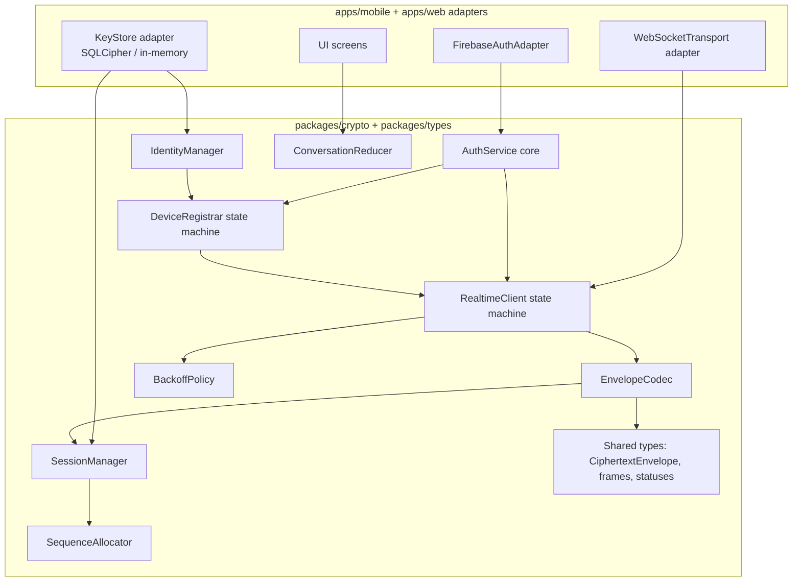
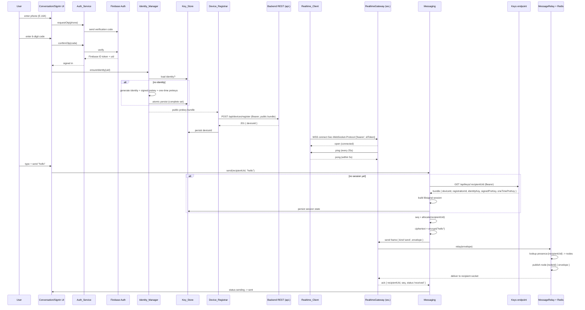
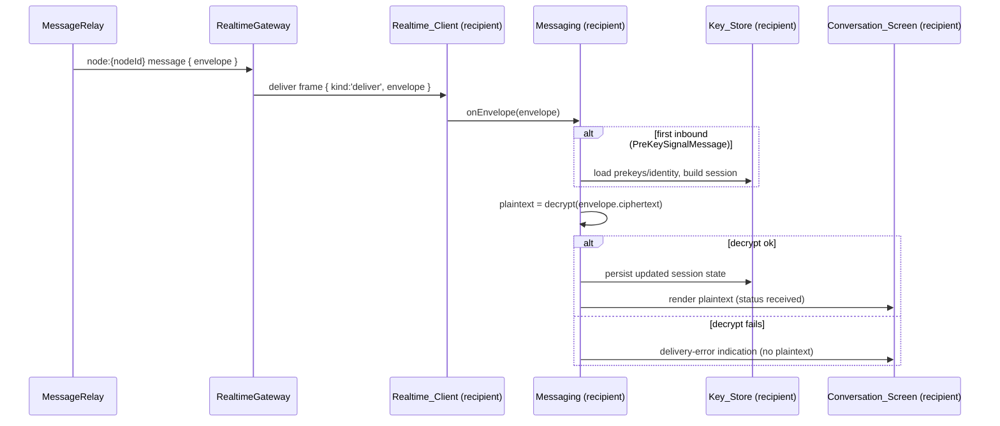

# Design Document: Phase 1 — Client Messaging (First Vertical Slice)

## Overview

Phase 1 delivers the first end-to-end vertical slice of the privacy chat application: a signed-in user, on
**either** the Mobile_App (React Native / Expo) or the Web_App (Next.js), generates its own libsignal
identity locally, registers the **public** prekey bundle with the Phase 0 backend, opens an authenticated
WebSocket, establishes a libsignal session to a recipient, and exchanges a 1:1 end-to-end encrypted text
message. The server only ever sees ciphertext.

This document covers **both** the client slice and the **minimal backend message-routing piece** the client
depends on (the dependency called out explicitly in requirements §5). Two backend deliverables are designed
here because the client cannot function without them:

1. **Prekey-bundle fetch (claim) endpoint** — so a sender can establish a session to a recipient device by
   claiming one one-time prekey plus the signed prekey and identity key. This consumes the Phase 0
   `one_time_prekeys` store (marking `consumed_at`) and rides the Phase 0 forward-contract index
   `idx_onetime_prekeys_device_unconsumed`.
2. **WebSocket message relay** — routing a Ciphertext envelope from the sender to the recipient's connected
   node(s) over the existing `RealtimeGateway` + Redis pub/sub backbone (`node:{nodeId}` channels and the
   `presence:{uid}` registry built in Phase 0), delivering to the recipient socket and ACKing the sender.
   Ciphertext-only; the server never sees plaintext.

The slice honors the confirmed stack and the Phase 0 contracts exactly:

- **Auth**: Firebase ID token via `@react-native-firebase/auth` (mobile) and the Firebase Web SDK (web),
  presented as `Authorization: Bearer <token>` for REST and via the `Sec-WebSocket-Protocol: ['bearer',
  idToken]` handshake the Phase 0 `RealtimeGateway` already parses.
- **Close codes**: `4401` (unauthorized → refresh + reconnect) and `4503` (auth dependency unavailable →
  backoff) are reused from Phase 0; `4429` (rate-limited) is also honored as a backoff trigger.
- **Public keys only**: the client transmits only public prekey material and libsignal ciphertext; private
  keys never leave the device.
- **Performance architecture (§12)**: WebSocket-first delivery, Redis pub/sub routing, async/optional DB
  persistence off the delivery hot path, and optimistic UI on send.

Everything else from the product spec stays deferred: the seven signature privacy features, group
messaging, media, reactions/edit/delete, typing indicators, presence/last-seen UI, multi-device sync beyond
a single device, FCM push, contact discovery, offline gap detection, and retry beyond a single in-session
send.

### Design principles for this slice

- **Shared-first**: all transport-agnostic logic (token acquisition orchestration, identity generation,
  registration state machine, envelope codec, session orchestration, backoff math, sequence numbering, the
  message-list reducer) lives in `packages/crypto` and `packages/types`. The platform apps provide only the
  thin adapters (Firebase SDK binding, WebSocket binding, Key_Store binding, UI).
- **Ports and adapters**: the shared core depends on narrow interfaces (`KeyStore`, `SignalProtocolStore`,
  `WebSocketTransport`, `AuthTokenProvider`, `HttpClient`). Mobile binds SQLCipher; web binds in-memory.
  This is what lets one codebase satisfy Requirement 6.7 (shared logic) and Requirement 7 (divergent
  storage) at once.
- **Ciphertext never coexists with plaintext on the wire**: the `CiphertextEnvelope` is constructed by a
  codec that has no field for plaintext, so there is no code path that can serialize plaintext to the
  socket (Requirements 5.3, 5.7, 8.2).

## Architecture

### System topology (client slice + Phase 1 backend additions)

```mermaid
graph TD
    subgraph Client[Client App - shared packages + platform adapters]
        UI[Sign_In_Screen + Conversation_Screen]
        AUTH[Auth_Service<br/>Firebase ID token + refresh]
        IDM[Identity_Manager<br/>packages/crypto]
        REG[Device_Registrar]
        RTC[Realtime_Client<br/>WebSocket + heartbeat + backoff]
        MSG[Messaging<br/>session + envelope codec]
        KS[Key_Store<br/>SQLCipher mobile / in-memory web]
    end

    subgraph Edge
        C[Caddy - TLS]
    end

    subgraph Backend[NestJS backend - Phase 0 + Phase 1 additions]
        DEV["DevicesController<br/>POST /api/devices/register (Phase 0)"]
        KEYS["KeysController<br/>GET /api/keys/:uid (Phase 1 NEW)"]
        GW["RealtimeGateway<br/>handshake+registry (Phase 0)<br/>message relay (Phase 1 NEW)"]
        RELAY[MessageRelayService<br/>Phase 1 NEW]
    end

    subgraph Data
        PG[(PostgreSQL<br/>devices, prekeys,<br/>messages NEW-optional)]
        RD[(Redis<br/>presence:{uid}<br/>node:{nodeId} pub/sub)]
    end

    FB[Firebase Auth]

    UI --> AUTH
    AUTH -->|sign-in / refresh| FB
    UI --> MSG
    IDM --> KS
    REG --> KS
    MSG --> KS
    RTC --> KS

    AUTH -.id token.-> REG
    AUTH -.id token.-> RTC
    IDM -.public bundle.-> REG

    REG -->|HTTPS Bearer| C
    MSG -->|HTTPS Bearer claim| C
    RTC -->|WSS bearer subprotocol| C

    C --> DEV
    C --> KEYS
    C --> GW

    DEV --> PG
    KEYS -->|claim 1 one-time prekey| PG
    GW --> RELAY
    RELAY -->|lookup recipient nodes| RD
    RELAY -->|publish node:{nodeId}| RD
    RELAY -.optional ciphertext write.-> PG
```

### Client component layering



The shared core is pure and platform-independent; the adapters inject `Date.now`, randomness, the Firebase
SDK, the WebSocket constructor, and the Key_Store implementation. This keeps the backoff math, sequence
allocation, envelope codec, and conversation reducer fully unit- and property-testable without a device.

## Sequence Diagrams

### Full happy path: sign-in → register → connect → session → send/receive



### Recipient receive + decrypt



### Reconnect / backoff on close

```mermaid
sequenceDiagram
    participant GW as RealtimeGateway
    participant RT as Realtime_Client
    participant AU as Auth_Service

    GW-->>RT: close(code)
    alt code == 4401
        RT->>AU: refresh token (<= 3 attempts)
        alt refresh ok
            RT->>GW: reconnect with new token
        else refresh fails x3
            RT->>RT: stop; expose disconnected + reauth-required
        end
    else code == 4503 / 4429 / other non-deliberate
        RT->>RT: delay = backoff(attempt) in [base..30s] + jitter
        RT->>GW: reconnect after delay
    else client-initiated (sign-out)
        RT->>RT: no reconnect
    end
```

## Components and Interfaces

All interfaces below are TypeScript and live in `packages/crypto` / `packages/types` unless noted as a
platform adapter or a backend component.

### Client Component 1: Auth_Service

**Purpose**: Acquire and refresh the Firebase ID token; expose the token and UID to the Device_Registrar
and Realtime_Client. Wraps `@react-native-firebase/auth` (mobile) and the Firebase Web SDK (web) behind one
shared interface (Requirements 1.1–1.11, 8.5, 8.8).

```typescript
export interface AuthTokenProvider {
  /** Current cached Firebase ID token, or null if not signed in. */
  getCurrentToken(): string | null;
  /** Signed-in user's Firebase UID, or null. */
  getCurrentUid(): string | null;
  /** Phone OTP: request a verification code for an E.164 number. */
  requestPhoneOtp(e164: string): Promise<OtpRequestResult>;
  /** Phone OTP: confirm a 6-digit code; resolves with a fresh token on success. */
  confirmPhoneOtp(code: string): Promise<SignInResult>;
  /** Force a token refresh from Firebase. Used on 401 / 4401. */
  refreshToken(): Promise<string>;
  /** Subscribe to auth state changes (signed-in / signed-out / reauth-required). */
  onAuthStateChanged(listener: (state: AuthState) => void): Unsubscribe;
  /** Client-initiated sign-out: clears token; Realtime_Client must not auto-reconnect. */
  signOut(): Promise<void>;
}

export type AuthState =
  | { status: 'signed-out' }
  | { status: 'signed-in'; uid: string; token: string }
  | { status: 'reauth-required' };

export interface OtpRequestResult { ok: boolean; resendLimited?: boolean; error?: string; }
export interface SignInResult { uid: string; token: string; }
```

**Responsibilities**:
- Request OTP within 30 s; accept a 6-digit numeric code; complete sign-in within 30 s (1.2, 1.3).
- On a rejected credential, stay on Sign_In_Screen, retain the entered phone number, surface an error (1.5).
- Reject codes submitted > 300 s after issuance with an expired-code error (1.11).
- Permit at most 5 resends per 60-minute window per phone number (1.10).
- On 401 / 4401, refresh the token, retrying at most 3 times; after 3 consecutive failures, transition to
  `reauth-required` and return to Sign_In_Screen (1.6, 1.9).
- Never put the token in logs; only ever hand it to the Device_Registrar / Realtime_Client (1.8, 8.5).

### Client Component 2: Identity_Manager (`packages/crypto`)

**Purpose**: Generate, hold, and expose the device's libsignal identity material; private keys never leave
the device (Requirements 2.1–2.8, 7.1, 7.5, 8.1).

```typescript
export interface IdentityManager {
  /**
   * Idempotently ensure a complete identity exists for `uid` on this device.
   * Generates on first call; reuses stored identity thereafter (2.6).
   */
  ensureIdentity(uid: string): Promise<PublicPreKeyBundleOut>;
  /** The public-only bundle to register (no private material) (2.5). */
  getPublicBundle(): Promise<PublicPreKeyBundleOut>;
}

/** Public-only material handed to Device_Registrar — base64 strings, never private keys. */
export interface PublicPreKeyBundleOut {
  registrationId: number;                 // >= 1 (2.3)
  identityKey: string;                    // base64 public identity key
  signedPreKey: { keyId: number; publicKey: string; signature: string };
  oneTimePreKeys: Array<{ keyId: number; publicKey: string }>; // 1..200 entries (2.2)
}
```

This maps directly onto the Phase 0 `RegisterDeviceDto` shape from `@chat-app/types`, so the registrar can
forward it without reshaping.

**Responsibilities**:
- Generate exactly one identity key pair, one registration id (≥ 1), one signed prekey (key pair +
  signature over the signed prekey public key by the identity key), and one batch of 1..200 one-time
  prekeys with non-negative, batch-unique key ids (2.1–2.3).
- Persist the **complete** identity set atomically, or persist nothing on partial failure and return an
  error (2.7, 2.8).
- Keep private halves only inside the Key_Store; expose only public material as base64 (2.4, 2.5).

### Client Component 3: Device_Registrar

**Purpose**: Register the public bundle against `POST /api/devices/register` and interpret the documented
`201 / 400 / 401 / 503` outcomes, with timeout and backoff handling, idempotent across launches
(Requirements 3.1–3.9).

```typescript
export interface DeviceRegistrar {
  /** Idempotent: returns the stored deviceId without a network call if already registered (3.7). */
  ensureRegistered(): Promise<RegistrationResult>;
}

export type RegistrationResult =
  | { status: 'registered'; deviceId: string }
  | { status: 'sign-in-required' }      // 401 after one refreshed retry (3.4)
  | { status: 'invalid'; field?: string } // 400, no retry of same payload (3.5)
  | { status: 'service-unavailable' };  // 503/timeout past cumulative budget (3.9)
```

**Responsibilities**:
- POST with `Authorization: Bearer <token>` and the public bundle body; include only public material
  (3.1, 3.2).
- On 201, persist `deviceId` and expose it to the Realtime_Client (3.3).
- On 401, discard the token, trigger a refresh, retry at most once, else surface sign-in-required (3.4).
- On 400, surface registration-failed, record the offending field, do not retry the same payload (3.5).
- On 503 or a 10 s timeout, retry with exponential backoff (500 ms start, 30 s cap, jitter) up to a 5-minute
  cumulative budget, retaining the unsent bundle (3.6, 3.8, 3.9).

### Client Component 4: Realtime_Client

**Purpose**: Maintain the authenticated WebSocket, run heartbeat/pong, and reconnect with close-code-aware
backoff; expose connection status (Requirements 4.1–4.11, 6.6).

```typescript
export interface RealtimeClient {
  connect(): Promise<void>;
  /** Client-initiated disconnect; disables auto-reconnect until next sign-in (4.8). */
  disconnect(): void;
  /** Send a wire frame (the Messaging layer builds the envelope). */
  send(frame: ClientToServerFrame): void;
  onFrame(listener: (frame: ServerToClientFrame) => void): Unsubscribe;
  onStatus(listener: (status: ConnectionStatus) => void): Unsubscribe;
  getStatus(): ConnectionStatus;
}

export type ConnectionStatus = 'connected' | 'disconnected';

/** Injected so close handling can be unit-tested deterministically. */
export interface WebSocketTransport {
  open(url: string, subprotocols: string[]): WebSocketHandle;
}
```

**Responsibilities**:
- Open over TLS to the `ws.` endpoint with subprotocols `['bearer', <token>]`; never put the token in the
  URL query string (4.1, 4.2).
- Reply to pings with a pong within 5 s; treat a missed-pong window as a failed connection (4.3, 4.11).
- On close `4401`: refresh token, reconnect on success; on refresh failure stop and surface reauth (4.4,
  4.9). On `4503` / other non-deliberate close / handshake timeout (10 s): reconnect with backoff (4.5,
  4.6, 4.10).
- Expose `connected` while open and `disconnected` while closed/reconnecting (4.7).

### Client Component 5: Messaging (`packages/crypto`)

**Purpose**: Establish libsignal sessions from fetched bundles, encrypt/decrypt 1:1 messages, build/parse
the Ciphertext envelope, allocate per-conversation sequence numbers, manage send/ack/pending state
(Requirements 5.1–5.11, 6.2).

```typescript
export interface Messaging {
  /** Send plaintext to a recipient; establishes a session first if needed (5.1, 5.2). */
  send(recipientUid: string, plaintext: string): Promise<void>;
  /** Handle an inbound envelope from the Realtime_Client (5.4, 5.5). */
  onEnvelope(envelope: CiphertextEnvelope): Promise<void>;
  /** Re-emit conversation state for the UI reducer. */
  onConversationUpdate(listener: (snapshot: ConversationSnapshot) => void): Unsubscribe;
}

export interface SessionManager {
  hasSession(recipientUid: string): Promise<boolean>;
  /** Build a session from a claimed public prekey bundle; persists state (5.1, 5.8). */
  establishSession(recipientUid: string, bundle: ClaimedPreKeyBundle): Promise<void>;
  encrypt(recipientUid: string, plaintext: string): Promise<CiphertextBody>;
  decrypt(envelope: CiphertextEnvelope): Promise<string>;
}

export interface EnvelopeCodec {
  /** Build an envelope. There is no parameter for plaintext (5.3, 5.7, 8.2). */
  encode(meta: EnvelopeRouting, body: CiphertextBody): CiphertextEnvelope;
  decode(envelope: CiphertextEnvelope): { routing: EnvelopeRouting; body: CiphertextBody };
}

export interface SequenceAllocator {
  /** Strictly increasing per-conversation sequence numbers (5.3, 6.2). */
  next(recipientUid: string): Promise<number>;
}
```

### Client Component 6: Key_Store (platform adapter)

**Purpose**: Persist identity material, session state, sequence counters, conversation/message rows, and
the `deviceId`. SQLCipher on mobile; in-memory only on web with the acknowledged ephemerality warning
(Requirements 7.1–7.7, 8.3, D9/D10).

```typescript
export interface KeyStore {
  /** Atomic write of the complete identity set, or nothing on failure (2.7, 2.8). */
  saveIdentity(record: IdentityRecord): Promise<void>;
  loadIdentity(uid: string): Promise<IdentityRecord | null>;
  saveDeviceId(deviceId: string): Promise<void>;
  loadDeviceId(): Promise<string | null>;
  // libsignal store surfaces
  loadSession(addr: SignalAddress): Promise<Uint8Array | null>;
  saveSession(addr: SignalAddress, record: Uint8Array): Promise<void>;
  consumeOneTimePreKey(keyId: number): Promise<void>;
  // sequence + conversation
  nextSeq(recipientUid: string): Promise<number>;
  appendMessage(row: MessageRow): Promise<void>;
  updateMessageStatus(id: string, status: MessageStatus): Promise<void>;
  /** Web only: wipe all in-memory material within the current event cycle (7.4). */
  destroy(): void;
}

/** Mobile binds SQLCipher (react-native-sqlcipher-storage); web binds an in-memory Map-backed store. */
export interface KeyStoreFactory {
  create(opts: { platform: 'mobile' | 'web' }): Promise<KeyStore>;
}
```

### Client Component 7: UI (Sign_In_Screen + Conversation_Screen)

**Purpose**: Minimal screens on both platforms, consuming the shared `ConversationReducer` so render logic
is identical (Requirements 6.1–6.9, 7.3, 7.7).

```typescript
/** Pure reducer: shared by mobile (FlatList) and web (virtual list). */
export interface ConversationReducer {
  reduce(state: ConversationState, event: ConversationEvent): ConversationState;
}

export interface ConversationState {
  connection: ConnectionStatus;
  /** Rendered ascending by seq, each message exactly once (6.2). */
  messages: RenderableMessage[];
  composer: { text: string; canSend: boolean };       // canSend=false for whitespace-only (6.4)
  webWarningAcknowledged: boolean;                     // gates messaging on web (7.7, 8.3)
}

export interface RenderableMessage {
  id: string;
  seq: number;
  direction: 'out' | 'in';
  text: string | null;                                 // null when delivery-error (5.5, 6.9)
  status: MessageStatus;                               // sending | sent | failed | received | delivery-error
}
```

### Backend Component A: KeysController + PreKeyClaimService (Phase 1 NEW)

**Purpose**: Serve a recipient's public prekey bundle to a sender so a libsignal session can be
established, atomically consuming one one-time prekey (requirements §5 backend dependency; aligns to Phase 0
`one_time_prekeys` and `idx_onetime_prekeys_device_unconsumed`).

```typescript
@Controller('api/keys')
export class KeysController {
  // Guarded by the Phase 0 FirebaseAuthGuard — a valid Firebase ID token is required.
  @Get(':uid')
  @UseGuards(FirebaseAuthGuard)
  claimBundle(@Auth() auth: AuthContext, @Param('uid') uid: string): Promise<PreKeyBundleResponse>;
}

export interface PreKeyClaimService {
  /** Claim a bundle for the recipient's (single, Phase 1) device. */
  claimForUser(recipientUid: string): Promise<PreKeyBundleResponse>;
}

export interface PreKeyBundleResponse {
  deviceId: string;
  registrationId: number;
  identityKey: string;                                 // base64 public identity key
  signedPreKey: { keyId: number; publicKey: string; signature: string };
  /** Null when the device's one-time prekeys are exhausted (fall back to signed prekey only). */
  oneTimePreKey: { keyId: number; publicKey: string } | null;
}
```

**Responsibilities**:
- Resolve `recipientUid` → its device row (Phase 1: a single device per user).
- Atomically claim one unconsumed one-time prekey: select `WHERE consumed_at IS NULL ... FOR UPDATE SKIP
  LOCKED`, set `consumed_at = now()`, return it. Use `idx_onetime_prekeys_device_unconsumed`.
- Return identity key + active signed prekey + the claimed one-time prekey (or `null` if exhausted).
- Return `404` if the recipient has no registered device; `401` (guard) if the caller is unauthenticated.

### Backend Component B: RealtimeGateway message relay + MessageRelayService (Phase 1 NEW)

**Purpose**: Add a message handler to the Phase 0 gateway that routes a Ciphertext envelope to the
recipient's connected node(s) and ACKs the sender. Ciphertext-only; never inspects plaintext (there is
none) and never decodes the ciphertext body.

```typescript
export interface MessageRelayService {
  /**
   * Route an envelope from sender to recipient's connected node(s) via node:{nodeId}
   * channels, after binding senderUid to the authenticated connection.
   */
  relay(sender: AuthContext, envelope: CiphertextEnvelope): Promise<RelayOutcome>;
  /** Deliver a published envelope to the local socket(s) for the recipient on this node. */
  deliverLocal(targetUid: string, envelope: CiphertextEnvelope): void;
}

export type RelayOutcome =
  | { status: 'received' }          // accepted for delivery; ACK the sender (5.6)
  | { status: 'rejected'; reason: 'sender-mismatch' | 'malformed' };

/** Published on node:{nodeId} so the owning node delivers to its local recipient socket. */
export interface NodeRelayMessage {
  targetUid: string;
  envelope: CiphertextEnvelope;
}
```

**Responsibilities**:
- Verify `envelope.senderUid === sender.uid`; reject spoofed sender (security boundary).
- Look up `presence:{recipientUid}` → `{connId -> nodeId}`; for each node, publish a `NodeRelayMessage` to
  `node:{nodeId}` over the Redis publisher; the subscribing node calls `deliverLocal`.
- Send an ACK frame back to the sender once accepted for delivery (5.6). If the recipient has no live
  connection, ACK `received` if persisted (optional) or surface no-ack so the client's 30 s timeout governs
  (5.11). For this slice, both parties are online.
- Optionally persist the ciphertext to a minimal `messages` table (kept off the delivery hot path, §12.2).
- Never log or decode the ciphertext body (8.2).

## Data Models

### Ciphertext envelope (wire format) — `packages/types`

The envelope carries only routing metadata and libsignal ciphertext. There is no plaintext field
(Requirements 5.3, 5.7, 8.2).

```typescript
/** Routing metadata — no message content. */
export interface EnvelopeRouting {
  senderUid: string;        // Firebase UID of the sender
  recipientUid: string;     // Recipient_Identifier (Firebase UID)
  senderDeviceId: string;   // server-issued deviceId of the sending device
  seq: number;              // per-conversation strictly monotonic sequence number (5.3, 6.2)
}

/** libsignal ciphertext body. `type` is the libsignal message type, NOT plaintext. */
export interface CiphertextBody {
  type: 1 | 3;              // 1 = SignalMessage (whisper), 3 = PreKeySignalMessage
  ciphertext: string;      // base64 libsignal ciphertext — opaque to the server
}

/** The full wire frame for a 1:1 message. */
export interface CiphertextEnvelope extends EnvelopeRouting, CiphertextBody {}

/** Client → server frames. */
export type ClientToServerFrame =
  | { kind: 'send'; envelope: CiphertextEnvelope };

/** Server → client frames. */
export type ServerToClientFrame =
  | { kind: 'deliver'; envelope: CiphertextEnvelope }
  | { kind: 'ack'; recipientUid: string; seq: number; status: 'received' };
```

> Note: `type` is part of the libsignal framing (which key flow to use on decrypt), not message content.
> The first message in a session is a `PreKeySignalMessage` (type 3); subsequent messages are
> `SignalMessage` (type 1). The server treats both as opaque.

### Client Key_Store schema (SQLCipher on mobile)

All tables live inside the single SQLCipher-encrypted database. The DB key is derived per §10.2 (device
keystore-backed); Phase 1 uses a device-keystore-provided passphrase. On web, each table is a process-memory
structure with identical fields and **no persistence** (Requirements 7.1, 7.2).

```sql
-- One row: the device's libsignal identity. Private halves live ONLY here (7.1, 8.1).
CREATE TABLE identity (
  uid                TEXT PRIMARY KEY,         -- signed-in Firebase UID
  registration_id    INTEGER NOT NULL,         -- >= 1
  identity_key_pub   BLOB NOT NULL,            -- public identity key
  identity_key_priv  BLOB NOT NULL,            -- PRIVATE — never leaves device
  device_id          TEXT,                     -- server-issued, set after registration (3.3)
  created_at         INTEGER NOT NULL
);

-- The active signed prekey (key pair + signature).
CREATE TABLE signed_prekeys (
  key_id       INTEGER PRIMARY KEY,
  pub          BLOB NOT NULL,
  priv         BLOB NOT NULL,                  -- PRIVATE
  signature    BLOB NOT NULL,                  -- signature over pub by identity key
  created_at   INTEGER NOT NULL
);

-- One-time prekeys; consumed locally once the matching inbound PreKeySignalMessage is processed.
CREATE TABLE one_time_prekeys (
  key_id     INTEGER PRIMARY KEY,
  pub        BLOB NOT NULL,
  priv       BLOB NOT NULL,                    -- PRIVATE
  consumed   INTEGER NOT NULL DEFAULT 0
);

-- libsignal session records, keyed by remote address.
CREATE TABLE sessions (
  remote_uid       TEXT NOT NULL,
  remote_device_id TEXT NOT NULL,
  record           BLOB NOT NULL,              -- serialized libsignal session state (5.8)
  updated_at       INTEGER NOT NULL,
  PRIMARY KEY (remote_uid, remote_device_id)
);

-- Per-conversation monotonic send counter (5.3, 6.2).
CREATE TABLE conversation_seq (
  remote_uid   TEXT PRIMARY KEY,
  last_send_seq INTEGER NOT NULL DEFAULT 0
);

-- Display + status rows for the conversation screen, including pending-send queue (5.10, 6.2, 6.8).
CREATE TABLE messages (
  id           TEXT PRIMARY KEY,               -- client-generated uuid
  remote_uid   TEXT NOT NULL,
  direction    TEXT NOT NULL,                  -- 'out' | 'in'
  seq          INTEGER NOT NULL,
  plaintext    TEXT,                           -- decrypted text for display; NULL on delivery-error (5.5)
  status       TEXT NOT NULL,                  -- sending|sent|failed|received|delivery-error
  created_at   INTEGER NOT NULL,
  UNIQUE (remote_uid, direction, seq)          -- dedupe: each message rendered once (6.2)
);
```

**Validation / invariants**:
- `registration_id ≥ 1`; all `key_id` values are non-negative; one-time prekey `key_id`s are unique within
  the generated batch (2.3).
- Private columns (`*_priv`, session `record`) never appear in any value handed to the Device_Registrar,
  the Realtime_Client, or any network request (2.4, 8.1).
- On web, the equivalent structures hold only public material plus volatile session records in JS memory;
  nothing is written to `localStorage`, `sessionStorage`, IndexedDB, Cache Storage, Web SQL, or cookies
  (7.2).

### Backend shapes (Phase 1)

The prekey-claim consumes the existing Phase 0 `one_time_prekeys` table (no schema change required — it
already has `consumed_at` and `idx_onetime_prekeys_device_unconsumed`). An optional minimal `messages` table
may be added for at-most-once ciphertext persistence; it is off the delivery hot path and not required for
this slice:

```sql
-- OPTIONAL (Phase 1, minimal): ciphertext-only relay log. Kept off the delivery path (§12.2).
CREATE TABLE messages (
  id              UUID PRIMARY KEY DEFAULT gen_random_uuid(),
  sender_uid      TEXT NOT NULL,
  recipient_uid   TEXT NOT NULL,
  sender_device_id UUID NOT NULL REFERENCES devices(id) ON DELETE CASCADE,
  seq             BIGINT NOT NULL,
  ciphertext      BYTEA NOT NULL,               -- opaque libsignal ciphertext; server never decodes
  msg_type        SMALLINT NOT NULL,            -- libsignal message type (1 | 3)
  created_at      TIMESTAMPTZ NOT NULL DEFAULT now()
);
-- Forward-contract index from §12.4 lands with this table when persistence is enabled.
```

The `PreKeyBundleResponse` and `CiphertextEnvelope` shapes are exported from `@chat-app/types` so the
backend and both clients share one definition.

## Correctness Properties

*A property is a characteristic or behavior that should hold true across all valid executions of a system —
essentially, a formal statement about what the system should do. Properties serve as the bridge between
human-readable specifications and machine-verifiable correctness guarantees.*

Phase 1 is heavy on pure, transport-agnostic logic in `packages/crypto` and `packages/types` — libsignal
encryption/decryption, the envelope codec, sequence allocation, the backoff policy, the connection state
machine, the conversation reducer, and the backend prekey-claim/relay logic. These are exactly the surfaces
where property-based testing earns its keep, so the slice carries a substantial property set. Each property
is universally quantified and traces to the requirements it validates. (UI-presence, Firebase-external, and
manifest/config criteria are covered by example, integration, and smoke tests in the Testing Strategy
instead — they are not property-shaped.)

### Property 1: libsignal session round-trip

*For any* plaintext message `m` and *any* libsignal session established between a sender and recipient,
decrypting the ciphertext produced by encrypting `m` yields exactly `m` (`decrypt(encrypt(m)) == m`),
including across a sequence of multiple messages where the session state persisted after each message is
used to decrypt the next.

**Validates: Requirements 5.1, 5.2, 5.4, 5.8**

### Property 2: Envelope codec round-trip

*For any* routing metadata `r` (sender UID, recipient UID, sender deviceId, sequence number) and *any*
ciphertext body `b`, decoding the envelope produced by `encode(r, b)` returns routing and body equal to `r`
and `b` — the codec neither loses nor mutates routing fields or ciphertext.

**Validates: Requirements 5.3**

### Property 3: No plaintext on the wire

*For any* message the client sends, the serialized `CiphertextEnvelope` placed on the WebSocket contains no
field holding the message plaintext, and the plaintext is not recoverable from the envelope without the
recipient's private key — there exists no code path that serializes plaintext to the Backend_API.

**Validates: Requirements 5.3, 5.7, 8.2**

### Property 4: Public keys only leave the device

*For any* generated identity and *any* value passed to the Device_Registrar, the Realtime_Client, or any
outbound network request, no Private key material (identity private key, signed-prekey private key,
one-time-prekey private keys, or libsignal session secret) is present — only public key material and
ciphertext cross the device boundary.

**Validates: Requirements 2.4, 3.2, 8.1**

### Property 5: Per-conversation sequence monotonicity

*For any* sequence of messages sent to a given Recipient_Identifier, the sequence numbers allocated by the
SequenceAllocator are strictly increasing (each `next` is greater than all previously allocated for that
conversation).

**Validates: Requirements 5.3, 6.2**

### Property 6: Message-list dedup and ordering

*For any* arrival order and *any* duplication of message events fed to the ConversationReducer, the rendered
message list contains each `(remoteUid, direction, seq)` exactly once and is ordered by ascending
per-conversation sequence number.

**Validates: Requirements 6.2**

### Property 7: Well-formed public prekey bundle

*For any* identity the Identity_Manager generates, the exposed public bundle has a `registrationId` ≥ 1, a
one-time prekey batch whose size is in the inclusive range 1..200, all key ids non-negative, one-time prekey
key ids unique within the batch, and every key field a valid base64 public value — matching the Phase 0
`RegisterDeviceDto` shape exactly.

**Validates: Requirements 2.1, 2.2, 2.3, 2.5**

### Property 8: Identity generation atomicity

*For any* identity-generation attempt that fails before the complete set (identity key pair, registration
id, signed prekey, one-time prekey batch) is produced, the Key_Store retains no partial identity material;
and *for any* attempt that succeeds, the persisted identity is the complete set.

**Validates: Requirements 2.7, 2.8**

### Property 9: Identity reuse idempotence

*For any* device on which a complete identity already exists for the signed-in user, `ensureIdentity`
returns the existing identity and registration id without generating a new identity key pair or registration
id.

**Validates: Requirements 2.6**

### Property 10: Registration idempotence across launches

*For any* device that already holds a stored `deviceId` and identity material, `ensureRegistered` issues no
new registration request and returns the stored `deviceId`; a new request is issued only when the stored
identity or `deviceId` is absent.

**Validates: Requirements 3.7**

### Property 11: Backoff delays stay within bounds

*For any* retry/reconnect attempt number `n`, the computed delay lies within the inclusive interval
[500 ms, 30 s] after jitter is applied (never below the base, never above the 30 s cap), and the
registration retry loop stops once the cumulative elapsed time reaches the 5-minute budget.

**Validates: Requirements 3.6, 3.9, 4.5, 4.6, 4.10, 4.11**

### Property 12: Token-refresh retry is bounded

*For any* sequence of refresh outcomes triggered by an HTTP 401 or a WebSocket 4401 close, the Auth_Service
performs at most 3 refresh attempts and stops early on the first success; after 3 consecutive failures it
transitions to a re-authentication-required terminal state (returning the user to the Sign_In_Screen).

**Validates: Requirements 1.6, 1.9, 3.4, 4.4, 4.9**

### Property 13: Close-code-driven reconnect classification

*For any* WebSocket close, the Realtime_Client's reaction is determined solely by the close code and
deliberateness: code 4401 → refresh-then-reconnect; codes 4503/4429 and any other non-deliberate close →
backoff reconnect; a client-initiated disconnect (sign-out) → no reconnection attempt.

**Validates: Requirements 4.4, 4.5, 4.6, 4.8**

### Property 14: Connection status reflects socket state

*For any* sequence of transport events, the status exposed to the Conversation_Screen is `connected` if and
only if the underlying socket is open, and `disconnected` while closed, connecting, or reconnecting.

**Validates: Requirements 4.7, 6.6**

### Property 15: Decrypt failure yields no plaintext

*For any* received envelope that fails libsignal decryption, the client renders no plaintext for that
envelope and assigns it a delivery-error status.

**Validates: Requirements 5.5, 6.9**

### Property 16: Pending send flushes exactly once

*For any* message submitted while the WebSocket connection is not open, the message is held in a
pending-send (`sending`) state and is transmitted exactly once when the connection is next established —
never dropped and never sent more than once.

**Validates: Requirements 5.10**

### Property 17: Ack and timeout status transitions

*For any* sent message, receiving a Backend_API acknowledgment within 30 seconds transitions its status
`sending → sent`; the absence of an acknowledgment within 30 seconds transitions it `sending → failed` while
retaining the message text in the list.

**Validates: Requirements 5.6, 5.11, 6.5, 6.8**

### Property 18: Web messaging gated on ephemerality acknowledgment

*For any* Web_App session, sending and receiving of messages is disabled while the in-memory-only
ephemerality warning has not been acknowledged, and becomes enabled once (and only once) the acknowledgment
is recorded; the warning stays visible until that explicit acknowledgment.

**Validates: Requirements 7.7, 8.3**

### Property 19: Web session-end wipe

*For any* Web_App session that ends via page unload, tab close, or sign-out, the in-memory identity material
and session state are discarded within the same event-handling cycle, after which no identity material or
session state is retrievable from JavaScript memory or any web storage mechanism.

**Validates: Requirements 7.2, 7.4**

### Property 20: No secrets in logs or error reports

*For any* operation the client performs, no emitted log entry, error report, or off-device diagnostic
contains a Firebase ID token value or any Private key material.

**Validates: Requirements 1.8, 8.5**

### Property 21: Composer send-enablement validation

*For any* composer input string, the send control is enabled if and only if the input's non-whitespace
(trimmed) length is in the inclusive range 1..4096; whitespace-only input keeps the control disabled and
submits nothing.

**Validates: Requirements 6.3, 6.4**

### Property 22: Prekey claim consumes exactly one one-time prekey

*For any* recipient device with `k ≥ 0` unconsumed one-time prekeys, a successful prekey-bundle fetch marks
exactly one previously-unconsumed one-time prekey as consumed and never returns an already-consumed key;
when `k = 0` it returns a `null` one-time prekey while still returning the identity key and active signed
prekey. Concurrent claims never hand the same one-time prekey to two callers.

**Validates: Requirements 5.1**

### Property 23: Relay binds sender to the authenticated connection

*For any* relayed envelope, the MessageRelayService routes it if and only if `envelope.senderUid` equals the
authenticated UID of the sending connection, rejecting any envelope whose declared sender does not match;
the relay treats the ciphertext body as opaque (never decoded) on every path.

**Validates: Requirements 5.7, 8.2**

## Error Handling

### Scenario 1: Firebase sign-in / OTP rejected

**Condition**: Firebase rejects the submitted phone number, the verification code, or an expired code
(> 300 s old).
**Response**: Stay on the Sign_In_Screen, retain the entered phone number, and show a non-technical error
(`sign-in did not succeed` / `code has expired`). Resend requests beyond 5 per 60-minute window are refused
with a resend-limit message.
**Recovery**: User re-enters the code or requests a new one (subject to the resend limit) (Requirements 1.5,
1.10, 1.11).

### Scenario 2: Token expiry mid-session (HTTP 401 / WS 4401)

**Condition**: The Backend_API returns 401, or the gateway closes with 4401.
**Response**: The Auth_Service refreshes the Firebase ID token, retrying at most 3 times. The Device_Registrar
retries registration at most once with the refreshed token; the Realtime_Client reconnects with the refreshed
token.
**Recovery**: On success, the original action proceeds. After 3 consecutive refresh failures, the client
returns to the Sign_In_Screen with a re-authentication-required indication (Requirements 1.6, 1.9, 3.4, 4.4,
4.9).

### Scenario 3: Auth dependency unavailable (HTTP 503 / WS 4503 / 4429)

**Condition**: The backend returns 503, or the gateway closes with 4503 (Firebase verification unavailable)
or 4429 (rate limited).
**Response**: Registration and reconnection retry with exponential backoff (500 ms base, 30 s cap, jitter).
Registration stops after a 5-minute cumulative budget and surfaces a service-unavailable state while
retaining the generated prekey bundle.
**Recovery**: Automatic retry until a non-503 response / successful reconnect, or the budget elapses
(Requirements 3.6, 3.8, 3.9, 4.5, 4.6).

### Scenario 4: Invalid registration payload (HTTP 400)

**Condition**: The backend rejects the bundle (e.g. a field the server deems invalid).
**Response**: Surface a registration-failed state, record the field the response identifies, and do not retry
the same payload.
**Recovery**: Requires a corrected bundle (operator/diagnostic path); not auto-retried (Requirement 3.5).

### Scenario 5: WebSocket handshake / heartbeat failure

**Condition**: The handshake does not complete within 10 s, or no pong is produced within 5 s of a ping.
**Response**: Terminate the pending or stale connection, expose `disconnected`, and reconnect with backoff.
**Recovery**: Backoff reconnection; status returns to `connected` on success (Requirements 4.3, 4.10, 4.11).

### Scenario 6: Session establishment failure

**Condition**: The recipient's public prekey bundle cannot be retrieved, or the session cannot be
established within 10 s.
**Response**: Transmit neither plaintext nor ciphertext, retain the composed text, and show an error
indication for that message.
**Recovery**: User may retry the send; no key material or plaintext was emitted (Requirements 5.9).

### Scenario 7: Decryption failure on receive

**Condition**: A received envelope fails libsignal decryption (corrupt ciphertext, out-of-order key state).
**Response**: Render no plaintext; mark the message with a delivery-error indication.
**Recovery**: None automatic for this slice; the error is surfaced honestly (Requirements 5.5, 6.9).

### Scenario 8: Send not acknowledged

**Condition**: A sent message is not acked within 30 s, or the send path reports failure.
**Response**: Transition the message to `failed` and retain its text in the list (not discarded).
**Recovery**: The message text remains available to the user (Requirements 5.11, 6.8).

### Scenario 9: Secure storage unavailable (mobile)

**Condition**: The Mobile_App cannot initialize, open, or decrypt the SQLCipher Key_Store.
**Response**: Write no identity material, session state, or `deviceId` to any unencrypted storage; retain no
Private key material in persistent storage; display a secure-storage-unavailable error.
**Recovery**: Messaging is blocked until secure storage is available (Requirement 7.6).

### Scenario 10: TLS cannot be established

**Condition**: A TLS connection to the `api.` or `ws.` endpoint fails.
**Response**: Abort the request/connection without transmitting any payload, Firebase ID token, or key
material; surface a connection-error state.
**Recovery**: Retry once connectivity returns (Requirement 8.7).

### Scenario 11: Recipient has no registered device (backend claim)

**Condition**: A sender requests a prekey bundle for a recipient with no registered device.
**Response**: The KeysController returns `404`; the client surfaces a session-establishment error (folds into
Scenario 6).
**Recovery**: None automatic; the recipient must register a device.

### Scenario 12: Spoofed sender on relay (backend)

**Condition**: A connection submits an envelope whose `senderUid` does not match its authenticated UID.
**Response**: The MessageRelayService rejects the envelope (`sender-mismatch`) and does not route or persist
it.
**Recovery**: None — this is a security rejection, surfaced as a send failure to the offending client
(Property 23).

## Testing Strategy

### Dual approach

- **Property-based tests** verify the 23 universally-quantified properties above across generated inputs.
  They target the pure shared logic in `packages/crypto` and `packages/types` and the backend
  claim/relay logic.
- **Example-based unit tests** cover specific scenarios, wiring, and error branches (the EXAMPLE-classified
  criteria: Sign_In_Screen presentation, token exposure wiring, 201/400 handling specifics, both-screens
  presence).
- **Integration tests** cover external/infrastructure behavior that does not vary meaningfully with input
  (Firebase sign-in/OTP, SQLCipher open/encrypt, WebSocket handshake against the real Phase 0 gateway, the
  end-to-end two-client message exchange).
- **Smoke/static checks** cover one-shot configuration (Android manifest excludes restricted permissions;
  shared packages are consumed by both apps; no key-backup API exists).

### Property-based testing

- **Library**: `fast-check` integrated with `Jest` (matching the Phase 0 choice).
- **Iterations**: each property test runs a minimum of 100 generated cases.
- **Tag format**: every property test is tagged with a comment
  `// Feature: phase1-client-messaging, Property {n}: {property text}` referencing the property above.
- **Determinism**: the shared core takes injected `Date.now`, RNG, the WebSocket constructor, the Firebase
  SDK, and the Key_Store, so time-, randomness-, and transport-dependent properties (backoff bounds, retry
  counts, reconnect classification, pending-send flush, ack/timeout transitions) are driven deterministically
  with fake clocks and scripted transports.
- **Representative encodings**:
  - P1/P2 (round-trips): generate arbitrary UTF-8 plaintext and routing metadata; assert
    `decrypt(encrypt(m)) == m` and `decode(encode(r,b)) == (r,b)`. Use a libsignal test harness with two
    in-memory stores.
  - P3/P4/P20 (no-plaintext / public-only / no-secret-logging): generate messages and identities, then
    deep-scan every serialized outbound frame and every captured log line for plaintext, private-key bytes,
    or token values — asserting absence.
  - P5/P6 (sequence + reducer): generate shuffled/duplicated event streams; assert strict monotonicity and
    dedup+ordering invariants.
  - P7/P8/P9 (identity): generate identities and inject failures at random generation steps.
  - P11/P12/P13 (backoff/retry/reconnect): generate attempt counts and close-code/outcome sequences.
  - P22/P23 (backend): generate devices with varying unconsumed-prekey counts and envelopes with
    matching/mismatching sender UIDs; the claim test also runs concurrent claims to assert no double-issue.

### Example-based unit testing

- Auth_Service: Sign_In_Screen shown when no token (1.1); token+uid exposed to consumers (1.4); rejected
  credential retains phone + error (1.5); email/Google route through the same path (1.7).
- Device_Registrar: 201 persists+exposes `deviceId` (3.3); 400 records field and does not retry (3.5).
- UI: both screens render on mobile and web (6.1); web ephemerality warning content (7.3).

### Integration testing

- **Firebase**: phone OTP request/confirm against the Firebase Auth emulator (1.2, 1.3) — timing and
  external behavior, not property-shaped.
- **SQLCipher (mobile)**: open/encrypt/persist/reopen the Key_Store; failure-to-open path writes nothing
  unencrypted (7.1, 7.6).
- **WebSocket against Phase 0 gateway**: real `['bearer', idToken]` handshake; 4401 on bad token; ping/pong
  liveness; presence registry entry appears/clears (4.1–4.3).
- **End-to-end two-client exchange**: two clients register, connect, claim bundles, and exchange one message;
  assert the recipient renders the plaintext and the sender sees `sent`, with the backend relay carrying
  ciphertext only (5.1–5.8 end-to-end).
- **Prekey claim endpoint**: register a device, claim its bundle, assert exactly one one-time prekey is
  consumed and a second claim returns the next (or null when exhausted) (B1).

### Smoke / static checks

- Android manifest excludes SMS, Call Log, Accessibility Service, and `QUERY_ALL_PACKAGES` (8.4).
- Both `apps/mobile` and `apps/web` import the shared `packages/crypto` / `packages/types` modules for
  sign-in, registration, connection, encryption, and send/receive (6.7).
- No key-backup or key-recovery API is exported by the client (7.5, D9).

## Security Considerations

- **End-to-end guarantee**: messages are encrypted with libsignal on the sending device and decrypted only
  on the recipient device. The Backend_API relays opaque ciphertext and never holds a key capable of
  decrypting it. Property 1 (round-trip), Property 3 (no plaintext on the wire), and Property 23 (relay treats
  the body as opaque) together enforce this end to end.
- **Private keys never leave the device**: the Identity_Manager exposes public material only; Property 4
  asserts no Private key material crosses the device boundary on any path. The client mirrors the Phase 0
  server invariant that only public prekey material is ever transmitted or stored.
- **Key handling at rest**: mobile stores all identity/session material in a SQLCipher-encrypted database,
  with the DB key derived from the device hardware-backed keystore (§10.2); web holds material in JS memory
  only and wipes it on session end (Property 19). There is no key backup or recovery path (D9/D10) — a
  deliberate forward-secrecy decision, disclosed honestly to web users before messaging is enabled
  (Property 18).
- **No plaintext or secret logging**: Property 20 asserts that Firebase ID token values and Private key
  material never appear in logs, error reports, or off-device diagnostics. Tokens ride only the
  `Authorization: Bearer` header and the `bearer` WebSocket subprotocol — never a URL query string
  (Property, Requirement 4.2).
- **Transport security**: all backend communication uses TLS (`https://api.` and `wss://ws.`); a TLS failure
  aborts before transmitting any payload, token, or key (Requirement 8.7).
- **New backend endpoints — security implications**:
  - `GET /api/keys/:uid` (prekey-bundle fetch) is guarded by the Phase 0 `FirebaseAuthGuard`; only an
    authenticated caller can claim a bundle. It returns **public** prekey material only and atomically
    consumes one one-time prekey (`FOR UPDATE SKIP LOCKED`, Property 22) so a prekey is never handed to two
    senders. It exposes no private material and no message content.
  - The **WebSocket message relay** requires the same authenticated handshake as Phase 0. It binds the
    envelope's `senderUid` to the connection's verified UID (Property 23), rejecting sender spoofing, and it
    stores/relays **ciphertext only** — it never decodes the libsignal body and never logs it. Any optional
    `messages` persistence holds opaque ciphertext, consistent with the §12.2 ciphertext-only delivery
    pipeline.
- **Google Play / restricted permissions**: the client declares none of SMS, Call Log, Accessibility
  Service, or `QUERY_ALL_PACKAGES` (Requirement 8.4), and applies `FLAG_SECURE` posture per the product
  spec where applicable (full FLAG_SECURE coverage is a later-phase concern but the slice introduces no
  permission that violates §16.4).
- **Authentication boundary**: every backend surface this slice touches — `POST /api/devices/register`,
  `GET /api/keys/:uid`, and the WebSocket handshake/relay — requires a valid, unexpired, unrevoked Firebase
  ID token, consistent with the Phase 0 security posture.

## Out of Scope (Deferred)

The following are explicitly NOT implemented in Phase 1. The design leaves the Phase 0 extension points
(connection registry, `node:{nodeId}` pub/sub, public prekey store, shared packages) intact so later phases
build on this slice without re-architecting.

- **Group messaging** and any multi-recipient fan-out.
- **Media / attachments** and the Backblaze B2 presigned-URL pipeline.
- **The seven signature privacy features**: per-chat hidden chats, in-chat identity verification (TOTP +
  duress), ephemeral secret segments, decoy PIN / duress app state, self-destructing messages, view-once
  media, and dual-layer shadow chat with the `/alias` system.
- **Reactions, reply/quote, edit, and delete-for-everyone.**
- **Typing indicators, presence / last-seen UI, and read receipts** (only send→sent/failed status is in
  scope).
- **Multi-device sync** beyond a single device per user (the prekey-claim resolves a single recipient
  device for this slice).
- **FCM push / wake-up** for offline users (noted as a follow-up; both parties are assumed online for the
  slice).
- **Contact discovery** (phone-number hashing / lookup).
- **Offline send queue persistence and message-gap detection** beyond a single in-session pending send and
  its flush on reconnect.
- **Optimistic-UI retry** beyond a single in-session send; no automatic resend of `failed` messages.
- **Certificate pinning, root/tamper detection, app PIN/biometric**, and other Phase 2 hardening.
- **Durable server-side message history**: the optional minimal `messages` table is ciphertext-only and off
  the delivery hot path; full message history, the §12.4 `messages` indexes beyond what persistence needs,
  TTL workers, and read/delivery-state columns are deferred.
- **Signed-prekey / one-time-prekey replenishment and rotation** (the slice registers one batch and claims
  from it; refill is a later concern).
