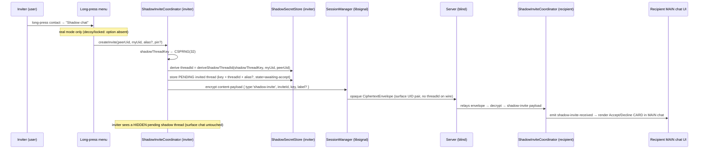
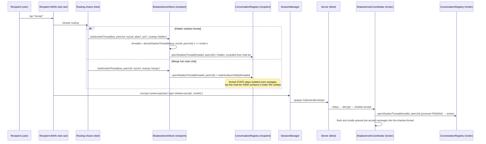
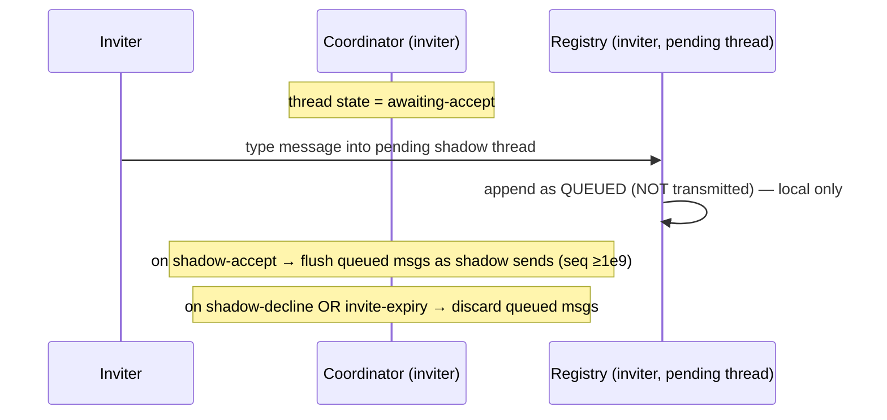
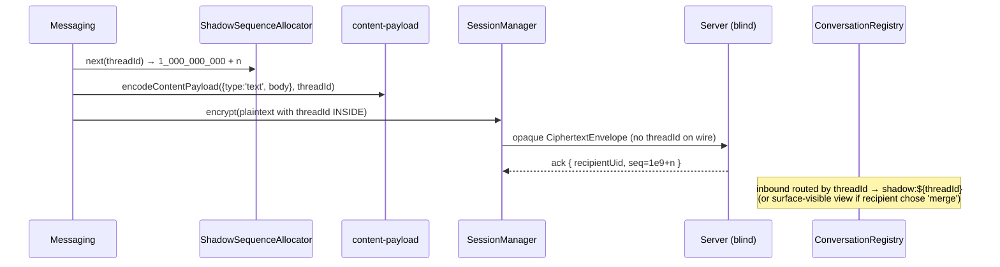

# Design Document: Shadow Chat Invites

> **Spec relationship.** This feature **evolves** the already-shipped Shadow Chat feature
> (`.kiro/specs/shadow-chat/design.md`, `requirements.md`, `tasks.md`). It does **not** re-litigate
> the shipped pure core. It changes exactly one thing about how a shadow thread comes to exist:
> instead of being a **silent, local-only, single-device** construct, a shadow thread becomes a
> **two-party, invitation-based** construct with **explicit consent** and a **recipient routing
> choice**. Everything the shipped feature already guarantees (server-blindness, per-thread
> isolation, decoy/locked inertness, the `+1e9` sequence offset, exclusion from the default chat
> list/notifications) is **preserved** wherever it does not conflict with the user's explicit choice
> to make the invitation a *visible* request.
>
> This document is written in **TypeScript** for code sections (the language of the existing
> `@chat-app/crypto` core and both apps) and provides **both** a High-Level (architecture, sequence
> diagrams, interfaces, data models) and a Low-Level (algorithmic pseudocode with pre/postconditions
> and correctness properties) view, grounded in the existing code.

---

## Overview

A **shadow chat** today is a completely independent, invisible parallel thread with an existing
contact, reached only by typing a private `/alias`. The shipped implementation has a **fatal
two-party defect**: `provisionShadowContext()` in
[`apps/mobile/src/app/chat-controller.ts`](../../../apps/mobile/src/app/chat-controller.ts) mints the
`shadowMasterSecret` as a **local 32-byte CSPRNG value that is never transmitted off-device**. Since
`deriveShadowThreadId` in
[`packages/crypto/src/shadow-chat.ts`](../../../packages/crypto/src/shadow-chat.ts) keys its HMAC on
that secret, **two different users derive different `threadId`s for the "same" conversation**. Shadow
messages therefore never converge: the recipient's
[`ConversationRegistry.apply()`](../../../packages/crypto/src/conversation-registry.ts) rejects the
inbound shadow message with `UnknownShadowThreadError` (Req 7.8). The existing
`messaging-shadow-e2e.test.ts` only passes because the harness **injects the same secret into both
clients** — masking the bug.

This feature fixes that defect by introducing a **consented, invitation-based rendezvous**:

1. **Invite (visible request).** The inviter long-presses a contact → **"Shadow chat"**. The
   recipient receives a **visible request in their MAIN (surface) conversation** with Accept /
   Decline. (The deniability trade-off of a *visible* request is documented explicitly below.)
2. **Shared-secret rendezvous (the fix).** The Accept handshake establishes a **shared per-thread
   key** that both sides hold, so their derived `threadId`s **match**. The key rides **encrypted
   inside the existing libsignal session payload** — no new endpoints, no wire/envelope/ack/codec
   change. Each side wraps and stores its **own copy** under its **own** encrypted vault, but the
   thread key itself is shared.
3. **Recipient routing choice.** On Accept, the recipient chooses whether the conversation lands in a
   **hidden shadow thread** on their side **or merges into their NORMAL main chat**. The asymmetry
   (secret for the inviter, ordinary for the recipient if they pick main chat) is a documented,
   informed choice.
4. **Per-chat invites.** Each shadow chat (shadow 1, shadow 2, …) is its own invite + accept; **all**
   follow-up requests always arrive in the **MAIN chat**, never nested inside a previous shadow
   thread.
5. **Optional per-chat PIN** remains exactly as today (simple, optional, set at creation or later).
   Decoy / locked mode stays inert.
6. **Strict delivery into the shadow thread only (this revision).** A shadow message is delivered to
   the recipient **only after they Accept** (and the shadow thread is opened), and it lands **only**
   in that shadow thread — **never** in the main/surface chat, on **either** side. Pre-accept
   messages stay **queued locally** on the inviter and **flush on Accept**; none ever reach the wire
   before Accept and none ever land in main. (The recipient's `merge` routing changes only the local
   *view* — see Component D — never the message's thread membership.)
7. **"Clear shadow chat" from MAIN SETTINGS (this revision).** A settings action, mirroring the
   app's existing **"Clear chat"** (a local purge of one conversation's history built on
   `KeyStore.purgeMessages`, [`ports.ts`](../../../packages/crypto/src/ports.ts) /
   [`messaging.ts`](../../../packages/crypto/src/messaging.ts), surfaced through a row-removal reducer
   event). **"Clear shadow chat"** is the shadow-thread analogue: it purges **one shadow thread's
   local history** while **keeping the thread + shared key** so the chat keeps working afterwards. It
   is **real-mode only** and **inert in decoy/locked** mode, lives in **settings**, and operates
   **per shadow chat**.
8. **"Revoke shadow chat" — wipe both sides (this revision, NEW).** An optional **Revoke** mode of
   the same settings action that, beyond the local history purge, sends a new `shadow-revoke`
   control payload (additive to
   [`content-payload.ts`](../../../packages/crypto/src/content-payload.ts), same E2E / server-blind
   pattern as `shadow-invite`/`-accept`/`-decline`) instructing the **peer's** device to delete the
   **shared thread key + that thread's local history** and **close the thread**. After Revoke the
   thread is **unusable on both sides** and its `threadId` **cannot be re-derived** from stored state.
9. **Invite-control auto-cleanup (this revision).** Once an invite is **responded to** (accept or
   decline) or **expires**, all invite-control residue — the `shadow-invite`/`-accept`/`-decline`
   records and the visible request card — is **automatically deleted**. The only thing that persists
   is the active `InvitedThreadRecord` (for an accepted invite) or **nothing** (for declined/expired).

**The one hard constraint is unchanged:** the deployed backend at `api.luminchat.app` is **frozen**.
The `threadId` and the shared thread key both ride **only inside the encrypted content payload**; on
the wire a shadow message — and every invite / accept / decline / **revoke** control message — is
just another `CiphertextEnvelope` between the same two real UIDs. **"Clear shadow chat"** adds no wire
traffic at all (it is a purely local purge); only **Revoke** sends one additional control payload, and
it too is just an opaque envelope.

---

## Architecture

```mermaid
graph TD
    subgraph UI["UI (apps/web, apps/mobile) — thin adapters"]
        LP["Long-press contact menu<br/>(NEW: 'Shadow chat' → invite)"]
        REQ["Invite request card<br/>(NEW: rendered in recipient's MAIN chat)<br/>Accept / Decline<br/>(auto-removed once responded/expired)"]
        ROUTE["Routing-choice sheet<br/>(NEW: Hidden shadow | Merge into main)"]
        PEND["Inviter pending view<br/>(NEW: 'waiting to accept', hidden)"]
        SET["MAIN SETTINGS<br/>(NEW: 'Clear shadow chat' | 'Revoke shadow chat')<br/>real-mode only; inert in decoy/locked"]
        SB[Chat search bar /alias]
        CS[Conversation screen]
    end

    subgraph CORE["@chat-app/crypto — shared pure core"]
        SIC["ShadowInviteCoordinator<br/>(NEW: invite/accept/decline + REVOKE control payloads;<br/>auto-cleanup of responded/expired invite records)<br/>emits ShadowInviteEvent"]
        CP["content-payload.ts<br/>(EXTEND: shadow-invite / shadow-accept / shadow-decline / shadow-revoke types)"]
        SC["shadow-chat.ts<br/>(REUSED UNCHANGED: deriveShadowThreadId keyed by SHARED thread key)"]
        SSS["ShadowSecretStore<br/>(EXTEND: bindInvitedThread / routing override / per-thread key;<br/>clearShadowThread (validate, keep key) / revokeShadowThread (delete key+record))"]
        MSG["messaging.ts<br/>(EXTEND: intercept invite + revoke control payloads, like verification)"]
        SSA["ShadowSequenceAllocator (+1e9, per-thread) — UNCHANGED"]
        REG["ConversationRegistry<br/>(EXTEND: recipient routing override → surface-visible;<br/>clearThread / closeThread on clear/revoke — shadow thread only)"]
        PURGE["KeyStore.purgeMessages (ports.ts/messaging.ts) — REUSED<br/>local history purge primitive (shared with 'Clear chat')"]
        AL["app-lock.ts (real vs decoy) — UNCHANGED"]
        SH["secret-hash.ts (per-chat PIN) — UNCHANGED"]
    end

    subgraph PORTS["Injected ports — UNCHANGED shapes"]
        SM[[SessionManager (libsignal)]]
        SSP[(ShadowSecretPersistence → encrypted vault)]
        RT[[MessagingRealtime]]
    end

    LP -->|create invite + fresh thread key| SIC
    SIC -->|encodeContentPayload(shadow-invite)| CP
    REQ -->|Accept| ROUTE
    ROUTE -->|hidden| SSS
    ROUTE -->|merge main| REG
    REQ -->|Decline| SIC
    SET -->|Clear: validate, keep key| SSS
    SET -->|Clear/Revoke: purge thread rows| PURGE
    SET -->|Revoke: delete key + send shadow-revoke| SIC
    SIC -->|Revoke: delete key + record| SSS
    SIC -->|Clear/Revoke: reset/close thread| REG
    SIC -->|encodeContentPayload(shadow-revoke)| CP
    SIC --> SSS
    SSS -->|deriveShadowThreadId(SHARED key, uidA, uidB)| SC
    MSG -->|intercepts invite/accept/decline/revoke| SIC
    MSG --> CP
    MSG --> SSA
    MSG --> REG
    SSS --> SSP
    SIC --> SM
    MSG --> SM
    SM --> RT
    RT -->|opaque CiphertextEnvelope| SRV[(Backend @ api.luminchat.app<br/>FROZEN — fully blind)]
    SB --> SC
    PEND --> CS
```

**Key architectural point (unchanged from the shipped feature):** every new behaviour is realised by
adding fields *inside* the encrypted body and by client-side bookkeeping. The `CiphertextEnvelope`,
the gateway, the ack frame, and the codec are **untouched**. Invite / accept / decline / **revoke**
messages are **control payloads** handled exactly like the existing in-chat **identity-verification**
flow (`verify-request` / `verify-response` / `verify-result` in
[`packages/crypto/src/content-payload.ts`](../../../packages/crypto/src/content-payload.ts) and the
`VerificationEvent` interception in
[`packages/crypto/src/messaging.ts`](../../../packages/crypto/src/messaging.ts)) — they ride inside
the libsignal ciphertext, are intercepted by Messaging, and emit events rather than ordinary
conversation rows. **"Clear shadow chat"** rides on nothing new at all — it is a purely local purge
through the existing `KeyStore.purgeMessages` primitive
([`ports.ts`](../../../packages/crypto/src/ports.ts) /
[`messaging.ts`](../../../packages/crypto/src/messaging.ts)) that the app's "Clear chat" already
uses; only **Revoke** adds the one new `shadow-revoke` control payload.

---

## The core fix, stated precisely

### What is broken (verified from code)

- `deriveShadowThreadId(shadowMasterSecret, uidA, uidB, alias?)` keys the HMAC on
  `shadowMasterSecret` ([`shadow-chat.ts`](../../../packages/crypto/src/shadow-chat.ts)).
- `provisionShadowContext()` mints `shadowMasterSecret` as a **device-local** CSPRNG value that is
  **never transmitted** ([`chat-controller.ts`](../../../apps/mobile/src/app/chat-controller.ts)).
- ⇒ Inviter's `masterSecret_A ≠ recipient's masterSecret_B` ⇒ `threadId_A ≠ threadId_B` ⇒ the
  recipient's `ConversationRegistry.apply()` throws `UnknownShadowThreadError`
  ([`conversation-registry.ts`](../../../packages/crypto/src/conversation-registry.ts), Req 7.8).

### The fix: a SHARED per-thread key as the HMAC key

We **stop using the device-local `masterSecret` as the convergence key for invited threads.** Instead
an **invited shadow thread is keyed by a shared `shadowThreadKey`** that both peers hold:

```
threadId = deriveShadowThreadId(shadowThreadKey, uidA, uidB)   // NO alias discriminator
```

Because `shadowThreadKey` is shared and `canonicalSortUids(uidA, uidB)` is order-independent, **both
sides compute the identical `threadId`** — convergence by construction, with no further negotiation.
**`shadow-chat.ts` is reused completely unchanged**: the `shadowMasterSecret` parameter simply now
receives the *shared* per-thread key for invited threads instead of a device-local secret.

> **Why no alias discriminator in the derivation (critical).** The recipient's routing choice means
> the two sides may label the thread **differently** (the inviter types `/chat1`; the recipient may
> merge it into main chat with no alias at all, or choose their own alias). If `threadId` depended on
> the alias, the two sides would diverge again. Therefore the invited-thread `threadId` is derived
> from **only** the shared key + the UID pair. The local `/alias` is purely a **local handle** that
> maps to the already-agreed `threadId`; it never participates in derivation for invited threads.

---

## Shared-secret rendezvous: design decision (recommended approach + justification)

Two candidate sources for the shared `shadowThreadKey` were considered:

| Option | How the shared key is obtained | Verdict |
| --- | --- | --- |
| **A. Derive from existing shared identity-key material** | Run an HKDF over the libsignal identity/session shared secret both peers already possess. No key carried in the invite. | **Rejected as the basis.** |
| **B. Inviter-generated random per-thread key, carried encrypted in the invite** *(RECOMMENDED)* | The inviter generates a fresh 32-byte CSPRNG `shadowThreadKey` and places it inside the **encrypted** `shadow-invite` payload. The recipient stores it on Accept. | **Recommended.** |

**Recommendation: Option B — a fresh inviter-generated random per-thread key carried inside the
encrypted invite.** Justification against the three constraints the user named:

- **Stability across ratchet.** libsignal sessions ratchet on every message and can be **torn down
  and re-established** (reinstall, prekey rotation, new device). A key *derived from session/ratchet
  state* would change after any re-establishment, breaking `threadId` convergence and resurrecting
  the exact "undecryptable / unknown thread" failure class. A **standalone random key persisted in
  each vault** is independent of the ratchet — it is established **once** (at Accept) and never
  changes, so the `threadId` is stable for the life of the thread.
- **Deniability / compartmentalisation.** A fresh random key is **not linkable** to identity keys and
  is **independent per thread**. Compromise of identity material does not retroactively yield any
  thread's id, and compromise of one thread's key reveals nothing about any other thread. (Deriving
  everything from one identity secret would make a single coercion of identity material enumerate all
  threads — strictly worse.)
- **Server-blindness.** The key only ever travels **inside** the already-E2E libsignal ciphertext of
  the `shadow-invite` payload; the frozen server sees an ordinary `CiphertextEnvelope` and learns
  nothing. (Option A is also server-blind, but loses on the two points above.)

**Where each side stores it (the user's "their own secrets/identity").** The key is *shared* but each
side wraps and stores **its own copy** under **its own** encrypted vault via the existing narrow
`ShadowSecretPersistence` port
([`shadow-secret-store.ts`](../../../packages/crypto/src/shadow-secret-store.ts)). Neither side ever
re-transmits it after Accept. The device-local `masterSecret`/`aliasKey` minted by
`provisionShadowContext` remain in place for **alias hashing** and for **legacy alias-only threads**
(see Backward Compatibility); only the *convergence key* for invited threads changes.

---

## Strict delivery, clear, revoke & lifecycle hygiene (this revision)

This revision adds four behaviours on top of the rendezvous above. All four preserve the frozen
backend, decoy/locked inertness, and the no-surface-disturbance invariant.

### 1. Strict delivery — shadow messages land ONLY in the shadow thread, ONLY after Accept

A shadow message is **never delivered before the recipient Accepts**, and once delivered it lands
**only** in that shadow thread — **never** in the main/surface chat, on **either** side. Concretely:

- **Before Accept (inviter side).** Messages typed into a `state:'awaiting-accept'` thread are
  **queued locally and not transmitted** (already designed; see sequence diagram 4 and the Decision
  register). Nothing rides the wire, so nothing can possibly land in the recipient's main chat.
- **On Accept (flush).** Queued messages flush as shadow sends carrying the `threadId` inside the
  ciphertext (seq `≥ SHADOW_SEQ_OFFSET`), routed by `ConversationRegistry` to `shadow:${threadId}`
  only.
- **Steady state.** Every shadow send/receive carries the `threadId` inside the payload, so the
  recipient's `ConversationRegistry.apply()` routes it to `shadow:${threadId}` — **never** to
  `surface:${peerUid}`. This holds even when the recipient chose **`merge`**: `merge` changes only
  the local chat-list **view** (Component D), not the message's thread membership, so the underlying
  `ConversationState` the message mutates is always the shadow thread's, never the surface state.
- **No leak on either side.** The inviter always keeps the thread hidden; the recipient's replies
  always carry the `threadId`. Therefore neither side's `surface:${peerUid}` state is ever mutated by
  a shadow message. This is stated formally as the **Strict-shadow-delivery** invariant and
  Correctness Property 12.

### 2. "Clear shadow chat" (local history purge, KEEP the key) — from MAIN SETTINGS

Mirroring the app's existing **"Clear chat"** (a local purge of one conversation's history built on
`KeyStore.purgeMessages`, [`ports.ts`](../../../packages/crypto/src/ports.ts) /
[`messaging.ts`](../../../packages/crypto/src/messaging.ts), surfaced to the UI by a row-removal
reducer event analogous to the reducer's existing `messages-expired` removal — which deletes rows
leaving **no tombstone**, see
[`conversation-reducer.ts`](../../../packages/crypto/src/conversation-reducer.ts)), **"Clear shadow
chat"** is its shadow-thread analogue:

- **What it does:** purges **one shadow thread's local message history** (all rows whose `threadId`
  matches) via `KeyStore.purgeMessages`, then resets that thread's `ConversationState` to empty via a
  thread-scoped clear in `ConversationRegistry` (Component D).
- **What it keeps:** the `InvitedThreadRecord` (thread + **shared `threadKey`** + alias + per-chat
  PIN). **The chat still works after clearing** — new messages flow on the same `threadId`.
- **Where it lives & gating:** a **MAIN SETTINGS** action, **per shadow chat**, **real-mode only**,
  and **inert in decoy/locked** mode (the store releases no shadow context, so the action resolves to
  a no-op that reveals nothing).
- **Scope:** local only. Clearing is **not** transmitted; the peer's history is untouched (that is
  what Revoke is for).

### 3. "Revoke shadow chat" (delete key + history on BOTH sides) — NEW

Revoke is an optional **mode** of the same settings action. In addition to the local history purge it
**deletes the shared `threadKey`** locally and sends a new **`shadow-revoke`** control payload that
instructs the **peer's** device to do the same and close the thread:

| | **Clear shadow chat** | **Revoke shadow chat** |
| --- | --- | --- |
| Local history | purged | purged |
| Local shared `threadKey` | **kept** | **deleted** |
| Thread usable afterward | **yes** | **no** (unusable; `threadId` not re-derivable) |
| Peer affected | no (local only) | **yes** — peer deletes key + history + closes thread |
| Wire traffic | none | one `shadow-revoke` control payload (E2E, server-blind) |

After a successful revoke **both sides** end with the thread **closed**, the **shared key gone**, and
the **local history purged**; the `threadId` cannot be re-derived because its only HMAC key
(`threadKey`) no longer exists in either vault (Correctness Properties 14–17).

### 4. Auto-cleanup of invite-control traffic

Invite-control records are **transient bookkeeping**, not durable state. They are deleted
automatically the moment they are no longer needed:

| Trigger | What is deleted | What remains |
| --- | --- | --- |
| **Accept** (recipient responds) | the `shadow-invite` record on the recipient, the visible request card, and — once `shadow-accept` is received — the inviter's `awaiting-accept` correlation bookkeeping is **promoted** (not left as a separate invite record) | the active `InvitedThreadRecord` (both sides) |
| **Decline** (recipient responds) | the recipient's `shadow-invite` record + card; on the inviter, the pending `InvitedThreadRecord` + key + queued pre-accept messages | **nothing** (no invite residue) |
| **Expiry** (no response within TTL) | same as Decline, on each side independently when its TTL elapses | **nothing** |

After cleanup, **no invite-control residue persists** beyond the active `InvitedThreadRecord` (for an
accepted invite) or nothing at all (for declined/expired). This is Correctness Property 13. The
visible request card is a UI rendering of the `invite-received` event, so its removal is an
`invite-resolved` event the coordinator emits on accept/decline/expiry (see Component A).

---

## Sequence Diagrams

### 1. Invite (inviter long-press → visible request in recipient's MAIN chat)



### 2. Accept with recipient routing choice (the rendezvous + convergence)



### 3. Decline

```mermaid
sequenceDiagram
    participant RU as Recipient
    participant RUI as MAIN chat card
    participant SM as SessionManager
    participant SRV as Server (blind)
    participant ISIC as ShadowInviteCoordinator (inviter)
    participant ISS as ShadowSecretStore (inviter)

    RU->>RUI: tap "Decline"
    RUI->>SM: encrypt content-payload { type:'shadow-decline', inviteId }
    SM->>SRV: opaque CiphertextEnvelope
    SRV->>ISIC: relays → decrypt → shadow-decline
    ISIC->>ISS: discard pending thread key + threadId, drop queued messages
    ISIC->>ISS: auto-cleanup: delete invite-control record (no residue)
    Note over ISIC: inviter pending view shows "declined" then clears.<br/>NEITHER side's surface chat is disturbed on the inviter side.
    Note over RUI: recipient auto-removes the request card and its<br/>shadow-invite record (emit invite-resolved); no shadow data persisted
```

### 4. Pre-accept messages (inviter types before the recipient accepts)



### 5. Steady-state shadow send/receive (unchanged from shipped feature)



### 6. Clear shadow chat (local) vs Revoke shadow chat (both sides)

```mermaid
sequenceDiagram
    participant U as User A (real mode)
    participant SET as Main Settings
    participant ASS as ShadowSecretStore (A)
    participant AREG as ConversationRegistry (A)
    participant PURGE as KeyStore.purgeMessages
    participant ASIC as ShadowInviteCoordinator (A)
    participant SM as SessionManager
    participant SRV as Server (blind)
    participant BSIC as ShadowInviteCoordinator (B)
    participant BSS as ShadowSecretStore (B)
    participant BREG as ConversationRegistry (B)

    U->>SET: open shadow chat settings
    Note over SET: action present in REAL mode only;<br/>absent / no-op in decoy/locked
    alt Clear shadow chat (local history only)
        SET->>ASS: clearShadowThread('real', threadId) → validate, KEEP record + key
        SET->>PURGE: purgeMessages(rowIds for threadId)
        SET->>AREG: clearThread(threadId)  // reset ConversationState
        Note over ASS: InvitedThreadRecord + shared key RETAINED → chat still works
    else Revoke shadow chat (delete key + history, both sides)
        SET->>ASIC: revokeShadowThread('real', threadId)
        ASIC->>PURGE: capture rowIds for threadId (row↔thread assoc), then purgeMessages
        ASIC->>ASS: revokeShadowThread → DELETE threadKey + record + alias (returns peerUid+inviteId)
        ASIC->>AREG: closeThread(threadId)  // remove ConversationState
        Note over ASIC: local deletion persisted FIRST (fail-closed, no ack needed)
        ASIC->>SM: encrypt content-payload { type:'shadow-revoke', inviteId, threadId }
        SM->>SRV: opaque CiphertextEnvelope (surface UID pair)  // best-effort; flush-on-reconnect
        SRV->>BSIC: relays → decrypt → shadow-revoke
        Note over BSIC: real-mode gated; decoy/null → inert no-op;<br/>unknown/old peer → 'unsupported' no-op (total decode)
        BSIC->>PURGE: purgeMessages(rowIds for threadId)
        BSIC->>BSS: revokeShadowThread → DELETE threadKey + record + alias
        BSIC->>BREG: closeThread(threadId)
        Note over BSS: B ends with key gone + history purged + thread closed (symmetry)
    end
```

---

## Components and Interfaces

### Component A: `ShadowInviteCoordinator` *(NEW — pure core, `@chat-app/crypto`)*

**Purpose:** own the invite / accept / decline control-message lifecycle, exactly mirroring the
existing identity-verification flow (`requestVerification` / `respondVerification` / `onVerification`
in [`messaging.ts`](../../../packages/crypto/src/messaging.ts)). It is platform-agnostic, holds no
transport, and emits `ShadowInviteEvent`s the UI renders.

```typescript
/** A device-local CSPRNG source, injected for determinism in tests. */
export interface RandomSource {
  /** Return `n` cryptographically-strong random bytes. */
  bytes(n: number): Uint8Array;
}

/** Lifecycle events surfaced to the platform UI (analogous to VerificationEvent). */
export type ShadowInviteEvent =
  /** Inviter side: we created and sent an invite; UI shows a hidden pending thread. */
  | { type: 'invite-sent'; inviteId: string; peerUid: string; threadId: string }
  /** Recipient side: an invite arrived; UI renders an Accept/Decline card in the MAIN chat. */
  | { type: 'invite-received'; inviteId: string; peerUid: string; label?: string }
  /** Inviter side: the recipient accepted; the pending thread is promoted to active. */
  | { type: 'invite-accepted'; inviteId: string; peerUid: string; threadId: string }
  /** Inviter side: the recipient declined; the pending thread + key are discarded. */
  | { type: 'invite-declined'; inviteId: string; peerUid: string }
  /**
   * EITHER side: an invite reached a terminal state (accepted/declined/expired) and its
   * invite-control residue (record + visible request card) has been auto-removed. Drives card
   * dismissal and asserts "no invite residue remains" (Correctness Property 13).
   */
  | { type: 'invite-resolved'; inviteId: string; reason: 'accepted' | 'declined' | 'expired' }
  /**
   * EITHER side: a shadow thread was revoked (locally initiated, or because a `shadow-revoke`
   * arrived from the peer). The thread is closed, its key + local history are gone. UI removes the
   * thread from any list/alias handle. Distinct from a local "clear" (which keeps the key).
   */
  | { type: 'thread-revoked'; threadId: string; peerUid: string; initiatedBy: 'self' | 'peer' };

/** The recipient's routing decision at Accept time. */
export type RecipientRouting = 'hidden' | 'merge';

export interface ShadowInviteCoordinator {
  /**
   * INVITER: mint a fresh shared thread key, derive the (already-converged) threadId, persist a
   * PENDING invited thread, and send the `shadow-invite` control payload over the E2E channel.
   * Real-mode only; returns null and sends nothing in decoy/null mode. Never disturbs the surface
   * chat on the inviter side.
   */
  createInvite(peerUid: string, myUid: string, alias?: string, pin?: string): Promise<InvitePending | null>;
  /**
   * RECIPIENT: accept an inbound invite, store the shared key under the local vault, open the thread
   * with the chosen routing, and send `shadow-accept`. Real-mode only. On success the inbound
   * `shadow-invite` record + request card are auto-removed (emit `invite-resolved` 'accepted').
   */
  acceptInvite(inviteId: string, routing: RecipientRouting, alias?: string, pin?: string): Promise<ShadowThreadRef | null>;
  /**
   * RECIPIENT: decline an inbound invite; send `shadow-decline`; persist no shadow data. The inbound
   * record + request card are auto-removed (emit `invite-resolved` 'declined').
   */
  declineInvite(inviteId: string): Promise<void>;
  /**
   * EITHER side, MAIN SETTINGS → "Revoke shadow chat": purge the thread's local history, DELETE the
   * shared key + InvitedThreadRecord, close the thread, AND send a `shadow-revoke` control payload so
   * the PEER does the same. Real-mode only (decoy/null → no-op, sends nothing). Fail-closed: the
   * local deletion is persisted regardless of whether the peer is reachable (no ack required). Emits
   * `thread-revoked` { initiatedBy:'self' }. Contrast `ShadowSecretStore.clearShadowThread`, which is
   * local-history-only and KEEPS the key.
   */
  revokeShadowThread(threadId: string): Promise<void>;
  /**
   * Sweep invite-control records whose TTL has elapsed (no Accept/Decline within the expiry window).
   * Discards the pending record + key + queued pre-accept messages and emits `invite-resolved`
   * 'expired'. Idempotent; safe to call on a timer or on app foreground.
   */
  expireStaleInvites(now: number): Promise<void>;
  /**
   * Intercept a decoded inbound control payload. Returns true and emits the corresponding
   * ShadowInviteEvent when the payload is a shadow-invite/accept/decline/revoke; returns false
   * otherwise so Messaging continues its normal routing (mirrors how verify-* payloads are
   * intercepted). A `shadow-revoke` for an unknown/already-revoked thread is a total no-op
   * (returns true, changes nothing) so stale or duplicate revokes never throw.
   */
  handleInbound(peerUid: string, payload: ContentPayload): Promise<boolean>;
  /** Subscribe to ShadowInviteEvents driving the request card / pending view / revoke UI. */
  onInvite(listener: (event: ShadowInviteEvent) => void): Unsubscribe;
}

/** The inviter's in-flight invite handle. */
export interface InvitePending {
  inviteId: string;
  peerUid: string;
  threadId: string;
  /** While true, sends into this thread are QUEUED locally and not transmitted (pre-accept). */
  awaitingAccept: boolean;
}
```

**Responsibilities:** generate `shadowThreadKey` (via injected `RandomSource`); derive the converged
`threadId` through the unchanged `deriveShadowThreadId`; persist pending/active invited threads
through `ShadowSecretStore`; (de)serialise the invite/accept/decline/**revoke** payloads; emit
lifecycle events; **auto-clean invite-control records** on accept/decline/expiry (emitting
`invite-resolved`); and drive **revoke** end-to-end (local purge + key deletion + outbound
`shadow-revoke`, and handling an inbound `shadow-revoke` from the peer). It performs **no** routing
into `ConversationRegistry` for the invite/revoke messages themselves — those are control messages,
not conversation rows (so they never appear as ordinary messages and never trip
`UnknownShadowThreadError`); the thread-history purge it triggers goes through the existing
`KeyStore.purgeMessages` primitive and a thread-scoped `ConversationRegistry` clear/close.

### Component B: `content-payload.ts` — three new control types *(EXTEND, additive)*

The existing codec already carries control payloads of exactly this shape (the `verify-request` /
`verify-response` / `verify-result` / `duress-alert` variants). We add three more discriminated
variants. Decoding stays **total**; unknown types still decode to `{ type: 'unsupported' }`, so older
peers ignore an invite they cannot understand.

```typescript
export type ContentPayload =
  // ...all existing variants unchanged...
  /** Inviter → recipient: open a two-party shadow thread. Carries the SHARED 32-byte key (base64). */
  | { type: 'shadow-invite'; inviteId: string; key: string; label?: string }
  /** Recipient → inviter: the invite was accepted (routing choice stays LOCAL to the recipient). */
  | { type: 'shadow-accept'; inviteId: string }
  /** Recipient → inviter: the invite was declined. */
  | { type: 'shadow-decline'; inviteId: string }
  /**
   * EITHER peer → the other: revoke (tear down) an established shadow thread. Instructs the
   * recipient's device to delete the shared thread key + that thread's local history and close the
   * thread. Carries the `inviteId`/`threadId` reference so the peer can locate the exact thread; it
   * carries NO key and NO content. Same E2E / server-blind pattern as the other shadow-* controls.
   */
  | { type: 'shadow-revoke'; inviteId: string; threadId: string };
```

Per-type validation (added to `decodeEnvelopePayload` in
[`content-payload.ts`](../../../packages/crypto/src/content-payload.ts)):

- `shadow-invite`: `inviteId` and `key` are non-empty strings (`key` a base64 string decoding to 32
  bytes); `label` optional string; else `{ type: 'unsupported' }`.
- `shadow-accept` / `shadow-decline`: `inviteId` non-empty string; else `{ type: 'unsupported' }`.
- `shadow-revoke`: `inviteId` non-empty string **and** `threadId` a non-empty 1..255-char string
  (same `isThreadId` bound the codec already enforces); else `{ type: 'unsupported' }`. A peer that
  predates this feature decodes `shadow-revoke` to `{ type: 'unsupported' }` and ignores it — a
  harmless no-op (totality of `decodeContentPayload`).

**These control payloads carry NO routable conversation `threadId`** in the sense that matters for
conversation routing: `shadow-invite`/`-accept`/`-decline` carry none at all, and while
`shadow-revoke` carries a `threadId` **reference** so the peer can locate the thread to tear down, it
is still **intercepted by Messaging before conversation routing** (it is a control message, not a
conversation row). None of them ever enter `ConversationRegistry` as a message or disturb either
side's surface conversation state. The recipient's *visible request card* is a **UI rendering** of the
`invite-received` event attached to the surface contact — not a surface message row in the reducer —
and it is auto-removed via the `invite-resolved` event once the invite is accepted/declined/expired.

### Component C: `ShadowSecretStore` — invited-thread persistence *(EXTEND)*

Today the store derives `threadId` from the device-local `masterSecret` + alias
([`shadow-secret-store.ts`](../../../packages/crypto/src/shadow-secret-store.ts) `bindAlias`). We add a
companion binding for **invited** threads keyed by the **shared** key, plus storage of the recipient's
routing choice. The existing `bindAlias` / `setThreadPin` / fail-closed / decoy-gating semantics are
untouched.

```typescript
/** A device-local invited shadow thread (the shared-key rendezvous record). */
export interface InvitedThreadRef extends ShadowThreadRef {
  /** The SHARED per-thread key (wrapped at rest by the vault). Never re-transmitted after Accept. */
  threadKey: Uint8Array;
  /** Recipient-only routing decision; 'hidden' (default) or 'merge' into the main chat. */
  routing: RecipientRouting;
  /** Lifecycle: 'awaiting-accept' (inviter, pre-accept) | 'active' | 'declined'. */
  state: 'awaiting-accept' | 'active' | 'declined';
  /** Correlates an accept/decline back to its invite. */
  inviteId: string;
}

export interface ShadowSecretStore {
  // ...existing getShadowContext / listAliasEntries / bindAlias / putAlias / setThreadPin...

  /**
   * Bind an INVITED thread from a shared key (real mode only; null otherwise). Derives the converged
   * threadId via deriveShadowThreadId(threadKey, myUid, peerUid) — NO alias discriminator — stores
   * the InvitedThreadRef (and an AliasEntry when `alias` is supplied so /alias can re-open it), and
   * optionally hashes a per-chat PIN (reusing the existing off-thread hashPin path).
   */
  bindInvitedThread(
    mode: AppMode | null,
    threadKey: Uint8Array,
    peerUid: string,
    myUid: string,
    options: { alias?: string; pin?: string; routing: RecipientRouting; inviteId: string; state: InvitedThreadRef['state'] },
  ): Promise<InvitedThreadRef | null>;

  /** Promote a pending invited thread to active on shadow-accept; idempotent. */
  markInvitedThreadActive(mode: AppMode | null, inviteId: string): Promise<InvitedThreadRef | null>;

  /** Discard a pending invited thread (key + ref) on shadow-decline / expiry; persists nothing partial. */
  discardInvitedThread(mode: AppMode | null, inviteId: string): Promise<void>;

  /**
   * "CLEAR SHADOW CHAT" (local history only). Validate, in real mode, that an `InvitedThreadRecord`
   * for `threadId` exists and return its ref so the caller can purge the thread's message history;
   * **KEEP** the record and its shared `threadKey` untouched, so the chat keeps working. Touches no
   * stored secret. Real-mode only; in decoy/null it is a no-op returning `null` (reveals nothing).
   * Idempotent. (The message-history purge itself runs through the message store + `purgeMessages`;
   * see note below — the store does not hold messages.)
   */
  clearShadowThread(mode: AppMode | null, threadId: string): Promise<InvitedThreadRef | null>;

  /**
   * "REVOKE SHADOW CHAT" (delete key + record). In real mode, atomically DELETE the shared
   * `threadKey`, the `InvitedThreadRecord`, and any `AliasEntry` pointing at `threadId`, then return
   * the `{ peerUid, inviteId }` the caller needs to address the peer and purge history. Fail-closed:
   * a persistence failure aborts (propagates), leaving the record intact so a retry is safe — never a
   * partial delete that strands a keyless record. After success the `threadId` is unrecoverable from
   * this vault: its only HMAC key is gone, so it cannot be re-derived or reopened. Real-mode only;
   * decoy/null → no-op returning `null`. Idempotent (a second revoke of an already-revoked thread
   * returns `null` and changes nothing).
   */
  revokeShadowThread(mode: AppMode | null, threadId: string): Promise<{ peerUid: string; inviteId: string } | null>;
}
```

The shared `threadKey` is the only genuinely new secret at rest; it is wrapped by the same encrypted
vault that already holds the `masterSecret` and `aliasKey`, released **only** in real mode (Req 8.2),
and **never** transmitted after Accept (Req 9.1/9.5 semantics carry over).

To support **Revoke**, the narrow `ShadowSecretPersistence` port gains an **additive, local-only**
atomic delete (e.g. `deleteInvitedThread(threadId)` removing the `InvitedThreadRecord`, its shared
`threadKey`, and any `AliasEntry` pointing at it in one all-or-nothing write). This changes only the
device-local persistence port — it is **not** a wire/envelope/codec change and the `KeyStore` port
itself stays unchanged (the adapter backs the delete with the existing encrypted store, mirroring the
existing atomic `saveAliasEntry` contract). It follows the same fail-closed rule as the other write
paths: on any persistence error it **aborts by propagating**, leaving nothing partial (so a revoke
never strands a record without its key, or vice-versa). **Clear** needs no new persistence capability
on this port — it only purges message rows and keeps the record untouched.

> **History purge — row↔thread association (device-local, additive).** The `ShadowSecretStore` holds
> secrets and mappings, **not** messages, so neither `clearShadowThread` nor `revokeShadowThread`
> purges history itself; they only manage the key/record. The actual history purge runs through the
> existing message store + `KeyStore.purgeMessages`
> ([`ports.ts`](../../../packages/crypto/src/ports.ts) /
> [`messaging.ts`](../../../packages/crypto/src/messaging.ts)) — exactly the primitive the app's
> "Clear chat" uses. Because the persisted `MessageRow`
> ([`ports.ts`](../../../packages/crypto/src/ports.ts)) does **not** currently carry a `threadId`
> (shadow rows are distinguished only by their `+1e9` seq space per `remoteUid`), resolving "all rows
> for this `threadId`" requires an **additive, device-local** row→thread association (e.g. tagging
> appended shadow rows with their `threadId`, or a thread→ids index). This is a **local persistence**
> addition only; it adds no wire/envelope/codec field and keeps the backend frozen. The Clear/Revoke
> orchestration (in `ShadowInviteCoordinator` / the platform controller) enumerates the thread's row
> ids via this association and hands them to `KeyStore.purgeMessages`.

### Component D: `ConversationRegistry` — recipient routing override *(EXTEND)*

The shipped registry isolates state per thread and excludes shadow threads from the surface list
([`conversation-registry.ts`](../../../packages/crypto/src/conversation-registry.ts)). For the
recipient's **merge into main** choice we add a *view-level* override that does **not** touch the pure
reducer and does **not** merge sequence spaces:

```typescript
export interface ConversationRegistry {
  // ...existing openShadowThread / apply / getState / listSurfaceConversations / isNotifiable...

  /**
   * RECIPIENT-ONLY: mark an open shadow thread as surface-VISIBLE (the 'merge into main' choice).
   * The thread keeps its OWN isolated ConversationState (own +1e9 seqs, own gap detection); only the
   * chat-list VIEW and notification policy treat it as an ordinary conversation with `peerUid`.
   * Idempotent. No-op for the inviter (who always keeps the thread hidden).
   */
  markSurfaceVisible(threadId: string): void;

  /**
   * "CLEAR SHADOW CHAT": reset a single shadow thread's ConversationState to empty (drop all
   * messages, gap markers, timers) while KEEPING the thread open and routable. Emits the same
   * row-removal effect as the reducer's existing `messages-expired` path (no tombstones, no trace),
   * scoped to `shadow:${threadId}` only — no other conversation, surface or shadow, is touched.
   * Idempotent. Pairs with `KeyStore.purgeMessages` for the durable history purge.
   */
  clearThread(threadId: string): void;

  /**
   * "REVOKE SHADOW CHAT": remove a shadow thread's ConversationState ENTIRELY and stop routing to it
   * (the thread no longer exists for this device). Used by both the local revoker and the peer that
   * received `shadow-revoke`. Scoped to `shadow:${threadId}`; never affects the surface chat or any
   * other thread. Idempotent (closing an unknown/closed thread is a no-op).
   */
  closeThread(threadId: string): void;
}
```

**Why a view override and not a state merge.** Merged-in shadow messages carry seqs `≥1e9` while the
recipient's genuine surface messages carry seqs `<1e9` allocated by an independent counter. Folding
them into one `ConversationState` would break monotonic ordering and gap detection (two independent
counters in one key space). Instead, the merged thread keeps its **own** isolated state (so gap
detection and the `+1e9` offset stay correct and the inviter's invariants are untouched), and
`listSurfaceConversations()` plus `isNotifiable()` are taught to *also* include a surface-visible
shadow thread. The display layer composes the contact's surface state and the surface-visible shadow
state **ordered by timestamp** for rendering. This is the documented reducer/seq implication of
merging.

> **Symmetry preserved on the wire.** Even when the recipient renders the thread in their main chat,
> their **replies still carry the `threadId`** inside the payload and still use shadow seqs `≥1e9`.
> This is what keeps the **inviter's** hidden thread consistent and the inviter's surface chat
> **undisturbed** (the inviter never receives a surface-tagged message from this conversation).

### Component E: `Messaging` — intercept invite control payloads *(EXTEND `messaging.ts`)*

`onEnvelope` already decrypts, decodes the content payload, and special-cases the verification control
types before conversation routing. We add the same interception for the **four** shadow control types
(`shadow-invite`/`-accept`/`-decline`/`-revoke`): after `decodeContentPayload`, if
`ShadowInviteCoordinator.handleInbound(...)` consumes the payload (returns `true`), Messaging stops —
no conversation event is emitted, nothing reaches `ConversationRegistry`. An inbound `shadow-revoke`
is therefore handled entirely by the coordinator (purge history + delete key + close thread) and never
appears as a message. Outbound, the coordinator builds the control payload and hands the plaintext to
the existing `send` path (encrypt → envelope → transmit), so the wire frame is an ordinary
`CiphertextEnvelope`. **No `Messaging` port shape changes**; this reuses the verification-style seam.

---

## Data Models

### `InvitedThreadRecord` (device-local, encrypted at rest)

```typescript
interface InvitedThreadRecord {
  inviteId: string;                 // uuid v4, correlates invite ↔ accept/decline
  peerUid: string;                  // the other real user
  threadId: string;                 // deriveShadowThreadId(threadKey, uidA, uidB)
  threadKey: Uint8Array;            // 32-byte SHARED key (wrapped by the vault)
  routing: 'hidden' | 'merge';      // recipient choice; inviter is always 'hidden'
  state: 'awaiting-accept' | 'active' | 'declined';
  alias?: string;                   // LOCAL handle only (never in derivation, never transmitted plaintext)
  pinVerifier?: string;             // optional per-chat PIN, hash-only (reuses secret-hash.ts)
  createdAt: number;                // for invite-expiry / pre-accept queue TTL
}
```

**Validation rules:**

- `threadKey` MUST be exactly 32 bytes; an invite whose decoded `key` is not 32 bytes decodes to
  `unsupported` and is ignored (fail-closed, no thread created).
- `threadId` MUST equal `deriveShadowThreadId(threadKey, peerUid, myUid)` — the binding recomputes it
  rather than trusting any transmitted id (the id is never transmitted; only the key is).
- `alias` (when present) MUST satisfy the existing `normalizeAlias` grammar.
- `pinVerifier` is produced only by `secret-hash.hashSecret`; the plaintext PIN is never stored.

### `shadow-invite` content payload (E2E, transient on the wire inside ciphertext)

```typescript
{ v: 1, type: 'shadow-invite', inviteId: string, key: string /* base64(32 bytes) */, label?: string }
```

`label` is an optional, user-blank-by-default display hint shown on the recipient's request card; it
never affects derivation and may be omitted for maximum deniability.

### `shadow-revoke` content payload (E2E, transient on the wire inside ciphertext)

```typescript
{ v: 1, type: 'shadow-revoke', inviteId: string, threadId: string /* 1..255 chars */ }
```

Carries a **reference** to the thread being torn down (no key, no content). The recipient validates
`threadId` against its stored `InvitedThreadRecord`; an unknown/already-revoked `threadId` is a total
no-op. It is a control payload, intercepted before conversation routing, so it never becomes a
message row and never disturbs the surface chat.

---

## Algorithmic Pseudocode (Low-Level, with formal specifications)

### `createInvite` (inviter)

```typescript
async function createInvite(peerUid, myUid, alias?, pin?): Promise<InvitePending | null>
```

**Preconditions:**
- App_Mode resolves to `real` (else return `null`, send nothing — decoy/locked inertness).
- `peerUid` and `myUid` are non-empty and distinct.

**Postconditions:**
- A fresh 32-byte `threadKey ← random.bytes(32)` is generated.
- `threadId = deriveShadowThreadId(threadKey, myUid, peerUid)` (no alias) — a 64-char lowercase hex.
- An `InvitedThreadRecord{ state:'awaiting-accept', routing:'hidden' }` is persisted (real mode).
- Exactly one `shadow-invite` control payload `{ inviteId, key: base64(threadKey), label? }` is
  encrypted and transmitted over the existing E2E channel; the wire frame is an ordinary
  `CiphertextEnvelope` with no `threadId`.
- The inviter's **surface** conversation state is **unchanged** (Property: no-surface-disturbance).
- Emits `{ type:'invite-sent', inviteId, peerUid, threadId }`.

```
BEGIN createInvite
  IF resolveAppMode(...) != 'real' THEN RETURN null
  ASSERT peerUid != "" AND myUid != "" AND peerUid != myUid
  threadKey ← random.bytes(32)
  threadId  ← deriveShadowThreadId(threadKey, myUid, peerUid)   // shared-key, no alias
  inviteId  ← uuidv4()
  store.bindInvitedThread('real', threadKey, peerUid, myUid,
                          { alias, pin, routing:'hidden', inviteId, state:'awaiting-accept' })
  payload ← { type:'shadow-invite', inviteId, key: base64(threadKey), label }
  messaging.send(peerUid, encodeControl(payload))   // E2E; surface UID pair; NO threadId
  emit { type:'invite-sent', inviteId, peerUid, threadId }
  RETURN { inviteId, peerUid, threadId, awaitingAccept:true }
END
```

### `handleInbound` (recipient + inviter)

```typescript
async function handleInbound(peerUid, payload): Promise<boolean>
```

**Preconditions:** `payload` is the decoded `ContentPayload` from `decodeContentPayload`.

**Postconditions (total, never throws):**
- `shadow-invite` ⇒ (real mode) emit `invite-received`; (decoy/null) **silently ignore** (return
  `true` so nothing renders) — coercion reveals nothing. No thread is created yet.
- `shadow-accept` ⇒ promote the matching pending `InvitedThreadRecord` to `active`, open the thread,
  flush queued pre-accept messages, emit `invite-accepted`.
- `shadow-decline` ⇒ discard the matching pending record + key, drop queued messages, emit
  `invite-declined` then `invite-resolved` 'declined' (record + card auto-removed).
- `shadow-revoke` ⇒ (real mode) resolve the thread by `threadId`; if known: purge its local history
  via `KeyStore.purgeMessages`, DELETE the shared key + record (`store.revokeShadowThread`), close the
  thread in the registry, emit `thread-revoked { initiatedBy:'peer' }`. If unknown/already-revoked: a
  total no-op. (decoy/null) **silently ignore** (return `true`, change nothing). Unknown/old peers
  never send this; an unparsable one already decoded to `unsupported` and never reaches here.
- Any other payload ⇒ return `false` (Messaging continues normal routing).

### `acceptInvite` (recipient, with routing choice)

```typescript
async function acceptInvite(inviteId, routing, alias?, pin?): Promise<ShadowThreadRef | null>
```

**Preconditions:** App_Mode `real`; a pending inbound invite with `inviteId` exists with a stored
32-byte `key`.

**Postconditions:**
- `threadId = deriveShadowThreadId(key, myUid, peerUid)` — **provably equal** to the inviter's
  `threadId` (same key, order-independent UID pairing).
- `store.bindInvitedThread('real', key, peerUid, myUid, { alias, pin, routing, inviteId, state:'active' })`.
- `registry.openShadowThread(threadId, peerUid)`; **if `routing === 'merge'`** also
  `registry.markSurfaceVisible(threadId)`.
- A `shadow-accept{ inviteId }` control payload is sent (routing choice stays **local** to the
  recipient — the inviter does not learn it).
- Returns the `ShadowThreadRef`.

**Loop invariants:** none (no loops).

### Pre-accept queue flush

```
ON inbound shadow-accept(inviteId):
  rec ← store.markInvitedThreadActive('real', inviteId)
  registry.openShadowThread(rec.threadId, rec.peerUid)
  FOR each queued msg q IN pendingPreAccept[rec.threadId]:   // local, ordered by enqueue time
     INVARIANT: every already-flushed q' was sent with a shadow seq < the current q's seq
     messaging.send(rec.peerUid, q.text, { threadId: rec.threadId })   // seq ≥ 1e9, contiguous
  clear pendingPreAccept[rec.threadId]
```

### `clearShadowThread` (local history purge, KEEP key) — from settings

```typescript
async function clearShadowThread(threadId): Promise<void>
```

**Preconditions:** App_Mode `real` (else no-op, reveal nothing); `threadId` refers to a stored
`InvitedThreadRecord` (else no-op).

**Postconditions:**
- All message rows with this `threadId` are purged via `KeyStore.purgeMessages` (durable), where the
  row ids are resolved through the device-local row↔thread association (see Component C note).
- `registry.clearThread(threadId)` resets `shadow:${threadId}` ConversationState to empty.
- The `InvitedThreadRecord` and its shared `threadKey` are **RETAINED**; the thread stays routable —
  a subsequent send/receive on the same `threadId` works (Property 18).
- No wire traffic; the peer is unaffected. No other conversation's state changes (Property 5).

```
BEGIN clearShadowThread(threadId)
  IF resolveAppMode(...) != 'real' THEN RETURN            // decoy/locked inert
  ref ← store.clearShadowThread('real', threadId)         // validates only; KEEPS record + key
  IF ref = null THEN RETURN                                // unknown thread → no-op
  rowIds ← messageHistory.rowIdsForThread(threadId)        // device-local row↔thread association
  keyStore.purgeMessages(rowIds)
  registry.clearThread(threadId)                           // record + key KEPT
END
```

### `revokeShadowThread` (delete key + history, BOTH sides) — from settings

```typescript
async function revokeShadowThread(threadId): Promise<void>
```

**Preconditions:** App_Mode `real` (else no-op, send nothing); `threadId` refers to a stored
`InvitedThreadRecord` (else no-op).

**Postconditions (fail-closed, local-first):**
- The thread's local history is purged via `KeyStore.purgeMessages` (row ids resolved through the
  device-local row↔thread association — see Component C note).
- The shared `threadKey` + `InvitedThreadRecord` + any `AliasEntry` for it are **DELETED** atomically
  (`store.revokeShadowThread`), which also returns the `peerUid`/`inviteId` needed to address the
  peer; `registry.closeThread(threadId)` removes the ConversationState.
- A `shadow-revoke{ inviteId, threadId }` control payload is then encrypted and sent over the existing
  E2E channel (ordinary `CiphertextEnvelope`, no key/content — Property 15 server-blindness). The
  libsignal session is between the two surface UIDs and is unaffected by deleting the thread record,
  so the send still works after local deletion; if the socket is down it rides the existing
  pending-send flush-on-reconnect.
- After return, `threadId` is **unrecoverable** from this device: its only HMAC key is gone, so it
  cannot be re-derived or reopened (Property 17).
- Local deletion is persisted **first and regardless of peer reachability** (no ack required); the
  peer applies the same deletion on receipt, yielding revoke symmetry (Property 14).

```
BEGIN revokeShadowThread(threadId)
  IF resolveAppMode(...) != 'real' THEN RETURN             // decoy/locked inert, sends nothing
  rowIds ← messageHistory.rowIdsForThread(threadId)        // capture BEFORE deleting the record
  res ← store.revokeShadowThread('real', threadId)         // DELETES key+record+alias; returns peerUid+inviteId
  IF res = null THEN RETURN                                 // unknown/already-revoked → no-op
  keyStore.purgeMessages(rowIds)                            // local history
  registry.closeThread(threadId)                            // remove ConversationState
  payload ← { type:'shadow-revoke', inviteId: res.inviteId, threadId }
  messaging.send(res.peerUid, encodeControl(payload))       // E2E; surface UID pair; no key/content
  emit { type:'thread-revoked', threadId, peerUid: res.peerUid, initiatedBy:'self' }
END
```

### Inbound `shadow-revoke` (peer-initiated) handling

```
ON inbound shadow-revoke(inviteId, threadId) [inside handleInbound]:
  IF resolveAppMode(...) != 'real' THEN RETURN true         // decoy/null inert (reveals nothing)
  rowIds ← messageHistory.rowIdsForThread(threadId)         // capture BEFORE deleting the record
  res ← store.revokeShadowThread('real', threadId)
  IF res = null THEN RETURN true                            // unknown/already-revoked → total no-op
  keyStore.purgeMessages(rowIds)
  registry.closeThread(threadId)
  emit { type:'thread-revoked', threadId, peerUid: res.peerUid, initiatedBy:'peer' }
  RETURN true
```

---

## Decision register (sensible defaults — adjustable by the user)

| Decision | Default chosen | Rationale |
| --- | --- | --- |
| **Pre-accept messages** (inviter types before Accept) | **Queue locally; not transmitted until Accept.** | Before Accept the recipient has no thread key ⇒ cannot derive `threadId` ⇒ an inbound shadow message would hit `UnknownShadowThreadError` (Req 7.8) and be lost. Queuing avoids guaranteed loss and gives a truthful "pending" UX. (Alternative *fail-with-retry* was rejected: it spams the wire with envelopes that will be rejected, weakening deniability for no benefit.) Queued messages are discarded on Decline or invite expiry. |
| **Invite expiry** | **7 days** then the pending record + key are discarded. | Bounds how long a shared key sits at rest awaiting a response; tunable. |
| **Decline behaviour** | Recipient sends `shadow-decline`; both sides **persist no shadow data**; inviter discards key + queued messages; **neither surface chat is disturbed on the inviter side**; recipient simply dismisses the card. | Minimises residue and preserves the inviter's surface invariants. |
| **Inviter view while pending** | A **hidden** shadow thread in `awaiting-accept` state (reachable by the inviter's `/alias`), showing "waiting to accept"; **never** shown in the surface list. | Keeps the inviter's deniability intact while pending. |
| **Recipient default routing** | `hidden` (must explicitly choose `merge`). | Preserves the strongest privacy posture by default. |
| **`label` on the invite** | **Omitted by default.** | Less metadata on the recipient's (visible) card = better deniability. |
| **Strict delivery** | A shadow message is delivered **only after Accept** and **only** into `shadow:${threadId}`, **never** into main on either side; pre-accept messages stay queued and flush on Accept. | Queuing pre-Accept already prevents `UnknownShadowThreadError`; routing every shadow message by its in-payload `threadId` keeps it out of the surface chat. `merge` is a view-only override, never a thread re-home. |
| **"Clear shadow chat" semantics** | Local-only purge of one shadow thread's history via `KeyStore.purgeMessages`; **keep** the record + shared key so the chat keeps working. Real-mode only; inert in decoy/locked; lives in main settings; per shadow chat. | Mirrors the app's existing "Clear chat" exactly; keeping the key avoids forcing a re-invite for a routine history wipe. |
| **"Revoke shadow chat" semantics** | Local purge **plus** delete the shared key + record, then send `shadow-revoke` so the peer does the same and closes the thread. Real-mode only; one additive control payload; fail-closed local-first. | Gives a true "wipe both sides / make the thread unusable" action without any wire/backend change; local deletion is guaranteed even if the peer is offline. |
| **Revoke ordering** | **Delete locally first**, then send `shadow-revoke` (best-effort, flush-on-reconnect). | Fail-closed: the initiator's secret is destroyed regardless of network; the peer notification reuses the existing pending-send retry. |
| **Invite-control cleanup** | `shadow-invite`/`-accept`/`-decline` records + the request card are auto-deleted on accept/decline/expiry (TTL). Only the active `InvitedThreadRecord` (accepted) or nothing (declined/expired) remains. | Invite control is transient bookkeeping; leaving no residue minimises what a later device unlock could reveal. |

---

## Backward Compatibility (no migration of existing derived ids)

- **Legacy alias-only path is untouched.** Existing single-device threads bound via `bindAlias` keep
  deriving `threadId` from the **device-local `masterSecret` + alias**
  ([`shadow-secret-store.ts`](../../../packages/crypto/src/shadow-secret-store.ts) /
  [`shadow-chat.ts`](../../../packages/crypto/src/shadow-chat.ts)). Their stored `AliasEntry.ref`
  already holds the resolved `threadId`, and routing keys on that stored value, so **nothing is
  rewritten**.
- **Invited threads use a different HMAC key** (the shared `threadKey`) than legacy threads (the
  device-local `masterSecret`). Both are 64-char HMAC-SHA256 hex outputs in the same id space;
  collision is cryptographically negligible. No `threadId` is ever transmitted, so a key change never
  needs a migration.
- **`deriveShadowThreadId` is reused byte-for-byte** — invited threads call it with `alias` omitted
  (so the suffix is empty), exactly the legacy-compatible derivation path already documented in the
  shipped design's "Reviewed cryptographic deviation". The alias-discriminator branch remains for the
  legacy local path; invited threads simply do not use it.
- **Mixed-version peers.** A peer without invite support receives `shadow-invite` and decodes it to
  `{ type:'unsupported' }` (totality of `decodeContentPayload`), so it renders nothing and the invite
  silently no-ops — no crash, no data loss, exactly as the shipped feature handles unknown payloads.

---

## Deniability trade-off (explicit)

The user chose a **visible** invitation request shown in the recipient's main chat. This is a
deliberate usability/consent win at a **documented deniability cost**:

- A **forced unlock of the recipient's device** (real PIN coerced) could reveal that an invite
  existed — the request card and, until Accept/Decline, the stored `shadow-invite` (including the
  shared key) are reachable in real mode. The shipped feature's silent `/alias` path leaked nothing;
  the visible request necessarily leaks "an invite happened" once unlocked in real mode.
- **Mitigations preserved:** in **decoy / null** mode the invite reveals nothing (the store releases
  no shadow context, `handleInbound` ignores invites), so coercion that does not yield the **real**
  PIN exposes nothing. The inviter's **surface chat is never disturbed**, so the inviter side retains
  full deniability of the surface relationship. If the recipient chooses **`merge`**, they
  *knowingly* trade deniability for convenience on **their** side only; the inviter's side stays
  hidden.

---

## Correctness Properties (for property-based testing)

These are universally-quantified statements suitable for `fast-check` (the core's existing PBT
library). They extend, and do not replace, the shipped feature's fourteen properties.

1. **Thread-key agreement / convergence.** ∀ 32-byte `key`, ∀ distinct non-empty `uidA, uidB`:
   `deriveShadowThreadId(key, uidA, uidB) === deriveShadowThreadId(key, uidB, uidA)` — both peers
   derive the identical `threadId` from the shared key with no handshake.
2. **Key uniqueness ⇒ thread uniqueness.** ∀ distinct keys `k1 ≠ k2`, same UID pair:
   `deriveShadowThreadId(k1, …) ≠ deriveShadowThreadId(k2, …)` with overwhelming probability
   (per-thread compartmentalisation).
3. **Accept symmetry.** ∀ invites: after `createInvite` then `acceptInvite`, the inviter's stored
   `threadId` equals the recipient's stored `threadId` (the regression the shipped e2e test masked).
4. **Server-blindness.** ∀ invite / accept / decline / shadow messages: the resulting
   `CiphertextEnvelope` has the **same field set, count, types, and ordering** as a surface
   envelope between the same UIDs, and contains **no** `threadId` and **no** plaintext.
5. **Per-thread isolation.** ∀ event streams across multiple threads + surface: applying a
   `threadId`-tagged event mutates only `shadow:${threadId}` state; no other conversation's
   messages/reactions/edits/deletes/timers change (carries the shipped Property 8 forward, including
   when the recipient has chosen `merge`).
6. **Decoy inertness.** ∀ inbound invites and ∀ `createInvite`/`acceptInvite` calls in App_Mode
   `decoy` or `null`: no shadow context is released, no thread is created, no `ShadowInviteEvent`
   that reveals an invite is rendered, and observable behaviour is identical between `decoy` and
   `null` (timing within 50 ms).
7. **Recipient-routing-choice correctness.** ∀ accepted invites: if `routing === 'hidden'` the thread
   is absent from `listSurfaceConversations()` and non-notifiable; if `routing === 'merge'` the
   thread appears in `listSurfaceConversations()` under `peerUid` and is notifiable — **yet in both
   cases** the thread's own `ConversationState` and its `+1e9` seqs are unchanged and the recipient's
   replies still carry the `threadId`.
8. **No-surface-disturbance for the inviter.** ∀ invite lifecycles (sent, accepted, declined, expired,
   with arbitrary pre-accept queued messages): the inviter's `surface:${peerUid}` `ConversationState`
   is byte-for-byte identical to its value had no invite occurred.
9. **Pre-accept queue safety.** ∀ sequences of pre-accept messages then an Accept: every queued
   message is flushed exactly once, in enqueue order, with strictly increasing contiguous shadow seqs
   `≥ SHADOW_SEQ_OFFSET`; on Decline/expiry none are transmitted.
10. **Total inbound decode.** ∀ arbitrary strings as decrypted plaintext: `decodeContentPayload`
    returns without throwing, and a malformed/unknown `shadow-invite` decodes to `unsupported`
    (no thread created, no crash).
11. **Backward compatibility.** ∀ legacy `bindAlias` inputs: the derived `threadId` is byte-for-byte
    identical before and after this feature (the legacy `masterSecret`+alias path is unchanged).
12. **Strict-shadow-delivery.** ∀ shadow messages (queued-then-flushed or steady-state), ∀ recipient
    routing ∈ {`hidden`, `merge`}: applying the message mutates **only** `shadow:${threadId}` state
    and **never** `surface:${peerUid}` on either side; and no shadow message is ever transmitted while
    its thread is `awaiting-accept` (delivery happens strictly after Accept). `merge` changes only the
    chat-list view, not the `ConversationState` the message mutates.
13. **No invite-control residue.** ∀ invite lifecycles ending in accept/decline/expiry: after
    resolution the only persisted artefact is the active `InvitedThreadRecord` (accept) or **nothing**
    (decline/expiry) — no `shadow-invite`/`-accept`/`-decline` record and no request card remain, and
    an `invite-resolved` event was emitted exactly once.
14. **Revoke symmetry.** ∀ established threads: once a `shadow-revoke` is delivered and applied, **both
    sides** end with the thread closed, the shared `threadKey` deleted, and the local history purged —
    i.e. the post-revoke vault on each side contains no `InvitedThreadRecord`, no `threadKey`, and no
    `AliasEntry` for that `threadId`.
15. **Revoke server-blindness.** ∀ revokes: the `shadow-revoke` `CiphertextEnvelope` has the same
    field set, count, types, and ordering as a surface envelope between the same UIDs, and contains
    **no** key, **no** plaintext, and **no** `threadId` on the wire (the reference rides inside the
    ciphertext only).
16. **Revoke decoy inertness.** ∀ inbound `shadow-revoke` and ∀ `revokeShadowThread` calls in App_Mode
    `decoy` or `null`: nothing is deleted, no key is touched, no `shadow-revoke` is sent, and
    behaviour is identical between `decoy` and `null` (timing within 50 ms). For an unknown/old peer
    the payload decodes to `unsupported` and is a total no-op.
17. **Revoked threads are non-re-derivable.** ∀ revoked threads: there exists no stored material from
    which `deriveShadowThreadId(threadKey, …)` can reproduce the revoked `threadId` (its only HMAC key
    was deleted), so the thread cannot be reopened from persisted state on either side.
18. **Clear keeps the chat working.** ∀ cleared threads: after `clearShadowThread` the thread's
    `ConversationState` is empty and its durable rows are purged, **yet** the `InvitedThreadRecord` +
    shared `threadKey` remain, so a subsequent send/receive on the same `threadId` succeeds and routes
    to `shadow:${threadId}` (clearing affects no other conversation — carries Property 5 forward).

---

## Error Handling

| Scenario | Condition | Response | Recovery |
| --- | --- | --- | --- |
| Invite key malformed | inbound `shadow-invite.key` not base64-32-bytes | Decode to `unsupported`; ignore; create nothing | None needed (no state changed) |
| Accept for unknown invite | `acceptInvite(inviteId)` with no pending record | Return `null`; persist nothing | UI shows the card as stale; user dismisses |
| Inbound shadow message before Accept | recipient receives `threadId` event for an unopened thread | Existing `UnknownShadowThreadError` (Req 7.8); registry state unchanged | Inviter queues pre-accept (Decision register) so this should not occur in the happy path |
| Persistence failure on bind | vault write fails in `bindInvitedThread` | Fail closed by **aborting** (propagate), nothing partial/plaintext persisted (existing store contract) | Caller surfaces a generic failure; user retries |
| Send failure (offline) | socket not open when sending invite/accept/decline | Reuse existing pending-send flush-on-reconnect ([`messaging.ts`](../../../packages/crypto/src/messaging.ts)) | Auto-flush on reconnect |
| Decoy coercion | invite arrives / actions attempted in decoy/null mode | Store releases nothing; coordinator ignores invites | Inherent (reveals nothing) |
| Revoke send fails (offline) | socket down when sending `shadow-revoke` | Local deletion is **already persisted** (local-first); the `shadow-revoke` rides the existing pending-send flush-on-reconnect ([`messaging.ts`](../../../packages/crypto/src/messaging.ts)) | Peer is torn down once the queued control message delivers; initiator already unusable |
| Revoke for unknown/already-revoked thread | `revokeShadowThread`/inbound `shadow-revoke` with no matching record | Total no-op; `store.revokeShadowThread` returns null; nothing sent/changed | None needed (idempotent) |
| Inbound `shadow-revoke` from old peer | peer predates the feature (cannot happen) or payload malformed | Decodes to `unsupported`; never reaches `handleInbound`'s revoke branch | None needed |
| Revoke persistence failure | atomic delete fails in `store.revokeShadowThread` | Fail closed by **aborting** (propagate); the record + key stay intact (no keyless-record strand), nothing sent | Caller surfaces a generic failure; user retries (idempotent) |
| Clear persistence failure | `KeyStore.purgeMessages` partially fails | Best-effort purge (mirrors existing disappearing-purge behaviour); record + key untouched so chat still works | Rows clear on a later relaunch; user may re-run Clear |
| Clear/Revoke in decoy/locked | action invoked outside real mode | Store resolves no shadow context → no-op returning null; reveals nothing | Inherent |

---

## Testing Strategy

### Unit testing
- `ShadowInviteCoordinator`: invite/accept/decline lifecycle, decoy inertness, pre-accept queue
  flush, event emission — with an injected `RandomSource` and a fake `Messaging`/`SessionManager`.
- `ShadowInviteCoordinator` revoke + cleanup: `revokeShadowThread` deletes key+record, purges history,
  closes the thread, sends exactly one `shadow-revoke`, and emits `thread-revoked{self}`; inbound
  `shadow-revoke` mirrors it (`thread-revoked{peer}`); decoy/null is inert; unknown/duplicate revoke
  is a total no-op; `invite-resolved` fires once on accept/decline/expiry with no residual record.
- `content-payload.ts`: round-trip and total-decode for the **four** new control types — including
  `shadow-revoke` (valid `inviteId`+`threadId` vs malformed → `unsupported`) (extend
  [`content-payload.test.ts`](../../../packages/crypto/src/content-payload.test.ts)).
- `ShadowSecretStore.bindInvitedThread` / `markInvitedThreadActive` / `discardInvitedThread`:
  real-mode gating, fail-closed aborts, 32-byte key validation.
- `ShadowSecretStore.clearShadowThread` (keeps record+key, returns purge ids) and
  `revokeShadowThread` (atomic delete of key+record+alias, fail-closed abort leaves nothing partial,
  decoy/null no-op).
- `ConversationRegistry.markSurfaceVisible`: surface-visible view inclusion without state merge.
- `ConversationRegistry.clearThread` (empties one shadow thread, leaves others + surface intact) and
  `closeThread` (removes the thread entirely, scoped to `shadow:${threadId}`).

### Property-based testing
- **Library:** `fast-check` (already used by the core).
- Encode Correctness Properties 1–18 above as properties; in particular Property 3 (Accept symmetry)
  must be tested with **two independently provisioned stores** (different device-local
  `masterSecret`s) to prove the fix — the opposite of the current harness that injects one shared
  secret. Property 12 (strict delivery) drives arbitrary interleavings of pre-accept queueing,
  Accept, and `merge`/`hidden` routing and asserts the surface state is never mutated. Properties
  14–17 drive arbitrary revoke orderings (local-first, peer offline, duplicate/stale revoke) and
  assert symmetric teardown, server-blind envelopes, decoy inertness, and non-re-derivability.

### Integration / end-to-end
- A **two-client** test (sibling to
  [`messaging-shadow-e2e.test.ts`](../../../packages/crypto/src/messaging-shadow-e2e.test.ts) and
  [`apps/mobile/src/data/shadow-create-e2e.test.ts`](../../../apps/mobile/src/data/shadow-create-e2e.test.ts))
  that provisions **distinct** master secrets per client, runs the full invite → accept → converge →
  bidirectional shadow message flow, and asserts: identical `threadId`, server sees only opaque
  envelopes, recipient-`hidden` vs recipient-`merge` rendering, no surface disturbance on the inviter,
  and that **no shadow message ever lands in either side's surface chat** (Property 12).
- A **revoke** e2e leg: after a converged thread, client A revokes; assert B receives `shadow-revoke`,
  both vaults end with the key + record + history gone, the thread is closed on both sides, the
  `threadId` cannot be re-derived, and the server saw only an opaque envelope. A **clear** e2e leg:
  client A clears, sends a new message on the same `threadId`, and B still receives it (chat survives).
- An **invite-cleanup** leg: assert that after decline/expiry no `shadow-invite` record or request
  card remains on either side, and after accept only the active `InvitedThreadRecord` persists.

---

## Security Considerations

- **Server stays blind & frozen.** No new endpoints, no envelope/ack/codec change; the shared key and
  `threadId` exist only inside libsignal ciphertext. (Req 3 of the parent shadow-chat spec.)
- **Per-thread compartmentalisation.** Each invited thread has its own random key; compromising one
  thread or identity material does not enumerate others. **Revoke** strengthens this: deleting a
  thread's key makes its `threadId` non-re-derivable, so a *later* device compromise cannot resurrect
  a revoked thread (forward-secrecy of the thread handle).
- **Real-PIN gating preserved.** Invites, keys, routing, **clear, and revoke** are released/acted on
  only in App_Mode `real`; decoy/null reveal nothing (Properties 6, 16).
- **Clear vs Revoke residue.** "Clear" is local-only and keeps the key (the chat survives); "Revoke"
  deletes the key on both sides and is fail-closed local-first, so the initiator's secret is gone even
  if the peer is offline. Neither leaks anything to the frozen server.
- **Visible-request residue, now bounded.** The visible request card and its `shadow-invite` record
  are **auto-removed** on accept/decline/expiry (Property 13), so the documented visible-invitation
  trade-off no longer leaves invite residue once the invite is resolved.

## Performance Considerations
- Invite/accept/decline are single control messages; key generation is one CSPRNG draw; derivation is
  one HMAC-SHA256. Per-chat PIN hashing reuses the existing **off-UI-thread** `Pbkdf2Provider` seam so
  the UI never blocks.

## Dependencies
- `@chat-app/crypto`: `shadow-chat.ts` (unchanged), `content-payload.ts` (additive — adds
  `shadow-revoke`), `shadow-secret-store.ts` (additive — `clearShadowThread`/`revokeShadowThread` plus
  an additive local-only delete on the narrow `ShadowSecretPersistence` port),
  `conversation-registry.ts` (additive — `clearThread`/`closeThread`), `messaging.ts` (additive
  interception of the four shadow control types), `secret-hash.ts`, `app-lock.ts` (unchanged).
- `KeyStore.purgeMessages` ([`ports.ts`](../../../packages/crypto/src/ports.ts) /
  [`messaging.ts`](../../../packages/crypto/src/messaging.ts)) — REUSED unchanged as the local
  history-purge primitive shared with the app's existing "Clear chat".
- libsignal `SessionManager` (existing E2E channel) — unchanged port.
- No backend or wire-format dependency changes.
