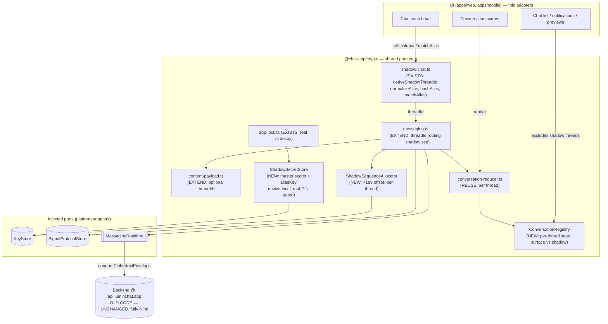
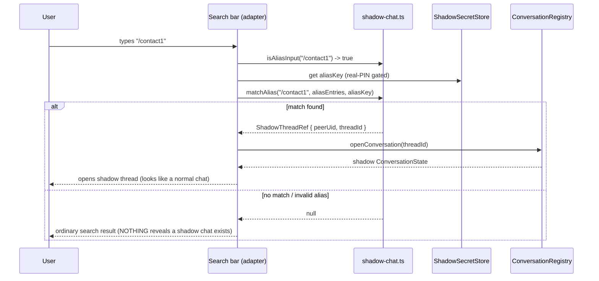
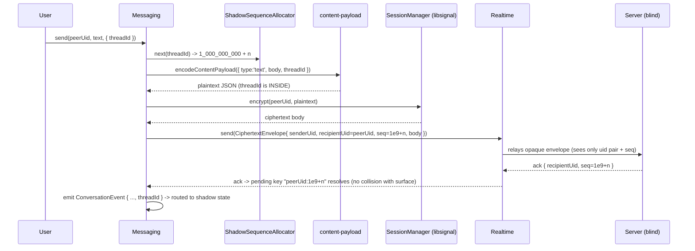
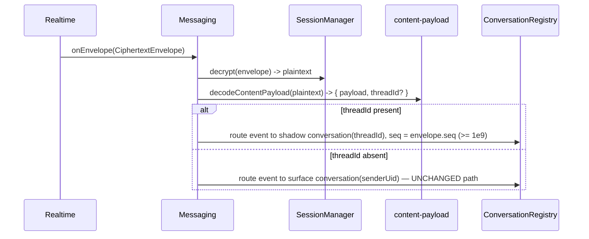

# Design Document: Shadow Chat

> **Spec status / scope.** This is the standalone design doc that Phase 2 deferred. The Phase 2
> design (`.kiro/specs/phase2-messaging-features/design.md`, "Wave 3") explicitly says hidden/decoy
> and shadow chat "require their own design doc before code … because getting key management wrong
> reintroduces the exact 'undecryptable message' failure class Phase 1 just fixed." This document is
> that doc. It covers **Requirement 8** (Hidden chats, **shadow chat**, decoy PIN) and Signature
> Feature 7 (§9 of `private-chat-app-requirements.md`), under cross-cutting requirements **C1**
> (no plaintext on the wire), **C2** (shared pure core), and **C3** (each feature ships pure-core
> unit/property tests).
>
> A previous implementation session built the **pure crypto core** and ran out of budget. This
> design therefore has three jobs: (1) **document what already exists** so it is not re-litigated,
> (2) **design what remains** (messaging integration, per-thread conversation store, the two-client
> e2e test, the UI alias interception, and device-local secret persistence), and (3) do all of that
> **without changing the server wire format**, because the deployed backend at `api.luminchat.app`
> runs old code and cannot be redeployed.

---

## Overview

A **shadow chat** is a completely independent, invisible parallel thread with an existing contact.
The contact already appears in the normal ("surface") chat list; the shadow thread is reachable
**only** by typing a private `/alias` (e.g. `/contact1`) into the chat search bar. Typing the exact
right alias opens that contact's shadow thread; a wrong alias and a non-existent alias are
**indistinguishable** — the app never confirms an alias exists. Each contact has exactly **one**
shadow thread.

The design is shaped end-to-end by one hard constraint: **the server must stay byte-for-byte the
same.** Consequently:

- The shadow **threadId rides inside the encrypted content payload** — the server never sees it and
  stays fully blind. On the wire a shadow message is just another `CiphertextEnvelope` between the
  same two real UIDs.
- The threadId is **deterministic and symmetric**: `deriveShadowThreadId(masterSecret, myUid,
  peerUid)`. Both sides compute the identical id with **no handshake**, and the id never appears in
  cleartext anywhere on the wire.
- Shadow message sequence numbers use a **large offset (`+1e9`)** so they (a) never collide with
  surface seqs in the ack-matching key space, (b) stay contiguous within the thread for gap
  detection, and (c) cannot cross-contaminate surface reactions/timers.
- **Surface chat behaviour is unchanged** whenever no `threadId` is present (absent ⇒ surface).

The pure core lives in `@chat-app/crypto` and is driven by the same injected ports as Phase 1/2
(`KeyStore`, `SignalProtocolStore`, `MessagingRealtime`, …). Plaintext never leaves the device; one
shared `ConversationReducer` render path is reused per thread.

### What already exists (document, do not redesign)

These modules in `packages/crypto/src` are implemented and tested (`shadow-chat.test.ts`,
`secret-hash.test.ts`, `content-payload.test.ts`, `app-lock.test.ts`, `lockout-policy.test.ts`):

| Module | Provides | Notes |
| --- | --- | --- |
| `shadow-chat.ts` | `deriveShadowThreadId`, `canonicalSortUids`, `isAliasInput`, `normalizeAlias`, `hashAlias`, `matchAlias`, `AliasEntry<T>` | Pure WebCrypto HMAC-SHA256. Thread-id is hex HMAC over the canonically-sorted uid pair + `"shadow"`. Alias matching is total and non-short-circuiting. |
| `secret-hash.ts` | `hashSecret`, `verifySecret`, `DEFAULT_SECRET_ITERATIONS` | PBKDF2-HMAC-SHA256, 16-byte salt, self-describing `pbkdf2$sha256$<iters>$<salt>$<hash>`, constant-time compare. Used for hidden-chat secrets and app PINs. |
| `content-payload.ts` | `ContentPayload`, `encodeContentPayload`, `decodeContentPayload`, `CONTENT_PAYLOAD_VERSION` | Versioned `{v:1,type,…}` E2E payload; decode is **total**. **Has no `threadId` field yet** — adding it (backward-compatibly) is part of *what remains*. |
| `app-lock.ts` | `resolveAppMode`, `PinVerifiers`, `AppMode` | Resolves an entered PIN to `real` / `decoy` / `null`; real checked first; `null` is indistinguishable between "no PIN" and "wrong PIN". |
| `lockout-policy.ts` | `evaluateLockout`, `pruneFailures`, `DEFAULT_LOCKOUT_POLICY` | 5 failures / 10 min → 30 min lockout; pure, clock-injected. Layered on top of secret/PIN entry. |

> **Do not modify the cryptographic semantics of these modules.** The one additive change permitted
> in this design is extending `content-payload.ts` with an **optional** `threadId` (see Data Models),
> which preserves backward compatibility and does not touch the wire envelope.

### What remains (designed below)

1. **Messaging integration** — thread the optional `threadId` through the content payload; allocate
   shadow seqs with the `+1e9` offset; route inbound/outbound by `threadId` to the correct surface
   vs shadow conversation; keep the surface path identical when `threadId` is absent.
2. **Per-thread conversation store / reducer** — separate state (history, gap detection,
   reactions/timers) keyed by thread, with shadow threads excluded from the default chat list,
   notifications, and previews.
3. **Two-client end-to-end test** — proving surface and shadow stay fully separated.
4. **UI alias interception** — search-bar `/alias` resolution via `matchAlias`; local hash-only
   alias→thread mappings; nothing reveals a shadow chat exists.
5. **Device-local secret persistence** — the shadow master secret and alias-HMAC key as device-local
   secrets (never to server), gated by the real (not decoy) PIN.

---

## Architecture



**Key architectural point:** every new behaviour is realised by adding a field *inside* the
encrypted body (`threadId`) and by client-side bookkeeping. The `CiphertextEnvelope`, the gateway,
the ack frame, and the codec are **untouched**. The server cannot distinguish a surface message from
a shadow message — both are opaque envelopes between the same UID pair.

---

## Sequence Diagrams

### Opening a shadow thread from the search bar



### Sending a shadow message (wire-compatible)



### Receiving and routing by threadId



---

## Components and Interfaces

### Component 1: `shadow-chat.ts` — derivation + alias system *(EXISTS — reference only)*

**Purpose:** the pure, platform-agnostic primitives for shadow threads and the `/alias` grammar.

**Interface (as implemented):**

```typescript
// Order-independent canonical pairing of two uids; sorted then joined with a single space
// separator so distinct uid pairs cannot collide by concatenation.
export function canonicalSortUids(uidA: string, uidB: string): string;

// shadow_thread_id = hex( HMAC-SHA256(key = shadowMasterSecret,
//                                     data = canonicalSortUids(uidA, uidB) + "shadow") )
// Deterministic + symmetric: both peers derive the same id with no handshake. Throws on empty secret.
export function deriveShadowThreadId(
  shadowMasterSecret: Uint8Array,
  uidA: string,
  uidB: string,
): Promise<string>;

export function isAliasInput(input: string): boolean;          // trimmed startsWith '/'
export function normalizeAlias(input: string): string | null;  // '/'+[a-z0-9]+ lowercased, else null
export function hashAlias(input: string, aliasKey: Uint8Array): Promise<string | null>; // HMAC hex
export interface AliasEntry<T> { aliasHash: string; ref: T; }
export function matchAlias<T>(                                 // total, non-short-circuiting
  input: string,
  entries: ReadonlyArray<AliasEntry<T>>,
  aliasKey: Uint8Array,
): Promise<T | null>;
```

**Responsibilities (already met):** deterministic symmetric thread-id derivation; alias grammar
normalisation; opaque alias hashing (plaintext alias never stored); indistinguishable match (wrong
alias and non-existent alias both yield `null`; every entry is checked so timing does not leak the
match position).

> **Implementation note (accurate to code):** `canonicalSortUids` joins the sorted uids with a
> single ASCII space. The module's own doc-comment mentions "NUL"; the shipped code uses a space.
> The design relies only on the property that the separator makes distinct pairs non-colliding — do
> not "fix" the separator, as that would change every already-derived thread id.

### Component 2: `content-payload.ts` — add optional `threadId` *(EXTEND)*

**Purpose:** carry the shadow threadId *inside* the encrypted body so the server never sees it.

**Change:** add an **optional** top-level `threadId` to the encoded envelope and surface it through
decode, alongside the existing discriminated `type`. Absent ⇒ surface; present ⇒ shadow.

```typescript
// Decoded result now carries the optional routing threadId distinct from the payload kind.
export interface DecodedContentPayload {
  /** The existing discriminated content payload (text/reaction/edit/delete/timer/attachment/…). */
  payload: ContentPayload;
  /** Present ⇒ this message belongs to a shadow thread; absent ⇒ surface chat. */
  threadId?: string;
}

// Encode accepts an optional threadId; when omitted the output is byte-for-byte the pre-shadow form.
export function encodeContentPayload(payload: ContentPayload, threadId?: string): string;

// Decode stays TOTAL. A valid string `threadId`, if present, is preserved; otherwise undefined.
// Everything else (legacy bare string, unknown type, malformed) behaves exactly as today.
export function decodeContentPayload(raw: string): DecodedContentPayload;
```

**Backward compatibility (critical):**
- `encodeContentPayload(p)` with no `threadId` emits the identical string the current code emits, so
  **surface messages are byte-for-byte unchanged** (Property 6).
- `decodeContentPayload` ignores an absent/invalid `threadId` and falls back to surface — a legacy
  Phase 1/2 peer that never sets `threadId` is always treated as surface.
- A legacy peer receiving a `threadId`-bearing payload simply does not understand `threadId` and
  renders the message in the surface chat. This is acceptable because a shadow relationship requires
  **both** peers to hold the shared master secret; a peer without shadow support is, by construction,
  never a shadow counterpart (see Security Considerations → "Rollout & mixed-version peers").

> To keep the change minimal and total, the existing per-`type` validation in `decodeContentPayload`
> is preserved verbatim; `threadId` is read once at the envelope level: `typeof env.threadId ===
> 'string' && env.threadId.length > 0 ? env.threadId : undefined`.

### Component 3: `ShadowSequenceAllocator` *(NEW)*

**Purpose:** allocate shadow seqs that are offset by `+1e9`, contiguous per thread, and disjoint
from surface seqs.

```typescript
/** The offset that separates shadow seqs from surface seqs in the shared ack/reducer key space. */
export const SHADOW_SEQ_OFFSET = 1_000_000_000; // 1e9

/**
 * Allocates strictly-increasing, contiguous shadow sequence numbers for one shadow thread.
 * Backed by a DEDICATED per-thread counter in the KeyStore (conversation key `shadow:${threadId}`),
 * so the underlying counter yields 0,1,2,… and this allocator returns SHADOW_SEQ_OFFSET + n.
 *
 * Implements the existing SequenceAllocator contract so Messaging can use it interchangeably.
 */
export class ShadowSequenceAllocator implements SequenceAllocator {
  constructor(private readonly keyStore: KeyStore, private readonly threadId: string) {}
  // next(_recipientUid) ignores the uid and keys on `shadow:${threadId}`, returns offset + counter.
  next(recipientUid: string): Promise<number>;
}
```

**Why a dedicated counter (not the surface `nextSeq(recipientUid)`):** on the wire, surface and
shadow messages share one server-side uid-pair conversation. If shadow reused the surface counter,
seqs would interleave and shadow seqs would be neither offset nor contiguous. A dedicated counter
keyed by `shadow:${threadId}` gives contiguity (gap detection works), and the `+1e9` offset gives
disjointness (no ack-key or reducer-key collision with surface). `KeyStore.nextSeq` already accepts
an arbitrary conversation key, so **no port change is needed** — the adapter persists the new key
just like any other `conversation_seq` row.

### Component 4: `Messaging` thread routing *(EXTEND `messaging.ts`)*

**Purpose:** thread `threadId` through send/receive without disturbing the surface path.

```typescript
export interface SendOptions {
  viewOnce?: boolean;
  /** When present, the message is sent into the contact's shadow thread (Req 8). Absent ⇒ surface. */
  threadId?: string;
}

// react / editMessage / deleteMessage / setDisappearingTimer gain the same optional { threadId }
// so reactions, edits, deletes and timers stay scoped to the thread they belong to.
```

**Outbound (`send`) changes — additive, guarded by `threadId`:**
1. Choose the allocator: `threadId` present ⇒ `ShadowSequenceAllocator(threadId)` (seq = `1e9+n`);
   else the existing surface allocator (seq = `n`).
2. Encode `encodeContentPayload({ type:'text', body, … }, threadId)` — `threadId` rides inside.
3. Build the envelope exactly as today: `codec.encode({ senderUid, recipientUid, senderDeviceId,
   seq }, body)`. The envelope shape is unchanged; only `seq` differs (`≥1e9` for shadow).
4. Pending key stays `${recipientUid}:${seq}` — unique across surface/shadow because the seq spaces
   are disjoint, so ack matching is correct for both.
5. Emit the `ConversationEvent` tagged with `threadId` so the registry routes it to shadow state.

**Inbound (`onEnvelope`) changes:**
1. Decrypt as today; `decodeContentPayload` now returns `{ payload, threadId }`.
2. If `threadId` present, all emitted events are tagged with that `threadId` (the seq is
   `envelope.seq`, already `≥1e9`); reaction/edit/delete `targetSeq` values are likewise `≥1e9` and
   the existing `targetOutbound`→local-direction flip is unchanged.
3. If `threadId` absent, the path is **identical to today** — surface behaviour byte-for-byte.

> **No new wire frames, no codec change, no ack-format change.** The only on-wire difference for a
> shadow message is that its `seq` is `≥1e9`, which the blind server treats as an ordinary seq.

### Component 5: `ConversationRegistry` — per-thread state *(NEW; reuses the pure reducer)*

**Purpose:** keep separate `ConversationState` per thread (history, gap detection, reactions, timers)
and exclude shadow threads from the chat list / notifications / previews.

```typescript
/** Identifies which conversation a stream of events belongs to. */
export type ConversationKey =
  | { kind: 'surface'; remoteUid: string }
  | { kind: 'shadow'; threadId: string; peerUid: string };

export interface ConversationRegistry {
  /** Apply a (threadId-tagged) ConversationEvent to the correct per-thread state via `reduce`. */
  apply(event: ConversationEvent): void;
  /** Current immutable snapshot for one conversation, creating an empty one on first access. */
  getState(key: ConversationKey): ConversationState;
  /** Chat-list entries for the DEFAULT (surface) view ONLY — shadow threads are never included. */
  listSurfaceConversations(): SurfaceListEntry[];
  /** Whether a notification/preview may be shown for an inbound event (false for shadow). */
  isNotifiable(event: ConversationEvent): boolean;
}
```

**Design:** the registry holds a `Map<string, ConversationState>` keyed by a derived string
(`surface:${remoteUid}` or `shadow:${threadId}`) and dispatches each event through the **existing
pure `reduce`** function — the reducer is not changed. Because each thread has its own state, gap
detection (`computeMissingBefore`) operates only on that thread's seqs, and reactions/timers attach
only within the thread. Shadow keys are tagged `kind: 'shadow'` so `listSurfaceConversations`,
notifications, and previews filter them out (Req 8.2, §9.2).

**Event routing:** `ConversationEvent` gains an optional `threadId` (the reducer ignores it; only the
registry reads it). Surface events carry `remoteUid` (as today) and no `threadId`.

### Component 6: `ShadowSecretStore` — device-local secrets *(NEW)*

**Purpose:** persist the shadow **master secret** and **alias-HMAC key**, and the local alias→thread
mappings (as hashes), strictly on-device and gated by the **real** PIN.

```typescript
export interface ShadowThreadRef { peerUid: string; threadId: string; }

export interface ShadowSecretStore {
  /** Returns the master secret + aliasKey ONLY in real-PIN mode; null in decoy mode (Req 8.1). */
  getShadowContext(mode: AppMode): Promise<{ masterSecret: Uint8Array; aliasKey: Uint8Array } | null>;
  /** Store an alias→thread mapping as an opaque hash entry (plaintext alias never persisted, §9.3). */
  putAlias(entry: AliasEntry<ShadowThreadRef>): Promise<void>;
  /** All alias entries for matchAlias; empty in decoy mode so nothing resolves (Req 8.1). */
  listAliasEntries(mode: AppMode): Promise<ReadonlyArray<AliasEntry<ShadowThreadRef>>>;
}
```

**Relationship to the decoy/real PIN (`app-lock.ts`):** `resolveAppMode(pin, verifiers)` returns
`real` | `decoy` | `null`. The `ShadowSecretStore` only releases the master secret / aliasKey and
only lists alias entries when `mode === 'real'`. In `decoy` mode it returns `null` / `[]`, so no
shadow thread can be derived, matched, or listed — the decoy state cannot even *prove the feature
exists* (Req 8.1, §6.1). The secrets are stored through the existing encrypted `KeyStore` (SQLCipher
on mobile, in-memory on web) and **never** transmitted to the server (C1, §9.3/§9.4).

---

## Data Models

### Shadow content payload (inside the ciphertext only)

```jsonc
// Encrypted as the libsignal plaintext; the server NEVER sees this. Surface = no threadId.
{
  "v": 1,
  "type": "text",                 // or reaction | edit | delete | timer | attachment | …
  "body": "see you at 8",
  "threadId": "9f1c…hex"          // OPTIONAL. Present ⇒ shadow thread. Absent ⇒ surface chat.
}
```

**Validation rules:**
- `threadId`, if present, MUST be a non-empty string; otherwise it is treated as absent (surface).
- `threadId` is opaque to the payload codec — it is produced by `deriveShadowThreadId` and only
  interpreted by the messaging/registry layer.
- All existing `type`-specific validation is unchanged and total.

### Shadow sequence number

```
surface seq:  n            where 0 <= n < SHADOW_SEQ_OFFSET (1e9)
shadow seq:   1e9 + n      contiguous per thread, n from a dedicated `shadow:${threadId}` counter
```

**Invariant:** `surfaceSeq < SHADOW_SEQ_OFFSET <= shadowSeq`, so the two streams are disjoint in the
ack-matching key (`${recipientUid}:${seq}`) and in the reducer key (`${direction}:${seq}`).

> **Sizing note:** JS integers are exact up to 2^53, so `1e9 + n` is exact for any realistic message
> count; surface conversations would need >1e9 messages to reach the offset, which is out of scope.

### Alias entry (device-local, hash-only)

```typescript
AliasEntry<ShadowThreadRef> = {
  aliasHash: string,                 // hex HMAC-SHA256(aliasKey, normalizeAlias(input)); never plaintext
  ref: { peerUid: string, threadId: string },
}
```

### Device-local secrets (never to server)

```typescript
ShadowContext = {
  masterSecret: Uint8Array,   // seeds deriveShadowThreadId; real-PIN gated
  aliasKey:     Uint8Array,   // HMAC key for hashAlias/matchAlias; real-PIN gated
}
```

### Key derivation summary

```
threadId = HMAC-SHA256(masterSecret, canonicalSortUids(myUid, peerUid) + "shadow")   // hex
aliasHash = HMAC-SHA256(aliasKey, normalizeAlias("/contact1"))                        // hex
pinVerifier = pbkdf2$sha256$210000$<saltB64>$<hashB64>                                // secret-hash.ts
```

---

## Key Functions with Formal Specifications

### `ShadowSequenceAllocator.next(recipientUid)`

```typescript
next(recipientUid: string): Promise<number>
```

**Preconditions:**
- The allocator was constructed with a non-empty `threadId`.
- `keyStore.nextSeq` yields strictly-increasing, contiguous counters per conversation key.

**Postconditions:**
- Returns `SHADOW_SEQ_OFFSET + n`, where `n` is the next dedicated counter for `shadow:${threadId}`.
- The returned value is `>= SHADOW_SEQ_OFFSET` and strictly greater than every prior value from this
  thread, increasing by exactly 1 per call (contiguity).
- `recipientUid` does not affect the counter (the thread, not the uid, is the keyspace).
- No side effects beyond advancing the persisted `shadow:${threadId}` counter.

### `encodeContentPayload(payload, threadId?)` / `decodeContentPayload(raw)`

**Preconditions:** `payload` is a valid `ContentPayload`; `threadId`, if provided, is a non-empty
string.

**Postconditions:**
- `decodeContentPayload(encodeContentPayload(p))` ⇒ `{ payload: p }` (no `threadId`) — surface
  round-trip identical to pre-shadow behaviour.
- `decodeContentPayload(encodeContentPayload(p, t))` ⇒ `{ payload: p, threadId: t }` for non-empty
  `t`.
- `decodeContentPayload` is **total**: any input returns a `DecodedContentPayload` without throwing;
  an absent/empty/non-string `threadId` yields `threadId === undefined` (surface).

### `matchAlias(input, entries, aliasKey)` *(EXISTS — spec restated for traceability)*

**Preconditions:** `aliasKey` is non-empty when `input` normalises to a valid alias.

**Postconditions:**
- Returns the `ref` of a stored entry **iff** `input` is a valid alias whose hash equals that entry's
  `aliasHash`; otherwise `null`.
- A grammatically invalid input and a valid-but-unknown alias both return `null` (indistinguishable).
- Every entry is examined (no short-circuit), so the work performed does not reveal the matched
  entry's position.

### `Messaging.send(recipientUid, plaintext, { threadId })`

**Preconditions:** `recipientUid` is an existing contact; if `threadId` is present it equals
`deriveShadowThreadId(masterSecret, myUid, recipientUid)` (resolved by the UI/registry).

**Postconditions:**
- The serialized `CiphertextEnvelope` contains **no `threadId`** and no plaintext (C1); its `seq` is
  `<1e9` for surface and `≥1e9` for shadow.
- The optimistic row and all emitted `ConversationEvent`s are routed to the surface conversation iff
  `threadId` is absent, and to the shadow conversation iff present.
- An expected delivery failure (offline, no recipient device, encrypt failure) marks the message
  `failed` with text retained, identically for surface and shadow.

---

## Algorithmic Pseudocode

### Outbound routing

```pascal
ALGORITHM sendMessage(recipientUid, text, options)
BEGIN
  threadId <- options.threadId            // undefined for surface
  IF threadId IS PRESENT THEN
    allocator <- ShadowSequenceAllocator(keyStore, threadId)   // seq in [1e9, ...)
  ELSE
    allocator <- surfaceAllocator                              // seq in [0, 1e9)
  END IF

  seq <- allocator.next(recipientUid)
  appendOptimisticRow(id, recipientUid, seq, text, threadId)   // tagged for the registry
  emit ConversationEvent(message-appended, threadId)

  sender <- resolveSender(); IF sender IS NULL THEN markFailed(id); RETURN

  TRY
    ensureSession(recipientUid)
    body <- encrypt(recipientUid, encodeContentPayload({type:'text', body:text}, threadId))
  CATCH e
    markFailed(id); RETURN
  END TRY

  envelope <- codec.encode({senderUid: sender.uid, recipientUid, senderDeviceId: sender.deviceId, seq}, body)
  ASSERT envelope has no 'threadId' field AND no plaintext field      // C1, Property 5
  enqueuePending(key = recipientUid + ":" + seq, frame = {kind:'send', envelope})
  IF connected THEN transmit(pending) END IF
END
```

### Inbound routing

```pascal
ALGORITHM onEnvelope(envelope)
BEGIN
  plaintext <- TRY decrypt(envelope) CATCH -> emit inbound-delivery-error; RETURN
  { payload, threadId } <- decodeContentPayload(plaintext)
  conversation <- (threadId IS PRESENT) ? shadow(threadId) : surface(envelope.senderUid)

  // seq is envelope.seq: >=1e9 for shadow, <1e9 for surface — disjoint by construction
  applyPayloadToConversation(conversation, payload, envelope.seq, envelope.senderUid)

  IF threadId IS PRESENT THEN
    suppressNotification()          // shadow never notifies / previews (Req 8.2)
  END IF
END
```

### Alias interception (UI adapter, pure-core calls only)

```pascal
ALGORITHM onSearchInput(text, mode)
BEGIN
  IF NOT isAliasInput(text) THEN RETURN normalSearch(text) END IF
  IF mode <> 'real' THEN RETURN normalSearch(text) END IF        // decoy never resolves (Req 8.1)
  ctx <- shadowSecretStore.getShadowContext(mode)                // null in decoy
  IF ctx IS NULL THEN RETURN normalSearch(text) END IF
  entries <- shadowSecretStore.listAliasEntries(mode)
  ref <- matchAlias(text, entries, ctx.aliasKey)                 // total, indistinguishable
  IF ref IS NULL THEN
    RETURN normalSearch(text)        // wrong/non-existent alias looks like an ordinary search
  ELSE
    RETURN openShadowThread(ref.threadId, ref.peerUid)
  END IF
END
```

---

## Example Usage

```typescript
// --- One-time setup (real-PIN mode only): bind an alias to a contact's shadow thread ---
const { masterSecret, aliasKey } = (await shadowSecretStore.getShadowContext('real'))!;
const threadId = await deriveShadowThreadId(masterSecret, myUid, peerUid); // symmetric, no handshake
const aliasHash = (await hashAlias('/contact1', aliasKey))!;               // plaintext never stored
await shadowSecretStore.putAlias({ aliasHash, ref: { peerUid, threadId } });

// --- Open a shadow thread by typing "/contact1" in the search bar ---
if (isAliasInput(input) && mode === 'real') {
  const ref = await matchAlias(input, await shadowSecretStore.listAliasEntries(mode), aliasKey);
  if (ref) openShadowThread(ref.threadId, ref.peerUid);   // else: ordinary search (no leak)
}

// --- Send into the shadow thread (wire-identical to a surface message except seq >= 1e9) ---
await messaging.send(peerUid, 'meet at the usual place', { threadId });

// --- Surface send is completely unchanged (no threadId) ---
await messaging.send(peerUid, 'hey, lunch tomorrow?');
```

---

## Correctness Properties

*A property is a characteristic or behavior that should hold true across all valid executions of the
system. Each property below is universally quantified and traces to the requirements it validates.
The shadow feature is almost entirely pure-core, so it carries a substantial property set (C3).*

### Property 1: Deterministic, symmetric thread id (no handshake)

*For any* non-empty `masterSecret` and *any* uids `a`, `b`: `deriveShadowThreadId(masterSecret, a, b)
=== deriveShadowThreadId(masterSecret, b, a)`, and the value is stable across calls; *and for any*
two distinct master secrets the derived ids differ (compartmentalisation).

**Validates: Req 8 (shadow), §9.4 — both sides converge with no handshake; id never negotiated.**

### Property 2: Surface/shadow sequence disjointness

*For any* surface seq `u` and *any* shadow seq `v` allocated by the system, `u < 1e9 <= v`. Hence the
ack-matching keys `${recipientUid}:${u}` and `${recipientUid}:${v}` never collide, and the reducer
keys `${direction}:${u}` and `${direction}:${v}` never collide.

**Validates: Req 8.2; the `+1e9` ack-matching + no-cross-contamination constraint.**

### Property 3: Shadow sequence contiguity within a thread

*For any* shadow thread `t`, successive allocations from its `ShadowSequenceAllocator` yield `1e9`,
`1e9+1`, `1e9+2`, … (strictly increasing by exactly 1), so per-thread gap detection is well-defined.

**Validates: Req 8.2 (gap detection stays contiguous within the thread).**

### Property 4: Alias indistinguishability

*For any* `aliasKey`, *any* entry set `E`, and *any* input `x` that is either not a valid normalised
alias **or** whose hash is absent from `E`: `matchAlias(x, E, aliasKey)` returns `null`. A wrong
alias and a non-existent alias are therefore indistinguishable, and the match scan is
non-short-circuiting.

**Validates: Req 8 (shadow), §9.3 — the app never confirms an alias exists.**

### Property 5: No threadId on the wire

*For any* shadow message the client sends, the serialized `CiphertextEnvelope` placed on the
WebSocket contains **no** `threadId` field (it exists only inside the encrypted body) and no
plaintext; the envelope shape is identical to a surface envelope.

**Validates: Req 8.3, C1; the server stays fully blind.**

### Property 6: Surface backward-compatibility (byte-for-byte)

*For any* surface message (no `threadId`), `encodeContentPayload(payload)` produces the exact string
the pre-shadow code produced, and the surface send/receive/reduce path is identical to pre-shadow
behaviour.

**Validates: "surface chat behaviour must be byte-for-byte unchanged when no threadId present".**

### Property 7: Content-payload threadId round-trip + totality

*For any* `payload` and optional non-empty `threadId`,
`decodeContentPayload(encodeContentPayload(payload, threadId))` recovers `payload` and the same
`threadId` (or `undefined` when omitted); *and for any* arbitrary string input, `decodeContentPayload`
returns a result without throwing.

**Validates: Req 8, C1 (payload carries threadId), and the existing total-decode invariant.**

### Property 8: Thread isolation (no cross-thread bleed)

*For any* interleaving of surface and shadow events routed through the `ConversationRegistry`, the
surface `ConversationState` and the shadow `ConversationState` share no message, reaction, edit,
delete, or timer; a reaction/edit/delete/timer applied with a given `threadId` affects only that
thread's state.

**Validates: Req 8.2; reactions/timers cannot cross-contaminate surface.**

### Property 9: Alias plaintext is never persisted

*For any* alias and `aliasKey`, the only stored representation is its HMAC hash (`AliasEntry.aliasHash`);
the normalised/plaintext alias never appears in any persisted structure.

**Validates: §9.3 — alias stored never-plaintext.**

### Property 10: Decoy mode reveals nothing

*For any* state entered with `mode === 'decoy'` (or `null`), `getShadowContext` returns `null` and
`listAliasEntries` returns `[]`, so no thread id can be derived, no alias resolves, and no shadow
thread is listed, notified, or previewed.

**Validates: Req 8.1, §6.1 — decoy never reveals hidden/shadow content.**

> **Property-test library:** `fast-check` (already used across `@chat-app/crypto`, e.g.
> `sequence-allocator.property.test.ts`, `conversation-reducer.property.test.ts`,
> `envelope-codec.property.test.ts`). New property suites: `shadow-sequence-allocator.property.test.ts`,
> `content-payload-threadid.property.test.ts`, and isolation properties in the e2e suite below.

---

## Error Handling

### Scenario 1: Wrong or non-existent alias typed

**Condition:** `matchAlias` returns `null`. **Response:** fall through to the ordinary search path;
show nothing shadow-related. **Recovery:** none needed — by design this is indistinguishable from a
normal search miss (Req 8, §9.3).

### Scenario 2: Decryption failure on an inbound (possibly shadow) envelope

**Condition:** `sessions.decrypt` throws. **Response:** the existing surface behaviour applies — emit
an `inbound-delivery-error` with no plaintext. Because the threadId lives *inside* the (undecryptable)
body, a failed decrypt cannot be attributed to a shadow thread; it is surfaced on the surface
conversation exactly as today. **Recovery:** store-and-forward redelivery / session repair (Phase 1).

### Scenario 3: Shadow secrets unavailable (decoy mode or locked)

**Condition:** `getShadowContext` returns `null`. **Response:** alias interception is disabled; the
search bar behaves normally. **Recovery:** unlock with the real PIN.

### Scenario 4: Legacy peer receives a shadow payload

**Condition:** a counterpart on pre-shadow code receives a `threadId`-bearing payload. **Response:**
the legacy decoder ignores the unknown `threadId` and renders the text on the surface chat.
**Recovery / mitigation:** a shadow relationship requires both peers to share the master secret;
treat a peer with no shadow capability as never being a shadow counterpart (documented threat/rollout
note). No data is lost or mis-encrypted.

### Scenario 5: Ack timeout for a shadow message

**Condition:** no ack within the 30 s deadline. **Response:** the message is marked `failed` with its
text retained, identically to surface (the pending key `${recipientUid}:${seq}` with `seq>=1e9`
resolves on the matching ack, so timeout/ack logic is unchanged).

---

## Testing Strategy

### Unit testing

- **`content-payload.ts` (extended):** threadId round-trip; omitted threadId emits the legacy string
  (Property 6); empty/non-string threadId decodes to surface; decode totality on fuzzed input.
- **`ShadowSequenceAllocator`:** offset correctness, contiguity, independence from `recipientUid`,
  persistence across instances (delegates to a fake `KeyStore`).
- **`ConversationRegistry`:** event routing by key; shadow excluded from `listSurfaceConversations`
  and from `isNotifiable`; per-thread gap detection via the reused `reduce`.
- **`ShadowSecretStore`:** real-PIN release vs decoy `null`/`[]`; hash-only alias persistence.
- Re-run the existing `shadow-chat.test.ts` / `secret-hash.test.ts` / `app-lock.test.ts` unchanged
  to guard the pure core.

### Property-based testing (`fast-check`)

Implements Properties 1–10 above. Notable suites:
- `shadow-sequence-allocator.property.test.ts` → Properties 2, 3.
- `content-payload-threadid.property.test.ts` → Properties 6, 7.
- Alias indistinguishability / plaintext-never-stored → Properties 4, 9 (extend `shadow-chat`
  property coverage).

### Integration / end-to-end testing — **the gating deliverable**

`messaging-shadow-e2e.test.ts` (mirrors `messaging-e2e.test.ts`): two `DefaultMessaging` instances
(client A and client B) wired over an in-memory transport with real libsignal sessions, sharing one
shadow `masterSecret`.

The test MUST prove **surface and shadow stay fully separated**:
1. Both clients independently derive the **same** `threadId` for the pair (Property 1).
2. Interleave surface and shadow sends in both directions; assert each client's surface
   `ConversationState` and shadow `ConversationState` contain only their own messages, with disjoint
   seq ranges (`<1e9` vs `>=1e9`) (Properties 2, 8).
3. Apply a reaction and a disappearing-timer in the shadow thread; assert they do **not** appear in
   the surface thread, and vice-versa (Property 8).
4. Induce a gap in each thread; assert `missingBefore` is computed **per thread** (Property 3).
5. Capture every frame placed on the transport; assert **no `threadId`** and **no plaintext** ever
   appear on the wire, and that the envelope shape equals a surface envelope (Property 5, C1).

This e2e test is the explicit "core first (crypto + messaging) before UI" gate: the UI work below
MUST NOT begin until it passes.

### UI testing (after the e2e gate)

- Search-bar interception: `/alias` opens the right shadow thread; wrong alias is indistinguishable
  from a normal search; decoy mode never resolves.
- Chat-list / notification / preview exclusion of shadow threads (Req 8.2).

---

## Security Considerations

- **Server blindness (C1, Req 8.3):** the threadId lives only inside the encrypted body; on the wire
  shadow and surface are indistinguishable opaque envelopes between the same UID pair. The server
  cannot enumerate or even detect shadow threads.
- **No-handshake derivation (§9.4):** the deterministic symmetric `threadId` means there is no
  setup frame an observer could correlate; both sides converge offline from the shared master secret.
- **Plausible deniability (Req 8.1, §6.1):** the decoy PIN opens a state where `getShadowContext`
  returns `null`; no alias resolves and no shadow thread is listed. The real/decoy resolution
  (`app-lock.ts`) is constant-time at the verifier level (`secret-hash.verifySecret`) and rate-limited
  (`lockout-policy.ts`).
- **Alias secrecy (§9.3):** aliases are stored only as HMAC hashes under a device-local key; a
  device/DB dump reveals neither the alias text nor the existence of a mapping beyond opaque hashes.
- **Wire-format assumption (must be validated by the e2e test):** the design assumes the server
  store-and-forwards and echoes acks by the client-chosen `seq` without enforcing global per-uid-pair
  monotonicity (so interleaved surface seqs `<1e9` and shadow seqs `>=1e9` are both accepted and
  acked). The `messaging-shadow-e2e.test.ts` MUST exercise this against the realtime contract; if the
  live server were found to reject non-monotonic seqs, the offset scheme would need revisiting — but
  **no server change is permitted**, so this assumption is called out as the top integration risk.
- **Threat-model boundary (Req 8.3):** OS-level backups/snapshots and storage-size analysis remain
  out of scope here and are documented in the hidden-chat threat model; this design adds no new
  cleartext at rest beyond the existing encrypted store.

---

## Dependencies

- **Existing pure core (no new deps):** `shadow-chat.ts`, `secret-hash.ts`, `content-payload.ts`,
  `app-lock.ts`, `lockout-policy.ts`, `conversation-reducer.ts`, `messaging.ts`,
  `sequence-allocator.ts`, `session-manager.ts`, `envelope-codec.ts` in `@chat-app/crypto`.
- **Injected ports (unchanged interfaces):** `KeyStore` (reused for the `shadow:${threadId}` counter
  and device-local secrets), `SignalProtocolStore`, `MessagingRealtime`.
- **WebCrypto:** `crypto.subtle` (native on web and Node ≥ 20; React Native via `src/polyfills.ts`).
- **Testing:** `fast-check` (property tests) and the existing in-memory transport/session harness
  used by `messaging-e2e.test.ts`.
- **Server:** **none** — the backend at `api.luminchat.app` is untouched and must remain so.

---

## Out of Scope / Delivery Notes

- **No wire/server changes.** The `CiphertextEnvelope`, gateway, ack format, and codec are frozen.
- **Core-first sequencing.** Implementation order is: extend `content-payload` → `ShadowSequenceAllocator`
  → messaging routing → `ConversationRegistry` → **`messaging-shadow-e2e.test.ts` (gate)** → UI
  interception → `ShadowSecretStore` persistence. UI work does not start until the e2e test passes.
- **Delivery note (not part of this design's scope):** the team intends to install the Android SDK to
  validate CI locally and land the work in single PRs. That is a delivery/CI concern captured here for
  planning only; it does not affect the design surface above.
- **Multi-device shadow sync (Req 9)** is explicitly out of scope; shadow threads follow the current
  single-device model until multi-device is designed.
