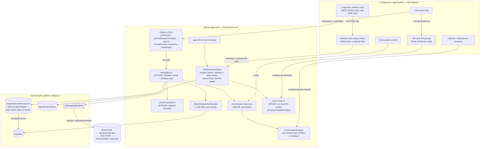
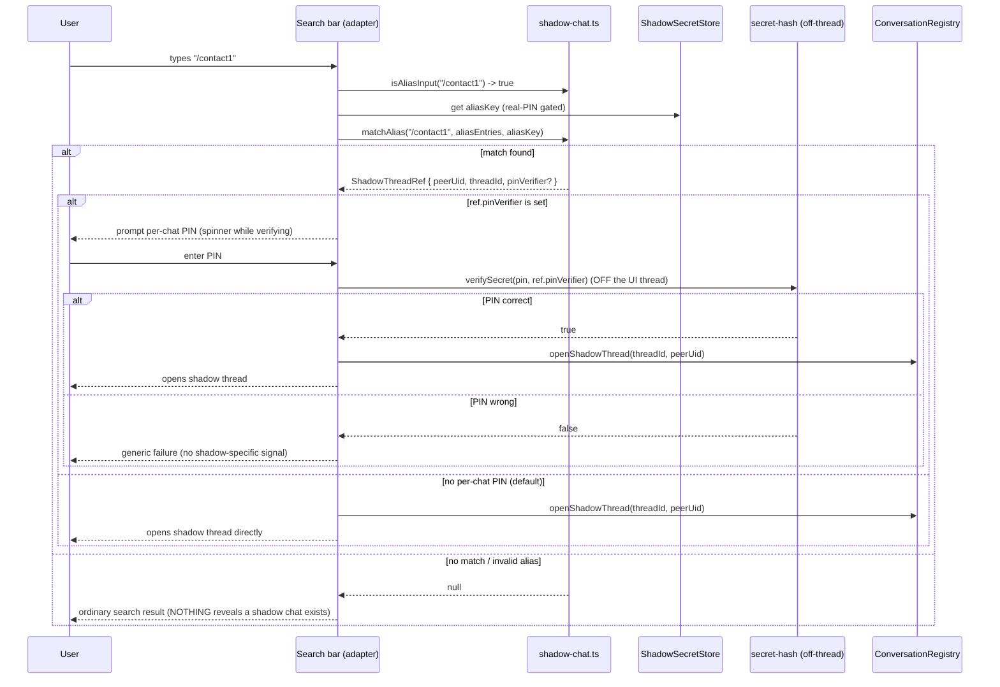
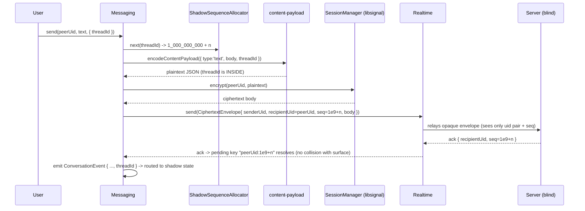
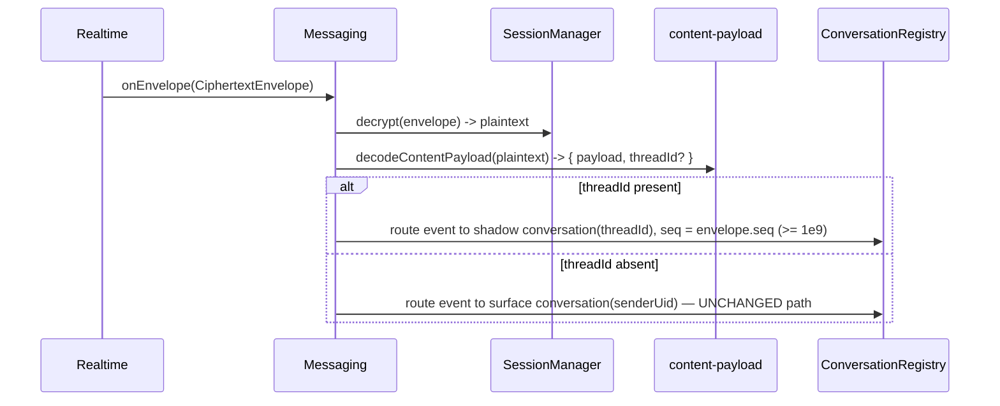

# Design Document: Shadow Chat

> **Spec status / scope.** This is the standalone design doc that Phase 2 deferred. The Phase 2
> design (`.kiro/specs/phase2-messaging-features/design.md`, "Wave 3") explicitly says hidden/decoy
> and shadow chat "require their own design doc before code … because getting key management wrong
> reintroduces the exact 'undecryptable message' failure class Phase 1 just fixed." This document is
> that doc. It covers **Requirement 8** (Hidden chats, **shadow chat**, decoy PIN) and Signature
> Feature 7 (§9 of `private-chat-app-requirements.md`), under cross-cutting requirements **C1**
> (no plaintext on the wire), **C2** (shared pure core), and **C3** (each feature ships pure-core
> unit/property tests).
>
> A previous implementation session built the **pure crypto core** and ran out of budget. This
> design therefore has three jobs: (1) **document what already exists** so it is not re-litigated,
> (2) **design what remains** (messaging integration, per-thread conversation store, the two-client
> e2e test, the UI alias interception, and device-local secret persistence), and (3) do all of that
> **without changing the server wire format**, because the deployed backend at `api.luminchat.app`
> runs old code and cannot be redeployed.

---

## Design Update — Full-Vision Evolution (additive, this revision)

> **Status of this revision.** The first implementation wave shipped the **pure crypto core**,
> sequence allocation, per-thread isolation, the two-client e2e gate, and search-bar `/alias`
> interception. It deliberately left out the *provisioning/binding UI*, so until an alias is bound
> every `/alias` falls through to ordinary search — which is exactly why the feature "appears to
> disappear." This revision extends the design to the **full vision** while preserving everything
> that does not conflict. Sections changed by this revision are marked **(UPDATED — full vision)**;
> new sections are marked **(NEW — full vision)**. Everything else is unchanged from the reviewed
> baseline and still holds.

**What this revision adds / changes (summary):**

1. **Creation flow (NEW).** A **long-press** on a chat-list row or a contact/new-chat row opens an
   overlay popup menu containing a **"Shadow chat"** action. It opens a creation sheet where the user
   types a secret **alias** (must start with `/`, e.g. `/chat1`) and an **optional per-chat PIN that
   is blank by default**. Creating a shadow chat never touches the contact's surface chat. The
   long-press menu is built as a **proper full-screen overlay with explicit z-order** (a `Modal`
   portal), so it cannot repeat the separate, out-of-scope ⋮-menu-behind-messages bug.

2. **Unlimited shadow chats per contact and overall (UPDATED — CONFLICTS with the frozen baseline).**
   The baseline derived **exactly one** thread per contact pair via
   `deriveShadowThreadId(masterSecret, uidA, uidB)`. To allow **many** distinct shadow threads per
   contact, the derivation now incorporates a **per-chat discriminator (the normalized alias)** so
   distinct aliases for the same pair yield distinct `threadId`s. This is an **explicit, reviewed
   cryptographic deviation** from the previously frozen `shadow-chat.ts` semantics — see the
   **"Reviewed cryptographic deviation"** callout in Component 1. It stays deterministic, symmetric,
   handshake-free (both peers converge from the **shared masterSecret + the shared alias**), and is
   **backward compatible**: called with no discriminator it reproduces the **byte-for-byte legacy
   id**, so already-derived single-thread ids keep working with no forced migration.

3. **Optional per-chat PIN (NEW; default = NO PIN).** Each shadow chat may carry its own PIN, but it
   is **a simple optional lock the user freely opts into — never required and never a separate gating
   concept.** At creation the PIN field is **blank by default**; the user MAY set a PIN or skip it,
   entirely their choice. **It can also be added, changed, or removed LATER** on an already-created
   shadow chat (e.g. from a chat settings/options action) — not only at creation time. Re-entry by
   typing the `/alias` prompts for that per-chat PIN **only if one is currently set**; otherwise it
   opens directly. The PIN is stored **hash-only** (reusing `secret-hash.ts` PBKDF2) on the
   `AliasEntry`, never plaintext, never sent to the server. Verification (and any later set/change)
   runs **off the UI thread** (the existing off-thread `Pbkdf2Provider`) so the app never freezes.
   **Trade-off documented:** with no-PIN-by-default, the secrecy of the alias itself is the only lock.

> **Note (this revision).** The per-chat PIN is a **simple optional lock** — fully user-opt-in, never
> mandatory — and can be set at creation **or added/changed/removed later** on an existing shadow chat.

4. **Durable encrypted persistence (UPDATED).** Shadow secrets and alias→thread mappings now bind to
   the existing **encrypted on-device vault** (SQLCipher on mobile) so they **survive app restarts**.
   The baseline's `ShadowSecretPersistence` port is unchanged; this revision specifies a **durable
   adapter** for it (the previous in-memory/unprovisioned hint was the other reason the feature seemed
   to vanish across restarts).

5. **Decoy / locked mode stays inert (UPDATED to cover creation).** In `decoy` or `null`
   (non-`real`) App_Mode the long-press **"Shadow chat" option does not appear**, and typing a
   `/alias` does nothing special (ordinary search). A forced unlock cannot create or expose shadow
   chats; all decoy-reveals-nothing properties remain intact.

6. **Default visibility = fully hidden (UPDATED).** A created shadow chat stays **fully hidden** and
   is re-enterable **only** by typing its `/alias`. A future **"pin to main list"** option was
   considered and **intentionally left out** for now; the design keeps it addable later without
   rework (see Component 5 note).

**Downstream impact (tracked, not designed here):**

- This revision **supersedes** the baseline's one-shadow-thread-per-contact rule (baseline
  Requirement 1.7 / Glossary "each contact has exactly **one** Shadow_Thread"). `requirements.md` and
  `tasks.md` will need a follow-up pass to match (multiple aliased threads per contact; per-chat PIN;
  durable persistence; the creation/long-press UI). Those edits are out of this design pass.
- **Out of scope (separate fixes, referenced only):** the two UI-layout bugs — (a) status-bar/notch
  overlap and (b) the **⋮ overflow menu drawing behind messages** — are tracked separately. They are
  *not* designed here; the only cross-reference is that the **new long-press overlay is explicitly
  designed to avoid the same z-order class of bug** (see Component 7).

The **frozen-server / no-wire-change** constraint is preserved everywhere below: the discriminated
`threadId` still rides only inside the encrypted content payload, sequence offsets are unchanged, and
no envelope/ack/codec field changes.

---

## Overview

A **shadow chat** is a completely independent, invisible parallel thread with an existing contact.
The contact already appears in the normal ("surface") chat list; the shadow thread is reachable
**only** by typing a private `/alias` (e.g. `/contact1`) into the chat search bar. Typing the exact
right alias opens that contact's shadow thread; a wrong alias and a non-existent alias are
**indistinguishable** — the app never confirms an alias exists. **(UPDATED — full vision)** A contact
may have **any number** of shadow threads (and there is no overall cap): each is created from the
long-press **"Shadow chat"** action and is keyed by a distinct `/alias`. A shadow chat may
**optionally** carry its own per-chat PIN (blank by default).

The design is shaped end-to-end by one hard constraint: **the server must stay byte-for-byte the
same.** Consequently:

- The shadow **threadId rides inside the encrypted content payload** — the server never sees it and
  stays fully blind. On the wire a shadow message is just another `CiphertextEnvelope` between the
  same two real UIDs.
- The threadId is **deterministic and symmetric**: **(UPDATED — full vision)**
  `deriveShadowThreadId(masterSecret, myUid, peerUid, alias?)`. Both sides compute the identical id
  with **no handshake** from the shared `masterSecret` **and the shared `alias`**, and the id never
  appears in cleartext anywhere on the wire. When `alias` is omitted the function reproduces the
  **byte-for-byte legacy** (single-thread) id, so existing threads are unaffected.
- Shadow message sequence numbers use a **large offset (`+1e9`)** so they (a) never collide with
  surface seqs in the ack-matching key space, (b) stay contiguous within the thread for gap
  detection, and (c) cannot cross-contaminate surface reactions/timers.
- **Surface chat behaviour is unchanged** whenever no `threadId` is present (absent ⇒ surface).

The pure core lives in `@chat-app/crypto` and is driven by the same injected ports as Phase 1/2
(`KeyStore`, `SignalProtocolStore`, `MessagingRealtime`, …). Plaintext never leaves the device; one
shared `ConversationReducer` render path is reused per thread.

### What already exists (document, do not redesign)

These modules in `packages/crypto/src` are implemented and tested (`shadow-chat.test.ts`,
`secret-hash.test.ts`, `content-payload.test.ts`, `app-lock.test.ts`, `lockout-policy.test.ts`):

| Module | Provides | Notes |
| --- | --- | --- |
| `shadow-chat.ts` | `deriveShadowThreadId`, `canonicalSortUids`, `isAliasInput`, `normalizeAlias`, `hashAlias`, `matchAlias`, `AliasEntry<T>` | Pure WebCrypto HMAC-SHA256. Thread-id is hex HMAC over the canonically-sorted uid pair + `"shadow"`. Alias matching is total and non-short-circuiting. |
| `secret-hash.ts` | `hashSecret`, `verifySecret`, `DEFAULT_SECRET_ITERATIONS` | PBKDF2-HMAC-SHA256, 16-byte salt, self-describing `pbkdf2$sha256$<iters>$<salt>$<hash>`, constant-time compare. Used for hidden-chat secrets and app PINs. |
| `content-payload.ts` | `ContentPayload`, `encodeContentPayload`, `decodeContentPayload`, `CONTENT_PAYLOAD_VERSION` | Versioned `{v:1,type,…}` E2E payload; decode is **total**. **Has no `threadId` field yet** — adding it (backward-compatibly) is part of *what remains*. |
| `app-lock.ts` | `resolveAppMode`, `PinVerifiers`, `AppMode` | Resolves an entered PIN to `real` / `decoy` / `null`; real checked first; `null` is indistinguishable between "no PIN" and "wrong PIN". |
| `lockout-policy.ts` | `evaluateLockout`, `pruneFailures`, `DEFAULT_LOCKOUT_POLICY` | 5 failures / 10 min → 30 min lockout; pure, clock-injected. Layered on top of secret/PIN entry. |

> **Do not modify the cryptographic semantics of these modules.** The one additive change permitted
> in this design is extending `content-payload.ts` with an **optional** `threadId` (see Data Models),
> which preserves backward compatibility and does not touch the wire envelope.

### What remains (designed below)

1. **Messaging integration** — thread the optional `threadId` through the content payload; allocate
   shadow seqs with the `+1e9` offset; route inbound/outbound by `threadId` to the correct surface
   vs shadow conversation; keep the surface path identical when `threadId` is absent.
2. **Per-thread conversation store / reducer** — separate state (history, gap detection,
   reactions/timers) keyed by thread, with shadow threads excluded from the default chat list,
   notifications, and previews.
3. **Two-client end-to-end test** — proving surface and shadow stay fully separated.
4. **UI alias interception** — search-bar `/alias` resolution via `matchAlias`; local hash-only
   alias→thread mappings; nothing reveals a shadow chat exists.
5. **Device-local secret persistence** — the shadow master secret and alias-HMAC key as device-local
   secrets (never to server), gated by the real (not decoy) PIN.

**Added in this revision (full vision), designed below:**

6. **Creation flow (Component 7)** — a long-press overlay menu with a **"Shadow chat"** action and a
   creation sheet (alias + optional per-chat PIN), real-mode only, never disturbing the surface chat.
7. **Alias-discriminated derivation (Component 1, reviewed deviation)** — `deriveShadowThreadId` gains
   an optional alias discriminator so a contact can hold **many** distinct shadow threads.
8. **Per-chat PIN (Component 8)** — an optional, hash-only, off-thread-verified PIN gate per shadow
   chat (default: none).
9. **Durable encrypted persistence (Component 6, updated)** — the `ShadowSecretPersistence` port is
   bound to a durable SQLCipher-backed adapter so shadow chats survive restarts.

---

## Architecture



**Key architectural point:** every new behaviour is realised by adding a field *inside* the
encrypted body (`threadId`) and by client-side bookkeeping. The `CiphertextEnvelope`, the gateway,
the ack frame, and the codec are **untouched**. The server cannot distinguish a surface message from
a shadow message — both are opaque envelopes between the same UID pair.

---

## Sequence Diagrams

### Creating a shadow chat from a long-press **(NEW — full vision)**

```mermaid
sequenceDiagram
    participant U as User
    participant ROW as Chat-list / contact row
    participant LP as Long-press overlay (Modal portal)
    participant SHEET as Creation sheet
    participant SS as ShadowSecretStore
    participant SH as secret-hash (off-thread)
    participant REG as ConversationRegistry

    U->>ROW: press-and-hold (long-press)
    ROW->>LP: open overlay menu (z-order above all rows)
    alt App_Mode === 'real'
        LP-->>U: shows "Shadow chat" action (+ other row actions)
        U->>LP: tap "Shadow chat"
        LP->>SHEET: open creation sheet (alias field; optional PIN, BLANK by default)
        U->>SHEET: enter alias "/chat1"  (PIN left blank)
        SHEET->>SS: bindAlias('real', "/chat1", peerUid, myUid, pin?)
        opt per-chat PIN provided
            SS->>SH: hashSecret(pin)  (off-thread PBKDF2)
            SH-->>SS: pinVerifier
        end
        SS->>SS: derive threadId(masterSecret, myUid, peerUid, "/chat1") + hashAlias
        SS->>SS: persist AliasEntry { aliasHash, ref:{peerUid, threadId, pinVerifier?} } (durable, encrypted)
        SS-->>SHEET: ShadowThreadRef (surface chat untouched)
        SHEET->>REG: openShadowThread(threadId, peerUid)
        SHEET-->>U: closes; shadow chat stays HIDDEN (re-enter only via "/chat1")
    else App_Mode !== 'real' (decoy / locked)
        LP-->>U: NO "Shadow chat" action appears (ordinary row actions only)
    end
```

### Opening a shadow thread from the search bar **(UPDATED — optional PIN branch)**



### Sending a shadow message (wire-compatible)



### Receiving and routing by threadId



---

## Components and Interfaces

### Component 1: `shadow-chat.ts` — derivation + alias system *(UPDATED — full vision)*

**Purpose:** the pure, platform-agnostic primitives for shadow threads and the `/alias` grammar.

**Interface (as implemented, with the additive discriminator):**

```typescript
// Order-independent canonical pairing of two uids; sorted then joined with a single space
// separator so distinct uid pairs cannot collide by concatenation.
export function canonicalSortUids(uidA: string, uidB: string): string;

// shadow_thread_id = hex( HMAC-SHA256(key = shadowMasterSecret,
//                                     data = canonicalSortUids(uidA, uidB) + "shadow"
//                                            [ + US(0x1f) + normalizeAlias(alias) ]) )
//
// (UPDATED — full vision) `alias` is an OPTIONAL per-chat discriminator that lets one contact pair
// hold MANY distinct shadow threads. Deterministic + symmetric: both peers derive the same id with
// no handshake from the shared masterSecret AND the shared alias. When `alias` is omitted (or empty)
// the function emits the BYTE-FOR-BYTE legacy id, so already-derived single-thread ids are unchanged.
// Throws on empty secret, empty/identical uids, or (when supplied) a grammatically invalid alias.
export function deriveShadowThreadId(
  shadowMasterSecret: Uint8Array,
  uidA: string,
  uidB: string,
  alias?: string,
): Promise<string>;

export function isAliasInput(input: string): boolean;          // trimmed startsWith '/'
export function normalizeAlias(input: string): string | null;  // '/'+[a-z0-9]+ lowercased, else null
export function hashAlias(input: string, aliasKey: Uint8Array): Promise<string | null>; // HMAC hex
export interface AliasEntry<T> { aliasHash: string; ref: T; }
export function matchAlias<T>(                                 // total, non-short-circuiting
  input: string,
  entries: ReadonlyArray<AliasEntry<T>>,
  aliasKey: Uint8Array,
): Promise<T | null>;
```

**Responsibilities (already met):** deterministic symmetric thread-id derivation; alias grammar
normalisation; opaque alias hashing (plaintext alias never stored); indistinguishable match (wrong
alias and non-existent alias both yield `null`; every entry is checked so timing does not leak the
match position).

> **Implementation note (accurate to code):** `canonicalSortUids` joins the sorted uids with a
> single ASCII space. The module's own doc-comment mentions "NUL"; the shipped code uses a space.
> The design relies only on the property that the separator makes distinct pairs non-colliding — do
> not "fix" the separator, as that would change every already-derived thread id.

> ### ⚠ Reviewed cryptographic deviation — alias-discriminated `threadId` **(NEW — full vision)**
>
> The prior security review **froze** `shadow-chat.ts` ("do not modify the cryptographic
> semantics"). This revision makes ONE deliberate, reviewed change: `deriveShadowThreadId` gains an
> **optional** trailing `alias` discriminator. This callout documents the change so it is not
> re-litigated.
>
> **Why.** The baseline derived exactly one thread per contact pair, so a contact could have at most
> one shadow chat. The full vision requires **unlimited** shadow chats per contact. Mixing a per-chat
> discriminator into the derivation makes distinct aliases for the same pair yield distinct
> `threadId`s.
>
> **What, precisely.** When `alias` is present and grammatically valid, the HMAC input becomes
> `canonicalSortUids(uidA, uidB) + "shadow" + US + normalizeAlias(alias)`, where `US` is the ASCII
> **Unit Separator `0x1f`**. The discriminator is the **normalized alias text** (e.g. `/chat1`),
> **not** the alias *hash*: the alias hash is keyed by the **device-local** `aliasKey` (which is not
> shared between peers), whereas the normalized alias text is shared knowledge between the two peers
> (same as the masterSecret). Using the text keeps the id **symmetric across peers with only
> `masterSecret` + `alias` shared** — no handshake, exactly as before.
>
> **Backward compatibility (no forced migration).** With `alias` omitted/empty, the HMAC input is
> identical to the legacy `canonicalSortUids(...) + "shadow"`, so the function returns the **exact
> legacy bytes**. Already-derived single-thread ids therefore keep working unchanged; and because the
> resolved `threadId` is what the `AliasEntry.ref` stores and what messaging routes on, no stored
> mapping needs rewriting. Existing one-per-contact threads simply continue as the
> no-discriminator id; new aliased threads always derive WITH the discriminator. (If a team later
> wants legacy threads to also carry an alias label, that is a re-binding, not a forced migration.)
>
> **Collision resistance / space disjointness.**
>   - For a fixed pair, two distinct normalized aliases produce distinct HMAC inputs (the suffix
>     after the fixed `…"shadow"` prefix differs), hence distinct ids by HMAC-SHA256
>     collision-resistance.
>   - The `US (0x1f)` separator cannot occur in a normalized alias (`/[a-z0-9]+`) nor in a Firebase
>     UID, so the boundary between `"shadow"` and the discriminator is unambiguous AND a discriminated
>     id can never equal a non-discriminated (legacy) id for ANY inputs — the legacy and
>     discriminated id-spaces are **disjoint**.
>   - Distinct contact pairs still produce distinct `canonicalSortUids` prefixes, so cross-pair
>     collisions remain impossible.
>
> **Invariants preserved.** Server-blind (the id still lives only inside the encrypted body),
> wire-compatible (no envelope/ack/codec change), no-handshake (both peers converge offline from
> shared `masterSecret` + shared `alias`), 64-char lowercase-hex output, and compartmentalisation by
> `masterSecret`. Only `content-payload.ts`'s additive `threadId` and this optional discriminator are
> the permitted changes to the frozen core.

### Component 2: `content-payload.ts` — add optional `threadId` *(EXTEND)*

**Purpose:** carry the shadow threadId *inside* the encrypted body so the server never sees it.

**Change:** add an **optional** top-level `threadId` to the encoded envelope and surface it through
decode, alongside the existing discriminated `type`. Absent ⇒ surface; present ⇒ shadow.

```typescript
// Decoded result now carries the optional routing threadId distinct from the payload kind.
export interface DecodedContentPayload {
  /** The existing discriminated content payload (text/reaction/edit/delete/timer/attachment/…). */
  payload: ContentPayload;
  /** Present ⇒ this message belongs to a shadow thread; absent ⇒ surface chat. */
  threadId?: string;
}

// Encode accepts an optional threadId; when omitted the output is byte-for-byte the pre-shadow form.
export function encodeContentPayload(payload: ContentPayload, threadId?: string): string;

// Decode stays TOTAL. A valid string `threadId`, if present, is preserved; otherwise undefined.
// Everything else (legacy bare string, unknown type, malformed) behaves exactly as today.
export function decodeContentPayload(raw: string): DecodedContentPayload;
```

**Backward compatibility (critical):**
- `encodeContentPayload(p)` with no `threadId` emits the identical string the current code emits, so
  **surface messages are byte-for-byte unchanged** (Property 6).
- `decodeContentPayload` ignores an absent/invalid `threadId` and falls back to surface — a legacy
  Phase 1/2 peer that never sets `threadId` is always treated as surface.
- A legacy peer receiving a `threadId`-bearing payload simply does not understand `threadId` and
  renders the message in the surface chat. This is acceptable because a shadow relationship requires
  **both** peers to hold the shared master secret; a peer without shadow support is, by construction,
  never a shadow counterpart (see Security Considerations → "Rollout & mixed-version peers").

> To keep the change minimal and total, the existing per-`type` validation in `decodeContentPayload`
> is preserved verbatim; `threadId` is read once at the envelope level: `typeof env.threadId ===
> 'string' && env.threadId.length > 0 ? env.threadId : undefined`.

### Component 3: `ShadowSequenceAllocator` *(NEW)*

**Purpose:** allocate shadow seqs that are offset by `+1e9`, contiguous per thread, and disjoint
from surface seqs.

```typescript
/** The offset that separates shadow seqs from surface seqs in the shared ack/reducer key space. */
export const SHADOW_SEQ_OFFSET = 1_000_000_000; // 1e9

/**
 * Allocates strictly-increasing, contiguous shadow sequence numbers for one shadow thread.
 * Backed by a DEDICATED per-thread counter in the KeyStore (conversation key `shadow:${threadId}`),
 * so the underlying counter yields 0,1,2,… and this allocator returns SHADOW_SEQ_OFFSET + n.
 *
 * Implements the existing SequenceAllocator contract so Messaging can use it interchangeably.
 */
export class ShadowSequenceAllocator implements SequenceAllocator {
  constructor(private readonly keyStore: KeyStore, private readonly threadId: string) {}
  // next(_recipientUid) ignores the uid and keys on `shadow:${threadId}`, returns offset + counter.
  next(recipientUid: string): Promise<number>;
}
```

**Why a dedicated counter (not the surface `nextSeq(recipientUid)`):** on the wire, surface and
shadow messages share one server-side uid-pair conversation. If shadow reused the surface counter,
seqs would interleave and shadow seqs would be neither offset nor contiguous. A dedicated counter
keyed by `shadow:${threadId}` gives contiguity (gap detection works), and the `+1e9` offset gives
disjointness (no ack-key or reducer-key collision with surface). `KeyStore.nextSeq` already accepts
an arbitrary conversation key, so **no port change is needed** — the adapter persists the new key
just like any other `conversation_seq` row.

### Component 4: `Messaging` thread routing *(EXTEND `messaging.ts`)*

**Purpose:** thread `threadId` through send/receive without disturbing the surface path.

```typescript
export interface SendOptions {
  viewOnce?: boolean;
  /** When present, the message is sent into the contact's shadow thread (Req 8). Absent ⇒ surface. */
  threadId?: string;
}

// react / editMessage / deleteMessage / setDisappearingTimer gain the same optional { threadId }
// so reactions, edits, deletes and timers stay scoped to the thread they belong to.
```

**Outbound (`send`) changes — additive, guarded by `threadId`:**
1. Choose the allocator: `threadId` present ⇒ `ShadowSequenceAllocator(threadId)` (seq = `1e9+n`);
   else the existing surface allocator (seq = `n`).
2. Encode `encodeContentPayload({ type:'text', body, … }, threadId)` — `threadId` rides inside.
3. Build the envelope exactly as today: `codec.encode({ senderUid, recipientUid, senderDeviceId,
   seq }, body)`. The envelope shape is unchanged; only `seq` differs (`≥1e9` for shadow).
4. Pending key stays `${recipientUid}:${seq}` — unique across surface/shadow because the seq spaces
   are disjoint, so ack matching is correct for both.
5. Emit the `ConversationEvent` tagged with `threadId` so the registry routes it to shadow state.

**Inbound (`onEnvelope`) changes:**
1. Decrypt as today; `decodeContentPayload` now returns `{ payload, threadId }`.
2. If `threadId` present, all emitted events are tagged with that `threadId` (the seq is
   `envelope.seq`, already `≥1e9`); reaction/edit/delete `targetSeq` values are likewise `≥1e9` and
   the existing `targetOutbound`→local-direction flip is unchanged.
3. If `threadId` absent, the path is **identical to today** — surface behaviour byte-for-byte.

> **No new wire frames, no codec change, no ack-format change.** The only on-wire difference for a
> shadow message is that its `seq` is `≥1e9`, which the blind server treats as an ordinary seq.

### Component 5: `ConversationRegistry` — per-thread state *(NEW; reuses the pure reducer)*

**Purpose:** keep separate `ConversationState` per thread (history, gap detection, reactions, timers)
and exclude shadow threads from the chat list / notifications / previews.

```typescript
/** Identifies which conversation a stream of events belongs to. */
export type ConversationKey =
  | { kind: 'surface'; remoteUid: string }
  | { kind: 'shadow'; threadId: string; peerUid: string };

export interface ConversationRegistry {
  /** Apply a (threadId-tagged) ConversationEvent to the correct per-thread state via `reduce`. */
  apply(event: ConversationEvent): void;
  /** Current immutable snapshot for one conversation, creating an empty one on first access. */
  getState(key: ConversationKey): ConversationState;
  /** Chat-list entries for the DEFAULT (surface) view ONLY — shadow threads are never included. */
  listSurfaceConversations(): SurfaceListEntry[];
  /** Whether a notification/preview may be shown for an inbound event (false for shadow). */
  isNotifiable(event: ConversationEvent): boolean;
}
```

**Design:** the registry holds a `Map<string, ConversationState>` keyed by a derived string
(`surface:${remoteUid}` or `shadow:${threadId}`) and dispatches each event through the **existing
pure `reduce`** function — the reducer is not changed. Because each thread has its own state, gap
detection (`computeMissingBefore`) operates only on that thread's seqs, and reactions/timers attach
only within the thread. Shadow keys are tagged `kind: 'shadow'` so `listSurfaceConversations`,
notifications, and previews filter them out (Req 8.2, §9.2).

**Event routing:** `ConversationEvent` gains an optional `threadId` (the reducer ignores it; only the
registry reads it). Surface events carry `remoteUid` (as today) and no `threadId`.

> **Default visibility — fully hidden (UPDATED — full vision).** A created shadow chat is **never**
> added to the default chat list: `listSurfaceConversations()` returns surface entries only, and a
> shadow thread is re-enterable **only** by typing its `/alias`. This is unchanged registry
> behaviour — the registry already excludes shadow threads — and is now an explicit product decision
> (the user did not opt into pinning a shadow chat onto the main list).
>
> **Future "pin to main list" (considered, intentionally deferred).** A future option could let a
> user *opt in* to surfacing a specific shadow chat on the main list. The design keeps this addable
> **without rework**: it would be a separate, user-driven projection (e.g. a `listPinnedShadow()`
> accessor or a `pinned` flag on the shadow entry) layered on top of the registry — the isolation
> invariant (Property 8) and the *default* exclusion stay exactly as they are; only an explicit,
> per-chat opt-in would ever promote a shadow thread into a visible list. It is **out of scope** for
> this revision and no code path auto-promotes a shadow chat today.

### Component 6: `ShadowSecretStore` — device-local secrets *(UPDATED — full vision)*

**Purpose:** persist the shadow **master secret** and **alias-HMAC key**, and the local alias→thread
mappings (as hashes, now carrying an optional per-chat PIN verifier), strictly on-device, **durably**,
and gated by the **real** PIN.

```typescript
export interface ShadowThreadRef {
  peerUid: string;
  threadId: string;
  /**
   * (NEW — full vision) Optional per-chat PIN verifier (`pbkdf2$sha256$…` from `secret-hash.ts`).
   * Present ⇒ re-entry requires this PIN; ABSENT (the default) ⇒ the chat opens directly. Hash-only:
   * the plaintext PIN is never stored and never sent to the server.
   */
  pinVerifier?: string;
}

export interface ShadowSecretStore {
  /** Returns the master secret + aliasKey ONLY in real-PIN mode; null in decoy mode (Req 8.1). */
  getShadowContext(mode: AppMode): Promise<{ masterSecret: Uint8Array; aliasKey: Uint8Array } | null>;
  /** Store an alias→thread mapping as an opaque hash entry (plaintext alias never persisted, §9.3). */
  putAlias(entry: AliasEntry<ShadowThreadRef>): Promise<void>;
  /** All alias entries for matchAlias; empty in decoy mode so nothing resolves (Req 8.1). */
  listAliasEntries(mode: AppMode): Promise<ReadonlyArray<AliasEntry<ShadowThreadRef>>>;

  /**
   * (UPDATED — full vision) Bind an alias to a contact's shadow thread in real-PIN mode, deriving the
   * (alias-discriminated) threadId and persisting a hash-only AliasEntry. `pin` is OPTIONAL and BLANK
   * BY DEFAULT; when provided it is hashed via `secret-hash.hashSecret` (off-thread) and stored as
   * `ref.pinVerifier`. Returns null (persisting nothing) in any non-real mode. Never persists the
   * plaintext alias or the plaintext PIN.
   */
  bindAlias(
    mode: AppMode,
    alias: string,
    peerUid: string,
    myUid: string,
    pin?: string,
  ): Promise<ShadowThreadRef | null>;

  /**
   * (NEW — full vision) Set, change, or remove the per-chat PIN on an ALREADY-CREATED shadow chat —
   * the optional lock is not fixed at creation time. In `real` mode only: when `newPin` is a non-empty
   * string it is hashed via `secret-hash.hashSecret` (OFF the UI thread) and written to the matching
   * entry's `ref.pinVerifier`; when `newPin` is `null` the verifier is CLEARED (set to `undefined`),
   * removing the lock so the chat opens directly again. The updated entry is persisted durably and
   * hash-only (plaintext PIN never stored, never transmitted). Returns the updated `ShadowThreadRef`,
   * or `null` (no-op, persisting nothing) in any non-real mode — so the entry point is inert under
   * decoy/locked. The change reflects on the NEXT re-entry.
   */
  setThreadPin(
    mode: AppMode,
    threadId: string,
    newPin: string | null,
  ): Promise<ShadowThreadRef | null>;
}
```

**Durable, encrypted persistence (UPDATED — full vision).** The store writes strictly through the
narrow `ShadowSecretPersistence` port (the `KeyStore` port itself is **unchanged**). This revision
binds that port to a **durable adapter** so shadow chats and their mappings **survive app restarts**:

- **Mobile:** a SQLCipher-backed adapter persists the master secret, the alias key, and the
  (hash-only, PIN-verifier-carrying) `AliasEntry`s in the **existing encrypted on-device vault** —
  the same SQLCipher database/key already used by the `KeyStore` — so the secrets inherit the at-rest
  encryption and are never written to any unencrypted location (Req 9.5) and never transmitted to the
  server (Req 9.1, C1).
- **Web:** an in-memory (session) adapter, matching the baseline's "in-memory on web" constraint.

This replaces the previous "effectively in-memory / unprovisioned" hint, which was a reason the
feature seemed to vanish across restarts. The port's atomic-write contract (Req 9.7) is unchanged:
each `saveAliasEntry` is all-or-nothing, so an aborted write leaves no partial or plaintext data.

**Relationship to the decoy/real PIN (`app-lock.ts`):** `resolveAppMode(pin, verifiers)` returns
`real` | `decoy` | `null`. The `ShadowSecretStore` only releases the master secret / aliasKey, only
lists alias entries, only **binds** new aliases, and only **sets/changes/removes** a per-chat PIN
(`setThreadPin`) when `mode === 'real'`. In `decoy`/`null` mode it returns `null` / `[]`, binds
nothing, and `setThreadPin` is a `null` no-op, so no shadow thread can be derived, matched, listed,
**created**, or have its lock altered — the decoy state cannot even *prove the feature exists* (Req
8.1, §6.1). The secrets are stored through the encrypted vault and **never** transmitted to the
server (C1, §9.3/§9.4).

### Component 7: Shadow-chat creation flow — long-press overlay + creation sheet *(NEW — full vision)*

**Purpose:** let the user *create* a shadow chat for an existing contact via a press-and-hold gesture,
without disturbing that contact's surface chat, and only in real mode.

**Where it lives:** thin platform adapters in `apps/mobile` (`ChatsListScreen` / `NewChatScreen` /
contact rows) and `apps/web`, wired to the shared `ShadowSecretStore.bindAlias` + `ConversationRegistry`.
No new pure-core decision logic beyond `bindAlias`.

**Interaction:**
1. **Long-press** a chat-list row OR a contact / new-chat row → open an overlay popup menu.
2. The menu contains a **"Shadow chat"** action **only when `App_Mode === 'real'`** (alongside any
   ordinary row actions). In `decoy`/`null` mode the action is **absent**, so a forced unlock cannot
   even surface the creation entry point (Req 8.1/8.6; decoy/locked inertness — Property 13).
3. Selecting **"Shadow chat"** opens a **creation sheet** with:
   - an **alias** text field — must begin with `/` and normalise via `normalizeAlias` (validated
     inline; the sheet refuses to bind an invalid alias); and
   - an **optional per-chat PIN** field that is **blank by default**. Setting a PIN is entirely the
     user's choice — they may type one or **skip it** (the default is no PIN). The PIN is a simple
     optional lock, **not** a required step. It need not be decided here: a PIN can also be **added,
     changed, or removed later** from the shadow chat itself (e.g. a chat settings/options action that
     calls `ShadowSecretStore.setThreadPin`) — see Component 8.
4. On confirm, the sheet calls `ShadowSecretStore.bindAlias('real', alias, peerUid, myUid, pin?)`,
   then `ConversationRegistry.openShadowThread(threadId, peerUid)`, then closes. The created chat
   stays **hidden** (re-enter only via the alias).

**Overlay z-order (explicit, to avoid the known ⋮-menu bug class).** The long-press menu MUST be a
**top-level overlay rendered through a portal** — on mobile a React Native `Modal` (the same
primitive `SheetModal` in `action-sheet.tsx` already uses), which renders above the entire view tree
regardless of sibling `elevation`/`zIndex`. It MUST NOT be an absolutely-positioned sibling inside a
list row (the failure mode of the separate, out-of-scope ⋮ overflow-menu bug, where the menu draws
*behind* message bubbles). The backdrop is dismiss-on-tap. This is a deliberate design constraint, not
a fix for the ⋮ bug — that bug is tracked separately (see Out of Scope).

**Surface-chat non-disturbance (invariant).** Creation performs only: one `bindAlias` (which derives
an alias-discriminated `threadId`, hashes the alias, optionally hashes the PIN, and writes ONE
`AliasEntry`) plus one `openShadowThread`. It does **not** send any message, does **not** touch the
surface `ConversationState`, does **not** advance any surface sequence counter, and does **not**
mutate the contact's surface list entry. Because the new `threadId` is alias-discriminated, it is
disjoint from the surface conversation and from every other shadow thread of the same contact.

```typescript
// Mobile/web adapter shape (platform-thin; all logic is in bindAlias + the registry).
interface ShadowChatCreationSheetProps {
  peerUid: string;            // the contact this shadow chat is with
  myUid: string;              // this device's uid (seeds symmetric derivation)
  mode: AppMode | null;       // gate: the sheet is only reachable when mode === 'real'
  onCreated: (ref: ShadowThreadRef) => void;  // opens the (hidden) thread, then dismiss
  onCancel: () => void;
}
```

### Component 8: Per-chat PIN — a simple optional lock *(NEW — full vision)*

**Purpose:** a **lightweight, fully optional lock** the user freely opts into on a shadow chat.
**Default: no PIN.** It is **never required** and is **not a separate gating concept or a mandatory
second factor** — just a simple lock the user may choose to add. When one is set, re-entry via the
`/alias` asks for it; otherwise the chat opens directly. Verification runs **off the UI thread**.

**Optional at creation, and changeable anytime (NEW).** The PIN is not fixed when the chat is made.
The user can **set, change, or remove** it **later** on an already-created shadow chat — e.g. from a
chat settings/options action that calls `ShadowSecretStore.setThreadPin(mode, threadId, newPin | null)`.
Passing a non-empty `newPin` adds or replaces the lock (hashed off-thread via `secret-hash.ts`);
passing `null` removes it, so the chat opens directly again. Adding a lock later and removing it later
are both first-class, equal to leaving it blank at creation.

**Storage (hash-only, reuse `secret-hash.ts`).** A per-chat PIN is stored as a PBKDF2 verifier
(`pbkdf2$sha256$<iters>$<salt>$<hash>`) on `ShadowThreadRef.pinVerifier` via `hashSecret`. The
plaintext PIN is never stored and never leaves the device — this holds equally whether the PIN was set
at creation or added/changed later via `setThreadPin`. When no PIN is set (blank at creation, or later
removed), `pinVerifier` is `undefined` and the chat opens directly on alias match.

**Inert under decoy/locked.** `setThreadPin` and the PIN-settings entry point are **inert in non-real
mode**: the settings action is **not shown**, and `setThreadPin` is a `null` no-op that persists
nothing (mirrors creation inertness — Property 13). A forced unlock can neither add, change, nor
remove a per-chat lock.

**Verification off the UI thread (no freeze).** `secret-hash.ts` already routes its single expensive
primitive through an injected `Pbkdf2Provider`; mobile binds the **native, off-thread** adapter
(`react-native-quick-crypto`) at boot, so the 210k-iteration `verifySecret` runs on a background
thread. The search-bar adapter wraps the prompt-and-verify in the existing `runBusy` / `submitGate`
helpers (`async-submit.ts`): while verification is in flight the prompt shows a spinner and disables
submit (Requirement 1.3 pattern), so the app never blocks.

**Re-entry flow (extends the search-bar interception):**

```pascal
ALGORITHM openAfterAliasMatch(ref)            // ref = matchAlias(...) result, real mode only
BEGIN
  IF ref.pinVerifier IS ABSENT THEN
    RETURN openShadowThread(ref.threadId, ref.peerUid)   // default: open directly
  END IF
  pin <- promptPerChatPin()                   // modal prompt; spinner while verifying
  ok  <- AWAIT verifySecret(pin, ref.pinVerifier)        // OFF the UI thread (Pbkdf2Provider)
  IF ok THEN
    RETURN openShadowThread(ref.threadId, ref.peerUid)
  ELSE
    RETURN genericFailure()                   // no shadow-specific message; try again / dismiss
  END IF
END
```

> **Security trade-off (documented).** With **no PIN by default**, the **secrecy of the alias itself
> is the only lock** — anyone who knows or observes the `/alias` can open the chat. Adding a per-chat
> PIN is a **simple optional lock** the user may switch on (at creation or later) for a little extra
> protection; because the prompt only appears **after** a correct alias match, the appearance of the
> prompt confirms — *only to someone who already typed the exact secret alias* — that a chat is bound
> and currently locked. The wrong-alias / non-existent-alias indistinguishability (Property 4) is
> **unchanged**: a non-matching alias still falls through to ordinary search with no prompt. The PIN
> stays a free user choice — the default optimises for the "fast, looks-like-nothing" re-entry the
> product favours, and users wanting a bit more can flip the lock on anytime.

---

## Data Models

### Shadow content payload (inside the ciphertext only)

```jsonc
// Encrypted as the libsignal plaintext; the server NEVER sees this. Surface = no threadId.
{
  "v": 1,
  "type": "text",                 // or reaction | edit | delete | timer | attachment | …
  "body": "see you at 8",
  "threadId": "9f1c…hex"          // OPTIONAL. Present ⇒ shadow thread. Absent ⇒ surface chat.
}
```

**Validation rules:**
- `threadId`, if present, MUST be a non-empty string; otherwise it is treated as absent (surface).
- `threadId` is opaque to the payload codec — it is produced by `deriveShadowThreadId` and only
  interpreted by the messaging/registry layer.
- All existing `type`-specific validation is unchanged and total.

### Shadow sequence number

```
surface seq:  n            where 0 <= n < SHADOW_SEQ_OFFSET (1e9)
shadow seq:   1e9 + n      contiguous per thread, n from a dedicated `shadow:${threadId}` counter
```

**Invariant:** `surfaceSeq < SHADOW_SEQ_OFFSET <= shadowSeq`, so the two streams are disjoint in the
ack-matching key (`${recipientUid}:${seq}`) and in the reducer key (`${direction}:${seq}`).

> **Sizing note:** JS integers are exact up to 2^53, so `1e9 + n` is exact for any realistic message
> count; surface conversations would need >1e9 messages to reach the offset, which is out of scope.

### Alias entry (device-local, hash-only) **(UPDATED — full vision)**

```typescript
AliasEntry<ShadowThreadRef> = {
  aliasHash: string,                 // hex HMAC-SHA256(aliasKey, normalizeAlias(input)); never plaintext
  ref: {
    peerUid: string,
    threadId: string,                // alias-discriminated (see derivation summary)
    pinVerifier?: string,            // OPTIONAL per-chat PIN verifier (pbkdf2$…); absent ⇒ no PIN
  },
}
```

A contact may have **many** alias entries (one per shadow chat). Each entry's `aliasHash` is unique
per normalized alias; its `ref.threadId` is the alias-discriminated id.

### Device-local secrets (never to server)

```typescript
ShadowContext = {
  masterSecret: Uint8Array,   // seeds deriveShadowThreadId; real-PIN gated
  aliasKey:     Uint8Array,   // HMAC key for hashAlias/matchAlias; real-PIN gated
}
```

### Durable persistence layout **(NEW — full vision)**

Persisted only through `ShadowSecretPersistence`, bound to the encrypted vault (SQLCipher on mobile;
in-memory on web). Nothing here is ever transmitted off the device.

```
master secret  ──► encrypted vault (single record)
alias key      ──► encrypted vault (single record)
alias entries  ──► encrypted vault (set keyed by aliasHash; value = { peerUid, threadId, pinVerifier? })
```

All three survive app restarts on mobile; each `saveAliasEntry` is atomic (Req 9.7).

### Key derivation summary **(UPDATED — full vision)**

```
threadId  = HMAC-SHA256(masterSecret, canonicalSortUids(myUid, peerUid) + "shadow"            // legacy / no-alias
                                       [ + 0x1f + normalizeAlias("/chat1") ])                  // alias-discriminated
aliasHash = HMAC-SHA256(aliasKey, normalizeAlias("/contact1"))                                 // hex
pinVerifier = pbkdf2$sha256$210000$<saltB64>$<hashB64>   // OPTIONAL per-chat PIN; secret-hash.ts
```

---

## Key Functions with Formal Specifications

### `ShadowSequenceAllocator.next(recipientUid)`

```typescript
next(recipientUid: string): Promise<number>
```

**Preconditions:**
- The allocator was constructed with a non-empty `threadId`.
- `keyStore.nextSeq` yields strictly-increasing, contiguous counters per conversation key.

**Postconditions:**
- Returns `SHADOW_SEQ_OFFSET + n`, where `n` is the next dedicated counter for `shadow:${threadId}`.
- The returned value is `>= SHADOW_SEQ_OFFSET` and strictly greater than every prior value from this
  thread, increasing by exactly 1 per call (contiguity).
- `recipientUid` does not affect the counter (the thread, not the uid, is the keyspace).
- No side effects beyond advancing the persisted `shadow:${threadId}` counter.

### `encodeContentPayload(payload, threadId?)` / `decodeContentPayload(raw)`

**Preconditions:** `payload` is a valid `ContentPayload`; `threadId`, if provided, is a non-empty
string.

**Postconditions:**
- `decodeContentPayload(encodeContentPayload(p))` ⇒ `{ payload: p }` (no `threadId`) — surface
  round-trip identical to pre-shadow behaviour.
- `decodeContentPayload(encodeContentPayload(p, t))` ⇒ `{ payload: p, threadId: t }` for non-empty
  `t`.
- `decodeContentPayload` is **total**: any input returns a `DecodedContentPayload` without throwing;
  an absent/empty/non-string `threadId` yields `threadId === undefined` (surface).

### `matchAlias(input, entries, aliasKey)` *(EXISTS — spec restated for traceability)*

**Preconditions:** `aliasKey` is non-empty when `input` normalises to a valid alias.

**Postconditions:**
- Returns the `ref` of a stored entry **iff** `input` is a valid alias whose hash equals that entry's
  `aliasHash`; otherwise `null`.
- A grammatically invalid input and a valid-but-unknown alias both return `null` (indistinguishable).
- Every entry is examined (no short-circuit), so the work performed does not reveal the matched
  entry's position.

### `deriveShadowThreadId(masterSecret, uidA, uidB, alias?)` *(UPDATED — full vision)*

**Preconditions:** `masterSecret` is non-empty; `uidA`, `uidB` are non-empty and distinct; if `alias`
is supplied it MUST normalise to a valid alias (`normalizeAlias(alias) !== null`).

**Postconditions:**
- Returns a 64-char lowercase-hex HMAC-SHA256 over
  `canonicalSortUids(uidA, uidB) + "shadow"` when `alias` is omitted/empty (**byte-for-byte legacy**),
  or over `… + 0x1f + normalizeAlias(alias)` when `alias` is present.
- **Symmetric:** the value is independent of the `(uidA, uidB)` order.
- **Deterministic:** identical across repeated calls for the same inputs; both peers converge offline
  given the shared `masterSecret` and the shared `alias` (no handshake).
- **Collision-resistant / disjoint:** distinct aliases (fixed pair) ⇒ distinct ids; a discriminated id
  is never equal to a legacy id (the `0x1f` separator cannot occur in an alias or uid); distinct
  master secrets ⇒ distinct ids.
- **Throws** on an empty secret, an empty/identical uid pair, or a grammatically invalid `alias`.

### `ShadowSecretStore.bindAlias(mode, alias, peerUid, myUid, pin?)` *(NEW — full vision)*

**Preconditions:** `alias` normalises to a valid alias; `peerUid !== myUid`; `pin`, if provided, is a
non-empty string.

**Postconditions:**
- Returns `null` and persists nothing when `mode !== 'real'` (decoy/locked binds nothing).
- In `real` mode: derives `threadId = deriveShadowThreadId(masterSecret, myUid, peerUid, alias)`,
  computes `aliasHash = hashAlias(alias, aliasKey)`, optionally computes
  `pinVerifier = hashSecret(pin)` (off-thread) when `pin` is provided, and persists **exactly one**
  hash-only `AliasEntry { aliasHash, ref: { peerUid, threadId, pinVerifier? } }`.
- Never persists the plaintext/normalised alias or the plaintext PIN; never transmits anything to the
  server.
- Does not touch surface state, surface counters, or any other shadow thread.
- Fails closed by **aborting** (propagating) on any persistence error, leaving nothing partial
  persisted (Req 9.7).

### `ShadowSecretStore.setThreadPin(mode, threadId, newPin)` *(NEW — full vision)*

Sets, changes, or removes the optional per-chat PIN on an **already-created** shadow chat (the lock is
not fixed at creation time).

**Preconditions:** `threadId` is non-empty; `newPin` is either a non-empty string (set/change) or
`null` (remove).

**Postconditions:**
- Returns `null` and persists nothing when `mode !== 'real'` (inert under decoy/locked — the entry
  point is a no-op).
- In `real` mode, locates the `AliasEntry` whose `ref.threadId === threadId`:
  - when `newPin` is a non-empty string: computes `pinVerifier = hashSecret(newPin)` **off the UI
    thread** and sets `ref.pinVerifier` to it (adding or replacing the lock);
  - when `newPin` is `null`: clears `ref.pinVerifier` to `undefined` (removing the lock).
- Persists the updated entry **durably and hash-only**; never stores or transmits the plaintext PIN.
- Returns the updated `ShadowThreadRef`; if no entry matches `threadId`, returns `null` and persists
  nothing.
- Touches only that entry's `pinVerifier` — no change to `aliasHash`, `peerUid`, `threadId`, surface
  state, or any other shadow thread.
- The change takes effect on the **next** re-entry: a now-present verifier requires the PIN; a now-
  cleared verifier opens directly.
- Fails closed by **aborting** (propagating) on any persistence error, leaving the prior verifier
  unchanged (Req 9.7).

### Per-chat PIN verification (re-entry) *(NEW — full vision)*

**Preconditions:** an alias match produced a `ref`; `ref.pinVerifier` may be present or absent.

**Postconditions:**
- `ref.pinVerifier` absent ⇒ the thread opens directly.
- `ref.pinVerifier` present ⇒ the thread opens **iff** `verifySecret(pin, ref.pinVerifier)` is
  `true`; otherwise a generic failure with no shadow-specific signal.
- Verification runs through the off-thread `Pbkdf2Provider`, so the UI thread never blocks; the prompt
  shows progress and disables submit while in flight (Req 1.3 pattern).

### `Messaging.send(recipientUid, plaintext, { threadId })`

**Preconditions:** `recipientUid` is an existing contact; if `threadId` is present it equals
`deriveShadowThreadId(masterSecret, myUid, recipientUid, alias)` for the alias bound to that thread
(resolved by the UI/registry).

**Postconditions:**
- The serialized `CiphertextEnvelope` contains **no `threadId`** and no plaintext (C1); its `seq` is
  `<1e9` for surface and `≥1e9` for shadow.
- The optimistic row and all emitted `ConversationEvent`s are routed to the surface conversation iff
  `threadId` is absent, and to the shadow conversation iff present.
- An expected delivery failure (offline, no recipient device, encrypt failure) marks the message
  `failed` with text retained, identically for surface and shadow.

---

## Algorithmic Pseudocode

### Outbound routing

```pascal
ALGORITHM sendMessage(recipientUid, text, options)
BEGIN
  threadId <- options.threadId            // undefined for surface
  IF threadId IS PRESENT THEN
    allocator <- ShadowSequenceAllocator(keyStore, threadId)   // seq in [1e9, ...)
  ELSE
    allocator <- surfaceAllocator                              // seq in [0, 1e9)
  END IF

  seq <- allocator.next(recipientUid)
  appendOptimisticRow(id, recipientUid, seq, text, threadId)   // tagged for the registry
  emit ConversationEvent(message-appended, threadId)

  sender <- resolveSender(); IF sender IS NULL THEN markFailed(id); RETURN

  TRY
    ensureSession(recipientUid)
    body <- encrypt(recipientUid, encodeContentPayload({type:'text', body:text}, threadId))
  CATCH e
    markFailed(id); RETURN
  END TRY

  envelope <- codec.encode({senderUid: sender.uid, recipientUid, senderDeviceId: sender.deviceId, seq}, body)
  ASSERT envelope has no 'threadId' field AND no plaintext field      // C1, Property 5
  enqueuePending(key = recipientUid + ":" + seq, frame = {kind:'send', envelope})
  IF connected THEN transmit(pending) END IF
END
```

### Inbound routing

```pascal
ALGORITHM onEnvelope(envelope)
BEGIN
  plaintext <- TRY decrypt(envelope) CATCH -> emit inbound-delivery-error; RETURN
  { payload, threadId } <- decodeContentPayload(plaintext)
  conversation <- (threadId IS PRESENT) ? shadow(threadId) : surface(envelope.senderUid)

  // seq is envelope.seq: >=1e9 for shadow, <1e9 for surface — disjoint by construction
  applyPayloadToConversation(conversation, payload, envelope.seq, envelope.senderUid)

  IF threadId IS PRESENT THEN
    suppressNotification()          // shadow never notifies / previews (Req 8.2)
  END IF
END
```

### Alias interception (UI adapter, pure-core calls only) *(UPDATED — per-chat PIN)*

```pascal
ALGORITHM onSearchInput(text, mode)
BEGIN
  IF NOT isAliasInput(text) THEN RETURN normalSearch(text) END IF
  IF mode <> 'real' THEN RETURN normalSearch(text) END IF        // decoy never resolves (Req 8.1)
  ctx <- shadowSecretStore.getShadowContext(mode)                // null in decoy
  IF ctx IS NULL THEN RETURN normalSearch(text) END IF
  entries <- shadowSecretStore.listAliasEntries(mode)
  ref <- matchAlias(text, entries, ctx.aliasKey)                 // total, indistinguishable
  IF ref IS NULL THEN
    RETURN normalSearch(text)        // wrong/non-existent alias looks like an ordinary search
  END IF
  IF ref.pinVerifier IS ABSENT THEN
    RETURN openShadowThread(ref.threadId, ref.peerUid)           // default: open directly
  END IF
  pin <- promptPerChatPin()                                      // spinner while verifying
  IF AWAIT verifySecret(pin, ref.pinVerifier) THEN               // OFF the UI thread
    RETURN openShadowThread(ref.threadId, ref.peerUid)
  ELSE
    RETURN genericFailure()          // wrong PIN: no shadow-specific signal
  END IF
END
```

### Creating a shadow chat (long-press → sheet → bind) *(NEW — full vision)*

```pascal
ALGORITHM onLongPressRow(peerUid, mode)
BEGIN
  IF mode <> 'real' THEN RETURN showOrdinaryRowMenu() END IF     // no "Shadow chat" action (Req 8.1)
  action <- showOverlayMenuWithShadowChat()                      // Modal portal, top z-order
  IF action <> 'shadow-chat' THEN RETURN END IF

  { alias, pin } <- showCreationSheet()                          // pin BLANK by default
  IF normalizeAlias(alias) IS NULL THEN RETURN refuseInvalidAlias() END IF

  ref <- AWAIT shadowSecretStore.bindAlias(mode, alias, peerUid, myUid, pin?)  // hash-only, durable
  // surface chat untouched: no send, no surface seq, no surface state mutation
  registry.openShadowThread(ref.threadId, ref.peerUid)           // stays hidden; re-enter via alias
END
```

---

## Example Usage

```typescript
// --- Create a shadow chat (real-PIN mode only) via the long-press "Shadow chat" sheet ---
// Many shadow chats per contact: each distinct alias yields a distinct, alias-discriminated threadId.
const refA = await shadowSecretStore.bindAlias('real', '/chat1', peerUid, myUid);          // no PIN (default)
const refB = await shadowSecretStore.bindAlias('real', '/vault', peerUid, myUid, '4827');  // optional per-chat PIN
registry.openShadowThread(refA!.threadId, refA!.peerUid);   // created chat stays hidden; surface untouched

// Both peers converge with NO handshake, from the shared masterSecret AND the shared alias:
//   deriveShadowThreadId(masterSecret, myUid, peerUid, '/chat1') === <same on the peer device>

// --- Open a shadow thread by typing "/chat1" in the search bar ---
if (isAliasInput(input) && mode === 'real') {
  const ref = await matchAlias(input, await shadowSecretStore.listAliasEntries(mode), aliasKey);
  if (ref) {
    if (ref.pinVerifier === undefined) {
      openShadowThread(ref.threadId, ref.peerUid);                 // default: open directly
    } else if (await verifySecret(promptedPin, ref.pinVerifier)) { // off-thread; spinner shown
      openShadowThread(ref.threadId, ref.peerUid);
    }
  }
  // else (or wrong PIN): ordinary search / generic failure — no leak that a shadow chat exists
}

// --- Send into the shadow thread (wire-identical to a surface message except seq >= 1e9) ---
await messaging.send(peerUid, 'meet at the usual place', { threadId: refA!.threadId });

// --- Surface send is completely unchanged (no threadId) ---
await messaging.send(peerUid, 'hey, lunch tomorrow?');
```

---

## Correctness Properties

*A property is a characteristic or behavior that should hold true across all valid executions of the
system. Each property below is universally quantified and traces to the requirements it validates.
The shadow feature is almost entirely pure-core, so it carries a substantial property set (C3).*

### Property 1: Deterministic, symmetric, alias-discriminated thread id (no handshake) **(UPDATED — full vision)**

*For any* non-empty `masterSecret`, *any* uids `a`, `b`, and *any* optional valid alias `s`:
`deriveShadowThreadId(masterSecret, a, b, s) === deriveShadowThreadId(masterSecret, b, a, s)`
(symmetric), and the value is stable across calls (deterministic); *and for any* two distinct master
secrets the derived ids differ (compartmentalisation).

**Validates: Req 8 (shadow), §9.4 — both sides converge with no handshake; id never negotiated.**

### Property 1b: Alias-discrimination collision-resistance + legacy compatibility **(NEW — full vision)**

*For any* fixed `masterSecret`, `a`, `b`: *for any* two distinct valid aliases `s1 ≠ s2`,
`derive(...,s1) !== derive(...,s2)`; *and* `derive(...)` with the alias omitted equals the
**byte-for-byte legacy** id; *and* a discriminated id is never equal to any legacy id (the `0x1f`
separator cannot occur in a normalized alias or a uid, so the two id-spaces are disjoint).

**Validates: full-vision unlimited-chats-per-contact deviation; backward compatibility of legacy ids.**

### Property 2: Surface/shadow sequence disjointness

*For any* surface seq `u` and *any* shadow seq `v` allocated by the system, `u < 1e9 <= v`. Hence the
ack-matching keys `${recipientUid}:${u}` and `${recipientUid}:${v}` never collide, and the reducer
keys `${direction}:${u}` and `${direction}:${v}` never collide.

**Validates: Req 8.2; the `+1e9` ack-matching + no-cross-contamination constraint.**

### Property 3: Shadow sequence contiguity within a thread

*For any* shadow thread `t`, successive allocations from its `ShadowSequenceAllocator` yield `1e9`,
`1e9+1`, `1e9+2`, … (strictly increasing by exactly 1), so per-thread gap detection is well-defined.

**Validates: Req 8.2 (gap detection stays contiguous within the thread).**

### Property 4: Alias indistinguishability

*For any* `aliasKey`, *any* entry set `E`, and *any* input `x` that is either not a valid normalised
alias **or** whose hash is absent from `E`: `matchAlias(x, E, aliasKey)` returns `null`. A wrong
alias and a non-existent alias are therefore indistinguishable, and the match scan is
non-short-circuiting.

**Validates: Req 8 (shadow), §9.3 — the app never confirms an alias exists.**

### Property 5: No threadId on the wire

*For any* shadow message the client sends, the serialized `CiphertextEnvelope` placed on the
WebSocket contains **no** `threadId` field (it exists only inside the encrypted body) and no
plaintext; the envelope shape is identical to a surface envelope.

**Validates: Req 8.3, C1; the server stays fully blind.**

### Property 6: Surface backward-compatibility (byte-for-byte)

*For any* surface message (no `threadId`), `encodeContentPayload(payload)` produces the exact string
the pre-shadow code produced, and the surface send/receive/reduce path is identical to pre-shadow
behaviour.

**Validates: "surface chat behaviour must be byte-for-byte unchanged when no threadId present".**

### Property 7: Content-payload threadId round-trip + totality

*For any* `payload` and optional non-empty `threadId`,
`decodeContentPayload(encodeContentPayload(payload, threadId))` recovers `payload` and the same
`threadId` (or `undefined` when omitted); *and for any* arbitrary string input, `decodeContentPayload`
returns a result without throwing.

**Validates: Req 8, C1 (payload carries threadId), and the existing total-decode invariant.**

### Property 8: Thread isolation (no cross-thread bleed)

*For any* interleaving of surface and shadow events routed through the `ConversationRegistry`, the
surface `ConversationState` and the shadow `ConversationState` share no message, reaction, edit,
delete, or timer; a reaction/edit/delete/timer applied with a given `threadId` affects only that
thread's state.

**Validates: Req 8.2; reactions/timers cannot cross-contaminate surface.**

### Property 9: Alias plaintext is never persisted

*For any* alias and `aliasKey`, the only stored representation is its HMAC hash (`AliasEntry.aliasHash`);
the normalised/plaintext alias never appears in any persisted structure.

**Validates: §9.3 — alias stored never-plaintext.**

### Property 10: Decoy mode reveals nothing

*For any* state entered with `mode === 'decoy'` (or `null`), `getShadowContext` returns `null` and
`listAliasEntries` returns `[]`, so no thread id can be derived, no alias resolves, and no shadow
thread is listed, notified, or previewed.

**Validates: Req 8.1, §6.1 — decoy never reveals hidden/shadow content.**

### Property 11: Per-chat PIN gating — including later set/change/remove **(UPDATED — full vision)**

*For any* shadow `ref`: if `ref.pinVerifier` is **absent**, opening the thread requires no PIN; if it
is **present**, the thread opens **iff** `verifySecret(pin, ref.pinVerifier)` is `true`. *For any*
`threadId` and `newPin`, after `setThreadPin('real', threadId, newPin)` the **next** re-entry gating
reflects the new state: when `newPin` is a non-empty string the thread now **requires** a PIN
(opens iff `verifySecret(newPin, ref.pinVerifier)`); when `newPin` is `null` the verifier is cleared
and the thread opens **directly**. *For any* `pin` — whether set at creation or via a later
set/change — the stored representation is only the PBKDF2 verifier; the plaintext PIN never appears in
any persisted structure and is never transmitted. In any non-`real` mode `setThreadPin` is a no-op
that changes no gating.

**Validates: full-vision optional per-chat PIN (settable at creation or later); hash-only PIN
storage across set-later; off-thread verification; decoy/locked inertness of the lock control.**

### Property 12: Durable persistence round-trip **(NEW — full vision)**

*For any* master secret, alias key, and set of bound `AliasEntry`s persisted in `real` mode, a fresh
`ShadowSecretStore` reading the same durable `ShadowSecretPersistence` (post-restart) recovers the
identical secrets and the identical entry set (including each `pinVerifier`), so a `/alias` that
resolved before a restart still resolves after one.

**Validates: full-vision durable encrypted persistence (survives app restarts).**

### Property 13: Creation-flow inertness under decoy/locked mode **(NEW — full vision)**

*For any* state with `mode !== 'real'` (`decoy` or `null`): the long-press menu exposes **no**
"Shadow chat" action, `bindAlias` returns `null` and persists nothing, and typing a `/alias` performs
an ordinary search. No forced unlock can create or expose a shadow chat; decoy and locked are
observationally identical.

**Validates: Req 8.1/8.6 extended to creation; decoy-reveals-nothing preserved.**

> **Property-test library:** `fast-check` (already used across `@chat-app/crypto`, e.g.
> `sequence-allocator.property.test.ts`, `conversation-reducer.property.test.ts`,
> `envelope-codec.property.test.ts`). New property suites: `shadow-sequence-allocator.property.test.ts`,
> `content-payload-threadid.property.test.ts`, and isolation properties in the e2e suite below.

---

## Error Handling

### Scenario 1: Wrong or non-existent alias typed

**Condition:** `matchAlias` returns `null`. **Response:** fall through to the ordinary search path;
show nothing shadow-related. **Recovery:** none needed — by design this is indistinguishable from a
normal search miss (Req 8, §9.3).

### Scenario 2: Decryption failure on an inbound (possibly shadow) envelope

**Condition:** `sessions.decrypt` throws. **Response:** the existing surface behaviour applies — emit
an `inbound-delivery-error` with no plaintext. Because the threadId lives *inside* the (undecryptable)
body, a failed decrypt cannot be attributed to a shadow thread; it is surfaced on the surface
conversation exactly as today. **Recovery:** store-and-forward redelivery / session repair (Phase 1).

### Scenario 3: Shadow secrets unavailable (decoy mode or locked)

**Condition:** `getShadowContext` returns `null`. **Response:** alias interception is disabled; the
search bar behaves normally. **Recovery:** unlock with the real PIN.

### Scenario 4: Legacy peer receives a shadow payload

**Condition:** a counterpart on pre-shadow code receives a `threadId`-bearing payload. **Response:**
the legacy decoder ignores the unknown `threadId` and renders the text on the surface chat.
**Recovery / mitigation:** a shadow relationship requires both peers to share the master secret;
treat a peer with no shadow capability as never being a shadow counterpart (documented threat/rollout
note). No data is lost or mis-encrypted.

### Scenario 5: Ack timeout for a shadow message

**Condition:** no ack within the 30 s deadline. **Response:** the message is marked `failed` with its
text retained, identically to surface (the pending key `${recipientUid}:${seq}` with `seq>=1e9`
resolves on the matching ack, so timeout/ack logic is unchanged).

### Scenario 6: Wrong per-chat PIN on re-entry *(NEW — full vision)*

**Condition:** `verifySecret(pin, ref.pinVerifier)` returns `false`. **Response:** show a generic
failure with no shadow-specific message; the thread does not open. The prompt may be retried or
dismissed. **Recovery:** none needed — the verifier is constant-time and the failure carries no
signal distinguishing "wrong PIN here" from any other failure.

### Scenario 7: Creation attempted while not in real mode *(NEW — full vision)*

**Condition:** the app is in `decoy`/`null` mode. **Response:** the long-press menu never shows the
"Shadow chat" action, so the creation sheet is unreachable; even if `bindAlias` were called it returns
`null` and persists nothing. **Recovery:** unlock with the real PIN.

### Scenario 8: Durable persistence write fails during creation *(NEW — full vision)*

**Condition:** the encrypted-vault `saveAliasEntry` (or a secret save) fails. **Response:** `bindAlias`
**aborts** by propagating the error, leaving nothing partial or plaintext persisted; the creation
sheet surfaces a generic "couldn't save" error. **Recovery:** retry; no half-bound alias is left.

---

## Testing Strategy

### Unit testing

- **`content-payload.ts` (extended):** threadId round-trip; omitted threadId emits the legacy string
  (Property 6); empty/non-string threadId decodes to surface; decode totality on fuzzed input.
- **`shadow-chat.ts` (UPDATED):** alias-discriminated derivation — distinct aliases ⇒ distinct ids;
  omitted alias ⇒ byte-for-byte legacy id; discriminated vs legacy id-spaces disjoint; symmetry and
  determinism with the alias present; invalid alias throws (Properties 1, 1b).
- **`ShadowSequenceAllocator`:** offset correctness, contiguity, independence from `recipientUid`,
  persistence across instances (delegates to a fake `KeyStore`).
- **`ConversationRegistry`:** event routing by key; shadow excluded from `listSurfaceConversations`
  and from `isNotifiable`; per-thread gap detection via the reused `reduce`.
- **`ShadowSecretStore` (UPDATED):** real-PIN release vs decoy `null`/`[]`; hash-only alias
  persistence; `bindAlias` derives the alias-discriminated id, stores exactly one entry, optionally
  hashes a PIN to `pinVerifier`, and binds nothing in non-real mode; durable round-trip via a durable
  fake `ShadowSecretPersistence` (Properties 11, 12, 13).
- **Per-chat PIN gate:** absent `pinVerifier` opens directly; present verifier opens iff
  `verifySecret` is `true`; PIN stored hash-only (Property 11). Verified via the injected
  `Pbkdf2Provider` so the test exercises the off-thread seam.
- Re-run the existing `shadow-chat.test.ts` / `secret-hash.test.ts` / `app-lock.test.ts` (the latter
  two unchanged) to guard the pure core.

### Property-based testing (`fast-check`)

Implements Properties 1–13 above. Notable suites:
- `shadow-sequence-allocator.property.test.ts` → Properties 2, 3.
- `content-payload-threadid.property.test.ts` → Properties 6, 7.
- `shadow-chat-derivation.property.test.ts` (UPDATED) → Properties 1, 1b (alias-discrimination,
  collision-resistance, legacy disjointness).
- Alias indistinguishability / plaintext-never-stored → Properties 4, 9 (extend `shadow-chat`
  property coverage).
- `shadow-secret-store.property.test.ts` (UPDATED) → Properties 10, 11, 12, 13 (PIN gating, durable
  round-trip, creation inertness under decoy).

### Integration / end-to-end testing — **the gating deliverable**

`messaging-shadow-e2e.test.ts` (mirrors `messaging-e2e.test.ts`): two `DefaultMessaging` instances
(client A and client B) wired over an in-memory transport with real libsignal sessions, sharing one
shadow `masterSecret`.

The test MUST prove **surface and shadow stay fully separated**:
1. Both clients independently derive the **same** `threadId` for the pair (Property 1).
2. Interleave surface and shadow sends in both directions; assert each client's surface
   `ConversationState` and shadow `ConversationState` contain only their own messages, with disjoint
   seq ranges (`<1e9` vs `>=1e9`) (Properties 2, 8).
3. Apply a reaction and a disappearing-timer in the shadow thread; assert they do **not** appear in
   the surface thread, and vice-versa (Property 8).
4. Induce a gap in each thread; assert `missingBefore` is computed **per thread** (Property 3).
5. Capture every frame placed on the transport; assert **no `threadId`** and **no plaintext** ever
   appear on the wire, and that the envelope shape equals a surface envelope (Property 5, C1).

This e2e test is the explicit "core first (crypto + messaging) before UI" gate: the UI work below
MUST NOT begin until it passes.

### UI testing (after the e2e gate)

- Search-bar interception: `/alias` opens the right shadow thread; wrong alias is indistinguishable
  from a normal search; decoy mode never resolves.
- **Creation flow (NEW):** long-press shows the "Shadow chat" action **only** in real mode; the
  creation sheet binds an alias (+ optional PIN) without touching the surface chat; the long-press
  menu renders through a `Modal` portal (top z-order). Decoy/locked mode shows no "Shadow chat"
  action (Property 13).
- **Per-chat PIN (NEW):** a PIN-protected alias prompts and opens only on the correct PIN; a no-PIN
  alias opens directly; verification runs off-thread with a spinner (Property 11).
- **Durability (NEW):** an alias bound before a simulated restart still resolves afterwards
  (Property 12).
- Chat-list / notification / preview exclusion of shadow threads (Req 8.2); a created shadow chat
  never appears in the default list.

---

## Security Considerations

- **Server blindness (C1, Req 8.3):** the threadId lives only inside the encrypted body; on the wire
  shadow and surface are indistinguishable opaque envelopes between the same UID pair. The server
  cannot enumerate or even detect shadow threads. The alias-discriminator changes only the *value*
  of the HMAC — never where it travels — so server blindness is unaffected.
- **No-handshake derivation (§9.4):** the deterministic symmetric `threadId` means there is no
  setup frame an observer could correlate; both sides converge offline from the shared master secret
  **and the shared alias** (full vision). The alias is shared knowledge between the two peers (like
  the master secret) and is never transmitted.
- **Alias-discrimination is a reviewed deviation:** see Component 1's callout. It preserves
  determinism, symmetry, collision-resistance, legacy byte-for-byte compatibility, and the disjoint
  legacy/discriminated id-spaces.
- **Per-chat PIN (full vision):** stored hash-only as a PBKDF2 verifier (`secret-hash.ts`), never
  plaintext, never sent to the server; verified off the UI thread (constant-time compare). **Default
  is no PIN**, so the secrecy of the alias is the only lock unless a PIN is set — documented trade-off
  in Component 8. A PIN prompt only appears after a correct alias match, so it reveals "this alias is
  PIN-protected" only to someone who already knows the exact secret alias; wrong/non-existent aliases
  remain indistinguishable (Property 4 unchanged).
- **Durable persistence (full vision):** shadow secrets and mappings persist only in the existing
  encrypted vault (SQLCipher on mobile) and survive restarts; nothing is written to unencrypted
  storage and nothing leaves the device. A device/DB dump still reveals only opaque hashes
  (`aliasHash`, `pinVerifier`) — never alias text or PINs.
- **Plausible deniability (Req 8.1, §6.1):** the decoy PIN opens a state where `getShadowContext`
  returns `null`; no alias resolves, no shadow thread is listed, **and the long-press "Shadow chat"
  creation action does not appear** (full vision). The real/decoy resolution (`app-lock.ts`) is
  constant-time at the verifier level (`secret-hash.verifySecret`) and rate-limited
  (`lockout-policy.ts`).
- **Alias secrecy (§9.3):** aliases are stored only as HMAC hashes under a device-local key; a
  device/DB dump reveals neither the alias text nor the existence of a mapping beyond opaque hashes.
- **Wire-format assumption (must be validated by the e2e test):** the design assumes the server
  store-and-forwards and echoes acks by the client-chosen `seq` without enforcing global per-uid-pair
  monotonicity (so interleaved surface seqs `<1e9` and shadow seqs `>=1e9` are both accepted and
  acked). The `messaging-shadow-e2e.test.ts` MUST exercise this against the realtime contract; if the
  live server were found to reject non-monotonic seqs, the offset scheme would need revisiting — but
  **no server change is permitted**, so this assumption is called out as the top integration risk.
- **Threat-model boundary (Req 8.3):** OS-level backups/snapshots and storage-size analysis remain
  out of scope here and are documented in the hidden-chat threat model; this design adds no new
  cleartext at rest beyond the existing encrypted store.

---

## Dependencies

- **Existing pure core (no new deps):** `shadow-chat.ts`, `secret-hash.ts`, `content-payload.ts`,
  `app-lock.ts`, `lockout-policy.ts`, `conversation-reducer.ts`, `messaging.ts`,
  `sequence-allocator.ts`, `session-manager.ts`, `envelope-codec.ts` in `@chat-app/crypto`.
- **Injected ports (unchanged interfaces):** `KeyStore` (reused for the `shadow:${threadId}` counter),
  `SignalProtocolStore`, `MessagingRealtime`, and `ShadowSecretPersistence` (the narrow port for
  device-local secrets/mappings; the **port shape is unchanged**, this revision adds a **durable
  SQLCipher-backed adapter** on mobile and keeps the in-memory adapter on web).
- **Off-thread PBKDF2 (existing seam):** `secret-hash.ts`'s injected `Pbkdf2Provider` — mobile binds
  the native off-thread adapter (`react-native-quick-crypto`) so per-chat PIN hashing/verification
  never blocks the UI thread. No new core dependency.
- **UI primitives (existing):** React Native `Modal` (already used by `action-sheet.tsx`'s
  `SheetModal`) for the long-press overlay and creation/PIN sheets; the `runBusy`/`submitGate`
  helpers (`async-submit.ts`) for the in-flight spinner.
- **WebCrypto:** `crypto.subtle` (native on web and Node ≥ 20; React Native via `src/polyfills.ts`).
- **Testing:** `fast-check` (property tests) and the existing in-memory transport/session harness
  used by `messaging-e2e.test.ts`.
- **Server:** **none** — the backend at `api.luminchat.app` is untouched and must remain so.

---

## Out of Scope / Delivery Notes

- **No wire/server changes.** The `CiphertextEnvelope`, gateway, ack format, and codec are frozen.
  The only permitted core changes remain the additive `threadId` on `content-payload.ts` and the
  reviewed optional alias discriminator on `deriveShadowThreadId`.
- **Two UI-layout bugs are tracked separately (NOT designed here):**
  - **(a) status-bar / notch overlap** — a global safe-area/insets fix, unrelated to shadow chat.
  - **(b) the ⋮ overflow menu drawing *behind* messages** — a z-order bug in the existing
    conversation menu. This revision does **not** fix it; it only references it so the **new
    long-press overlay is explicitly designed to avoid the same class of bug** by rendering through a
    `Modal` portal at top z-order (Component 7) rather than as an absolutely-positioned row sibling.
- **Downstream spec updates (tracked):** this revision supersedes the baseline's one-shadow-thread-
  per-contact rule. `requirements.md` (Requirement 1.7 / Glossary "exactly one Shadow_Thread") and
  `tasks.md` need a follow-up pass to add: multiple aliased threads per contact, the per-chat PIN, the
  durable encrypted persistence adapter, and the long-press creation UI. Those edits are out of this
  design pass.
- **Core-first sequencing.** Implementation order is: extend `content-payload` → `ShadowSequenceAllocator`
  → messaging routing → `ConversationRegistry` → **`messaging-shadow-e2e.test.ts` (gate)** →
  `ShadowSecretStore` persistence (now durable) + alias discriminator → per-chat PIN → UI alias
  interception → **long-press creation UI**. UI work does not start until the e2e test passes.
- **Delivery note (not part of this design's scope):** the team intends to install the Android SDK to
  validate CI locally and land the work in single PRs. That is a delivery/CI concern captured here for
  planning only; it does not affect the design surface above.
- **"Pin a shadow chat to the main list"** was considered and intentionally deferred (see Component 5);
  the design keeps it addable later without rework.
- **Multi-device shadow sync (Req 9)** is explicitly out of scope; shadow threads follow the current
  single-device model until multi-device is designed.
