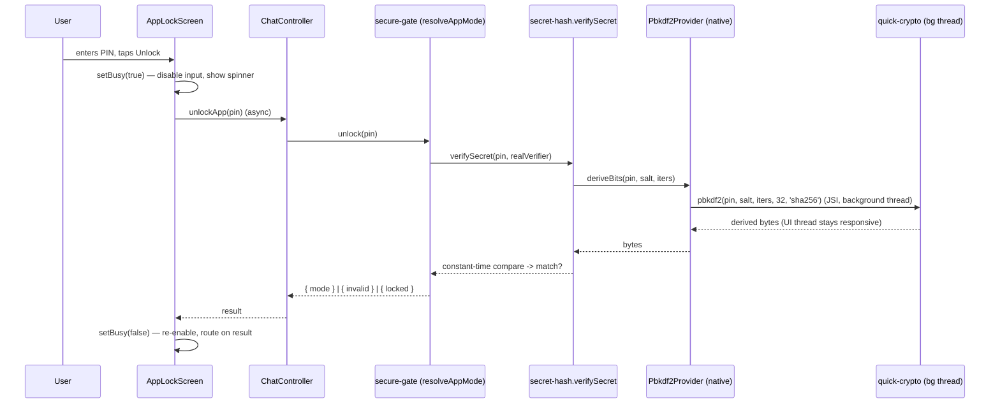
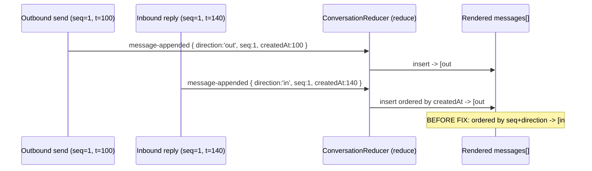
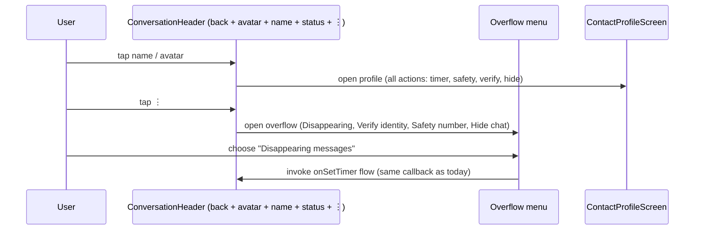

# Design Document: UI Modernization & Setup-Freeze Fix

> **Spec status / scope.** This is a **Design-First** spec covering three user-reported defects in the
> Lumin Chat (Chit-Chat) mobile client, reported verbatim as: *"Decoy, app pin, shadow chat, hidden chat
> every feature is freezing the app while setting up, and app ui look outdated should be minimal yet
> modern … everything is showing contact name bar right side, look at professional apps like WhatsApp,
> telegram signals … and chat ui is also not good we can chat messaging jumbli (jumbled)."*
>
> It addresses three root-caused problems: **(P1)** the app freezes during PIN / decoy / hidden-chat /
> shadow-chat setup and unlock; **(P2)** chat messages render **out of true order** ("jumbled"); and
> **(P3)** the UI looks **outdated** and the conversation header is **cluttered** with five icons.
>
> This design honors the standing hard constraints from the existing specs:
> - **Backend FROZEN** — the deployed server at `api.luminchat.app` runs old code and cannot be
>   redeployed. **No wire / envelope / ack / codec change** is permitted (C1 from `shadow-chat` design,
>   Phase 1 §"No plaintext on the wire").
> - **Shared pure core (C2)** — platform-agnostic logic lives in `@chat-app/crypto` so web + mobile share
>   one code path.
> - **Each feature ships pure-core unit/property tests (C3)** — new behaviour in the shared core is
>   covered by `node --test` + `fast-check`.
> - **Do not weaken cryptographic security** to fix the freeze. PBKDF2 strength, the constant-time
>   compare, and the §3.1 timing-only feedback are preserved or strengthened.
>
> The design is the comprehensive **BOTH** detail level: it carries High-Level Design (screen layouts,
> component/state architecture, data-flow + sequence diagrams) **and** Low-Level Design (concrete
> component props, async/threading fixes, render-ordering logic, and the KDF port signatures).

---

## Overview

Lumin Chat is a privacy messenger built as a Node/TypeScript monorepo: `apps/mobile` (React Native / Expo,
Hermes engine), `apps/web` (Next.js), and `packages/crypto` (the shared, dependency-free pure core). All
three reported defects trace to a small number of concrete, confirmed root causes in real files:

1. **Setup/unlock freeze (P1).** `packages/crypto/src/secret-hash.ts` derives a password verifier with
   **PBKDF2-HMAC-SHA256 at `DEFAULT_SECRET_ITERATIONS = 210_000`** via `crypto.subtle.deriveBits`. On
   mobile, `crypto.subtle` is the **pure-JS `msrcrypto`** shim wired in `apps/mobile/src/polyfills.ts`
   (`setWebCrypto(...)`). A pure-JS PBKDF2 at 210 000 iterations runs **synchronously on Hermes' single JS
   thread** for seconds, freezing the UI. Every feature the user named hits this: `setPin` (real **and**
   decoy), `hideChat`, and `unlock`/`revealHiddenChat` in `apps/mobile/src/app/secure-gate.ts`.
   `revealHiddenChat` is the worst case — it calls `verifySecret` for **every** hidden chat (N × 210 000
   PBKDF2). The same `msrcrypto` shim also backs the encrypted vault's AES-CBC/HMAC for every
   `vault.read`/`vault.mutate`, compounding the stall.

2. **Jumbled message order (P2).** `packages/crypto/src/conversation-reducer.ts` orders the rendered list
   **purely by `seq`** with an `in:`/`out:` `localeCompare` tiebreak. But inbound and outbound seqs occupy
   **independent per-direction spaces** (both start at 1), so a real back-and-forth does **not** render in
   chronological order: a peer's reply (their `seq=1`, inbound) always sorts against your `seq=1`
   (outbound) by **direction**, not by **time**. `RenderableMessage` has **no timestamp** even though
   `MessageRow.createdAt` (unix-ms) already exists in `ports.ts` and inbound rows are stamped via
   `this.now()`. Mobile's `ConversationScreen` `FlatList` is also not bottom-anchored/auto-scrolled.

3. **Outdated, cluttered UI (P3).** `apps/mobile/src/ui/ConversationScreen.tsx` packs **five** tappable
   emoji icons (back `‹`, timer `⏲`, safety `🛡`, verify `👤`, hide `🫥`) into the header to the right of
   the peer name. The app uses **emoji-as-icons** throughout (`TabBar.tsx`, status labels, FAB) and a dated
   visual language. WhatsApp / Telegram / Signal instead keep avatar + name + a light status line, and move
   actions into a profile screen and an overflow (`⋮`) menu.

The fix is shaped to keep the blast radius small and the security model intact:

- **P1** introduces a small, injected **KDF port** (`Pbkdf2Provider`) consumed by `secret-hash.ts`. The
  pure verifier format (`pbkdf2$sha256$<iters>$<salt>$<hash>`) and constant-time compare are **unchanged**;
  only *where the PBKDF2 bytes are computed* changes. Mobile binds the port to a **native / off-thread**
  implementation (`react-native-quick-crypto`, JSI, runs `pbkdf2` on a background thread); web/Node keep
  real `crypto.subtle`. The mobile setup/unlock flows become explicitly **async with in-progress UI**, so
  no heavy hash ever runs synchronously on the JS thread.
- **P2** adds a monotonic **`createdAt`** ordering field to `RenderableMessage`, threads it through the
  `message-appended` event, and **orders the list by `createdAt` then a stable tiebreak**. Gap detection
  stays on inbound `seq`. The reducer stays pure and shared (C2). Mobile's chat list becomes
  bottom-anchored with time labels, day separators, and consecutive-sender grouping.
- **P3** redesigns the conversation header (back + tappable avatar + name + concise status) and collapses
  the four action icons into an **overflow (`⋮`) menu** and a new **Contact/Profile screen**, refreshes
  `theme.ts` (spacing/typography scale, refined bubbles), and adopts a real icon set
  (`@expo/vector-icons`) in place of emoji glyphs. Components stay presentational; container/state wiring
  is unchanged.

### Files touched (grounded in what exists)

| Area | File | Change |
| --- | --- | --- |
| P1 | `packages/crypto/src/secret-hash.ts` | Add injectable `Pbkdf2Provider` port; default to WebCrypto path (unchanged semantics). |
| P1 | `packages/crypto/src/index.ts` | Export the new port + `setPbkdf2Provider`. |
| P1 | `apps/mobile/src/crypto/pbkdf2-native.ts` *(new)* | Native adapter binding the port to `react-native-quick-crypto`. |
| P1 | `apps/mobile/src/polyfills.ts` | Install the native KDF provider at boot, after the existing WebCrypto wiring. |
| P1 | `apps/mobile/src/app/secure-gate.ts` | Unchanged logic; documented as already async. UX progress added in screens. |
| P1 | `apps/mobile/src/ui/AppLockScreen.tsx`, `OnboardingScreen.tsx`, `SettingsScreen.tsx`, `ConversationScreen.tsx` (hide sheet) | Add in-progress (busy) state + disabled controls while a hash runs. |
| P2 | `packages/crypto/src/conversation-reducer.ts` | Add `createdAt` to `RenderableMessage`; order by time; keep gap detection on seq. |
| P2 | `packages/crypto/src/messaging.ts` | Thread `createdAt` into emitted `message-appended` events (value already on `MessageRow`). |
| P2 | `apps/mobile/src/ui/ConversationScreen.tsx` | Bottom-anchor/auto-scroll list, time labels, day separators, sender grouping. |
| P3 | `apps/mobile/src/ui/ConversationScreen.tsx` | New header + overflow menu; move timer/safety/verify/hide off the header. |
| P3 | `apps/mobile/src/ui/ContactProfileScreen.tsx` *(new)* | Profile screen surfacing all moved actions. |
| P3 | `apps/mobile/src/ui/theme.ts` | Spacing/typography scale; refined tokens. |
| P3 | `apps/mobile/src/ui/icons.tsx` *(new)*, `TabBar.tsx`, screens | `@expo/vector-icons` icon strategy replacing emoji glyphs. |
| P3 (lower priority) | `apps/web/src/ui/*` | Same render-contract modernization where shared. |

---

## Architecture

```mermaid
graph TD
    subgraph CORE["@chat-app/crypto — shared pure core (C2)"]
        SH["secret-hash.ts<br/>(EXTEND: injected Pbkdf2Provider;<br/>verifier format + constant-time compare UNCHANGED)"]
        CR["conversation-reducer.ts<br/>(EXTEND: createdAt ordering;<br/>gap detection stays on seq)"]
        MSG["messaging.ts<br/>(EXTEND: thread createdAt into message-appended)"]
        AL["app-lock.ts (UNCHANGED: real vs decoy)"]
        LP["lockout-policy.ts (UNCHANGED)"]
    end

    subgraph MOBILE["apps/mobile (React Native / Hermes)"]
        POLY["polyfills.ts<br/>(EXTEND: install native KDF provider)"]
        NPB["pbkdf2-native.ts (NEW)<br/>react-native-quick-crypto, JSI, off-thread"]
        SG["secure-gate.ts<br/>(unchanged logic; async)"]
        CONV["ConversationScreen.tsx<br/>(REDESIGN header + ordered/anchored list)"]
        PROF["ContactProfileScreen.tsx (NEW)<br/>timer / safety / verify / hide actions"]
        ICONS["icons.tsx (NEW) + theme.ts (REFRESH)"]
        OTHER["ChatsListScreen / TabBar / Onboarding /<br/>AppLock / Settings / SignIn / NewChat"]
    end

    subgraph WEB["apps/web (Next.js)"]
        WSUBTLE["WebCrypto subtle (native/fast) — KDF unchanged"]
        WUI["Web ConversationScreen (shared render contract)"]
    end

    subgraph PORTS["Injected ports / platform crypto"]
        SUBTLE["crypto.subtle<br/>(mobile: msrcrypto pure-JS — SLOW for PBKDF2)"]
        QC["react-native-quick-crypto<br/>(native pbkdf2, background thread)"]
    end

    SG --> SH
    SH -->|default provider| SUBTLE
    SH -->|mobile provider (P1 fix)| NPB
    NPB --> QC
    POLY --> NPB
    CONV --> CR
    PROF --> CR
    MSG --> CR
    CONV --> ICONS
    OTHER --> ICONS
    WUI --> CR
    WSUBTLE --> SH

    classDef new fill:#e7f0ff,stroke:#2F5FE8;
    classDef edit fill:#fff5e6,stroke:#B07A4F;
    class NPB,PROF,ICONS new;
    class SH,CR,MSG,POLY,CONV edit;
```

**Key architectural points**

- **The freeze fix is a *placement* change, not a *crypto* change.** The PBKDF2 algorithm, iteration count
  (≥ 210 000), salt, and self-describing verifier format are identical. We only move the bit-derivation
  off the pure-JS `msrcrypto` path on mobile and off the JS thread. The pure core's default path stays
  WebCrypto, so web/Node and all existing tests are byte-for-byte unaffected.
- **Ordering is decoupled from sequencing.** `seq` keeps its two jobs (per-direction identity for
  dedup/ack and inbound gap detection); `createdAt` takes over the *display order* job. This is the
  minimal change that makes a cross-direction back-and-forth render chronologically.
- **The UI declutter is presentational.** The container (`App.tsx`) already passes every action callback
  (`onSetTimer`, `getSafetyNumber`, `onRequestVerification`, `onHideChat`, …) into `ConversationScreen`.
  We re-route those same callbacks into an overflow menu and a profile screen — no container/state rewire.

---

## Sequence Diagrams

### P1 — Unlock without freezing (native off-thread KDF + async UI)



### P1 — `revealHiddenChat` over N hidden chats (no N×freeze)

```mermaid
sequenceDiagram
    participant U as User
    participant CL as ChatsListScreen (search)
    participant CC as ChatController
    participant SG as secure-gate.revealHiddenChat
    participant SH as verifySecret (×N, constant-set)
    participant PB as native Pbkdf2Provider

    U->>CL: types secret in search bar
    CL->>CL: setRevealing(true)
    CL->>CC: revealHiddenChat(secret)
    CC->>SG: revealHiddenChat(secret)
    loop every hidden chat (checked in full — §3.1 timing-only)
        SG->>SH: verifySecret(secret, verifier_i)
        SH->>PB: deriveBits (native, off-thread)
        PB-->>SH: bytes -> compare
    end
    SG-->>CC: { peerUid } | { invalid } | { locked }
    CC-->>CL: setRevealing(false); open matched chat or show nothing
```

### P2 — Message ordering across both directions



### P3 — Conversation header + overflow / profile navigation



---

## Components and Interfaces

### Component 1: `Pbkdf2Provider` port + `secret-hash.ts` extension *(EXTEND — P1)*

**Purpose:** make the single expensive primitive — PBKDF2 bit derivation — *injectable*, so a platform can
supply a native/off-thread implementation without touching the verifier format, salt handling, or
constant-time compare.

```typescript
// packages/crypto/src/secret-hash.ts

/**
 * The ONLY expensive primitive in this module: derive `keyLenBytes` of PBKDF2-HMAC-SHA256 bits from
 * `password` under `salt`/`iterations`. A provider MUST compute exactly the standard PBKDF2-HMAC-SHA256
 * function (RFC 8018) so verifiers are interchangeable between providers. Platforms inject a native/
 * off-thread implementation; the default uses WebCrypto `crypto.subtle.deriveBits`.
 */
export interface Pbkdf2Provider {
  deriveBits(
    password: Uint8Array,
    salt: Uint8Array,
    iterations: number,
    keyLenBytes: number,
  ): Promise<Uint8Array>;
}

/** Install a process-wide PBKDF2 provider (mobile binds the native adapter at boot). */
export function setPbkdf2Provider(provider: Pbkdf2Provider): void;

/** The current provider — the WebCrypto-backed default until `setPbkdf2Provider` replaces it. */
export function getPbkdf2Provider(): Pbkdf2Provider;
```

The existing exported surface is **unchanged** in signature and semantics:

```typescript
export const DEFAULT_SECRET_ITERATIONS = 210_000;            // unchanged (≥ 100_000 asserted by test)
export function hashSecret(secret: string, iterations?: number): Promise<string>;   // same format
export function verifySecret(secret: string, stored: string): Promise<boolean>;     // constant-time
```

**Responsibilities & invariants**
- `derive(secret, salt, iterations)` now calls `getPbkdf2Provider().deriveBits(...)` instead of inlining
  `subtle.importKey`/`subtle.deriveBits`. The default provider performs exactly the previous WebCrypto
  calls, so on web/Node nothing observable changes.
- `hashSecret` still emits `pbkdf2$sha256$<iterations>$<saltB64>$<hashB64>`; `verifySecret` still parses
  that format, rejects malformed/foreign strings with `false` (never throws), and compares in constant
  time via the unchanged `timingSafeEqual`.
- Salt generation still uses `crypto.getRandomValues` (the native CSPRNG on mobile), independent of the
  KDF provider.

### Component 2: Native KDF adapter `pbkdf2-native.ts` *(NEW — P1, mobile only)*

**Purpose:** bind `Pbkdf2Provider` to a native PBKDF2 that runs **off the JS thread**.

```typescript
// apps/mobile/src/crypto/pbkdf2-native.ts
import QuickCrypto from 'react-native-quick-crypto';
import type { Pbkdf2Provider } from '@chat-app/crypto';

/**
 * Native PBKDF2 via react-native-quick-crypto (JSI; node-crypto-compatible). `pbkdf2` runs the
 * derivation on a background thread, so the JS/UI thread is never blocked even at 210k iterations.
 */
export const nativePbkdf2Provider: Pbkdf2Provider = {
  deriveBits(password, salt, iterations, keyLenBytes) {
    return new Promise((resolve, reject) => {
      QuickCrypto.pbkdf2(
        Buffer.from(password),
        Buffer.from(salt),
        iterations,
        keyLenBytes,
        'sha256',
        (err, derived) => (err || derived == null
          ? reject(err ?? new Error('pbkdf2 failed'))
          : resolve(new Uint8Array(derived as Buffer))),
      );
    });
  },
};
```

> **Decision (recommended option, justified).** Three candidates were evaluated:
> 1. **`react-native-quick-crypto`** — JSI, node-`crypto`-compatible `pbkdf2`/`pbkdf2Sync`, derivation
>    runs on a **background thread** ⇒ native speed *and* never blocks the JS thread. Adds a native module
>    (Expo prebuild / dev-client required; APK signing unaffected beyond a standard rebuild).
> 2. **`expo-crypto`** — ships `digestStringAsync` and `getRandomBytes`, but has **no PBKDF2 primitive**;
>    building PBKDF2 from raw HMAC iterations in JS would re-introduce the per-iteration JS-thread loop —
>    i.e. it would not actually move the 210k-iteration work off-thread. Rejected for the KDF.
> 3. **Custom native Expo module** — fastest control, highest build/maintenance/signing risk.
>
> **Chosen: option 1 (`react-native-quick-crypto`)** — it is the option with the **least native
> build/signing risk that still runs PBKDF2 natively and off-thread**, and its node-crypto-compatible API
> keeps the adapter tiny. **Fallback:** if the native module is unavailable at runtime, the provider falls
> back to the WebCrypto/`msrcrypto` default but the iteration count stays at 210 000 (never weakened) and
> the call is still `await`-ed behind the async busy-UI (see Component 4), so correctness/security hold —
> only speed degrades. The fallback never silently lowers `iterations`.

### Component 3: `polyfills.ts` provider installation *(EXTEND — P1, mobile)*

**Purpose:** install the native provider at boot, after the existing WebCrypto/Buffer wiring.

```typescript
// apps/mobile/src/polyfills.ts  (appended after existing setWebCrypto block)
import { setPbkdf2Provider } from '@chat-app/crypto';
import { nativePbkdf2Provider } from './crypto/pbkdf2-native';

// P1: route secret-hash's PBKDF2 to the native, off-thread implementation. The encrypted vault's
// AES-CBC/HMAC stays on msrcrypto (small, bounded work); only the 210k-iteration KDF is moved.
try {
  setPbkdf2Provider(nativePbkdf2Provider);
} catch {
  // Native module missing (e.g. Expo Go without dev-client): keep the secure WebCrypto default.
}
```

### Component 4: Async setup/unlock UX *(EXTEND — P1, mobile screens)*

**Purpose:** never block the UI even when a hash runs; show explicit progress.

`secure-gate.ts` is already `async` (every method returns a `Promise`); `ChatController.unlockApp`,
`setAppPin`, `hideChat`, `revealHiddenChat` are already `async`. The remaining gap is **UI feedback** — the
screens fire the promise and (today) leave the button live, so a multi-second hash looks like a freeze. We
add a local `busy` flag and disabled controls. No synchronous KDF loop runs on the JS thread; the only
yielding fallback (`InteractionManager.runAfterInteractions`) is reserved for the WebCrypto-fallback path.

```typescript
// AppLockScreen.tsx — added local state + busy gating (illustrative)
const [busy, setBusy] = useState(false);
const submit = async (): Promise<void> => {
  if (!valid || locked || busy) return;
  setBusy(true);
  try { onUnlock(pin); } finally { setBusy(false); }   // onUnlock resolves async in the container
};
// button: disabled={!valid || locked || busy}; show ActivityIndicator while busy
```

```typescript
// New optional prop surfaced so the container can reflect in-flight hashing in the lock UI.
export interface AppLockScreenProps {
  onUnlock: (pin: string) => void;
  error?: string | null;
  locked?: boolean;
  /** NEW: true while the unlock hash is in flight (spinner + disabled controls). */
  busy?: boolean;
}
```

The same `busy`/`ActivityIndicator` pattern is applied to: `OnboardingScreen` (PIN set), `SettingsScreen`
(set/clear real & decoy PIN), and the hidden-chat sheet in `ConversationScreen` (`onHideChat`), plus the
search-bar reveal in `ChatsListScreen`/`App.tsx` (a `revealing` flag).

> **`revealHiddenChat` worst case.** With the native provider, N × PBKDF2 becomes N fast off-thread
> derivations, so checking every hidden chat (required by §3.1 to keep timing independent of *which* chat
> matched) no longer freezes. We keep the **check-all-candidates** loop (do **not** short-circuit on first
> match) so the indistinguishability/timing property is preserved. We do **not** reduce iterations or
> skip candidates.

### Component 5: `RenderableMessage` + ordering in `conversation-reducer.ts` *(EXTEND — P2)*

**Purpose:** render in true conversational order across both directions and across store-and-forward
backfill, without disturbing gap detection or the wire.

```typescript
// packages/crypto/src/conversation-reducer.ts

export interface RenderableMessage {
  id: string;
  seq: number;
  direction: 'out' | 'in';
  /**
   * NEW (P2): wall-clock creation time in unix-ms used as the PRIMARY render-ordering key. Sourced from
   * MessageRow.createdAt for outbound and from this.now() for inbound (both already exist in messaging.ts).
   * Ordering by createdAt makes a cross-direction back-and-forth and backfilled store-and-forward
   * messages render chronologically. OPTIONAL at the type level for backward compatibility; absent values
   * sort as if 0 (legacy rows keep a deterministic position via the seq tiebreak).
   */
  createdAt?: number;
  text: string | null;
  status: MessageStatus;
  error?: string;
  reactions?: string[];
  edited?: boolean;
  deleted?: boolean;
  viewOnce?: boolean;
}
```

**Ordering change (the heart of P2).** `upsertMessage` keeps dedup by `(direction, seq)` (unchanged — that
key is still unique per 1:1 conversation), but sorts by **`createdAt` ascending, then a stable tiebreak**:

```typescript
function orderKey(m: RenderableMessage): number {
  return typeof m.createdAt === 'number' && Number.isFinite(m.createdAt) ? m.createdAt : 0;
}

function upsertMessage(messages, incoming): RenderableMessage[] {
  const key = messageKey(incoming);
  const next = messages.filter((e) => messageKey(e) !== key);
  next.push(incoming);
  next.sort((a, b) => {
    const byTime = orderKey(a) - orderKey(b);
    if (byTime !== 0) return byTime;
    // Stable, total tiebreak when timestamps tie (e.g. same-ms send/receive or legacy rows):
    // fall back to the prior seq-then-direction ordering so the comparator is deterministic.
    return a.seq === b.seq ? messageKey(a).localeCompare(messageKey(b)) : a.seq - b.seq;
  });
  return next;
}
```

**Gap detection is untouched.** `computeMissingBefore` still derives from the **set of inbound `seq`s** only
(`direction === 'in'`), so "messages may be missing" continues to work on the contiguous inbound sequence
space — ordering moved to time, gap detection stays on seq, exactly as required.

**Shadow threads stay correct.** Shadow messages carry `seq ≥ 1e9` but their **own `createdAt`**; the
`ConversationRegistry` already routes them to a per-thread state, and time-ordering within a thread keeps
them chronological without any cross-contamination.

### Component 6: `messaging.ts` — thread `createdAt` into events *(EXTEND — P2)*

**Purpose:** populate `RenderableMessage.createdAt` from the value that already exists.

`MessageRow` already has `createdAt: number` (see `ports.ts`), and `DefaultMessaging` already stamps
`createdAt: this.now()` on outbound rows and on inbound rows. The change is to **include `createdAt` in the
`message-appended` event's `message`** (and the inbound render path), e.g.:

```typescript
this.emitUpdate({
  type: 'message-appended',
  message: { id, seq, direction: 'out', text: plaintext, status: 'sending', createdAt: row.createdAt,
             ...(viewOnce ? { viewOnce: true } : {}) },
  remoteUid: recipientUid,
  ...(threadId !== undefined ? { threadId } : {}),
});
```

No new event variants, no wire change. `inbound-delivery-error` entries also gain a `createdAt` (the
receive time) so a failed-decrypt row sorts in place rather than jumping to the top.

### Component 7: Conversation header redesign + overflow/profile *(REDESIGN — P3, mobile)*

**Purpose:** replace the five-icon header with a clean, modern one and move actions into an overflow menu
and a Contact/Profile screen, keeping every capability reachable.

**New header layout (left → right):** `‹ back` · **tappable avatar** · **name + concise status** (flex) ·
`⋮ overflow`. The avatar/name area is a single `Pressable` that opens `ContactProfileScreen`. The status
line keeps the existing `headerStatus(...)` priority (typing → online/last-seen → encrypted/connecting).

```typescript
// ConversationScreen.tsx — header sub-component (illustrative props)
interface ConversationHeaderProps {
  peerName: string;
  status: string;                 // from existing headerStatus(...)
  statusTone: 'brand' | 'secure' | 'faint';
  onBack: () => void;
  onOpenProfile: () => void;      // tap name/avatar
  onOpenOverflow: () => void;     // tap ⋮
  verification: 'none' | 'requested' | 'incoming' | 'verified' | 'unverified';
}
```

`ConversationScreenProps` is **unchanged** (all existing callbacks remain); we add local UI state
(`profileOpen`, `overflowOpen`) and route the same callbacks. The overflow menu items map 1:1 to the
removed icons:

| Removed header icon | New home | Callback (unchanged) |
| --- | --- | --- |
| `⏲` timer | Overflow + Profile | `onSetTimer` |
| `🛡` safety number | Overflow + Profile | `getSafetyNumber` |
| `👤` verify identity | Overflow + Profile | `onRequestVerification` / `onRespondVerification` |
| `🫥` hide chat | Overflow + Profile | `onHideChat` / `onUnhideChat` |

```typescript
// New screen (presentational; receives the same callbacks the header used to own).
export interface ContactProfileScreenProps {
  peerName: string;
  peerOnline?: boolean | null;
  peerLastSeen?: number | null;
  verification: 'none' | 'requested' | 'incoming' | 'verified' | 'unverified';
  disappearingTtlMs: number;
  isHidden: boolean;
  onBack: () => void;
  onSetTimer: (ttlMs: number) => void;
  getSafetyNumber: () => Promise<SafetyNumber | null>;
  onRequestVerification?: () => void;
  onRespondVerification?: (kind: 'normal' | 'duress') => void;
  onHideChat?: (secret: string) => void;
  onUnhideChat?: () => void;
}
```

The existing action sheets (timer/safety/verify/hide modals already in `ConversationScreen`) are reused —
they are simply opened from the profile screen / overflow menu instead of from header icons. An
`incoming`/`unverified` verification state surfaces as a small badge near the name **and** a profile-row
hint, so the user is never stranded without the prompt the header icon used to give.

### Component 8: Bottom-anchored, grouped message list *(REDESIGN — P3 + P2, mobile)*

**Purpose:** match WhatsApp/Telegram conventions — newest message visible, time labels, day separators,
consecutive-sender grouping — while keeping the existing bubble semantics.

- **Anchoring:** render the list **`inverted`** over `[...state.messages].reverse()` (or call
  `scrollToEnd` on `message-appended`); `inverted` is preferred (no scroll jank, keyboard-safe).
- **Day separators:** a centered pill (e.g. "Today", "Yesterday", "12 Jun") inserted when the calendar day
  of `createdAt` changes between adjacent messages.
- **Time labels:** a small per-message time (`HH:mm` from `createdAt`) in the bubble footer next to the
  status indicator.
- **Sender grouping:** consecutive messages from the same `direction` within a short window get reduced
  vertical spacing and a single tail, instead of repeating full bubble chrome.
- **Bubble semantics preserved:** reactions, edited/deleted, view-once gating, and status indicators are
  unchanged in behaviour — only spacing/typography/iconography are refreshed.

### Component 9: Visual system refresh — `theme.ts` + icons *(REFRESH — P3)*

**Purpose:** a minimal, modern, calm visual language; real icons instead of emoji glyphs.

Extend the existing `Theme` (which already drives every screen via `useTheme()`) with an explicit
**spacing scale** and **typography scale**, keeping the current light/dark palettes (already calm —
Near-White / Charcoal / Slate / Deep-Blue):

```typescript
// theme.ts additions (palette colors retained; structure added)
export const spacing = { xs: 4, sm: 8, md: 12, lg: 16, xl: 24, xxl: 32 } as const;
export const radius  = { sm: 8, md: 12, lg: 18, pill: 999 } as const;
export const type = {
  title:   { fontSize: 28, fontWeight: '800' as const, lineHeight: 34 },
  heading: { fontSize: 17, fontWeight: '700' as const, lineHeight: 22 },
  body:    { fontSize: 15, fontWeight: '400' as const, lineHeight: 21 },
  meta:    { fontSize: 12, fontWeight: '500' as const, lineHeight: 16 },
  caption: { fontSize: 11, fontWeight: '500' as const, lineHeight: 14 },
};
```

**Icon strategy:** introduce `apps/mobile/src/ui/icons.tsx` wrapping **`@expo/vector-icons`** (ships with
Expo SDK 51 — **no new native module, no APK-signing impact**) with a typed `Icon` component so screens
reference semantic names (`back`, `more-vert`, `timer`, `shield`, `verified`, `hide`, `send`, `chats`,
`calls`, `settings`) instead of emoji. Emoji used as *content* (reactions palette, "message deleted"
placeholder copy) stay as emoji; emoji used as *UI affordances* (header icons, tab icons, send arrow `➤`,
status `🕓`/`✓✓`, FAB `+`/`✎`) move to vector icons. This keeps it minimal and professional — not neon.

### Component 10: Web parity *(LOWER PRIORITY — P3)*

The shared render contract (`ConversationState` / `RenderableMessage` / `reduce`) means the P2 ordering fix
benefits web automatically. The web `ConversationScreen` adopts the same modernization principles
(spacing/typography, decluttered header, day separators) **where the shared contract allows**; components
stay presentational and container/state wiring is unchanged. Mobile is the priority since the report is
about the app.

---

## Data Models

### `RenderableMessage` (extended)

```typescript
interface RenderableMessage {
  id: string;
  seq: number;                 // per-direction identity (dedup + ack + inbound gap detection)
  direction: 'out' | 'in';
  createdAt?: number;          // NEW: unix-ms PRIMARY render-ordering key
  text: string | null;
  status: MessageStatus;
  error?: string;
  reactions?: string[];
  edited?: boolean;
  deleted?: boolean;
  viewOnce?: boolean;
}
```

**Validation / ordering rules**
- `createdAt`, when present, is a finite unix-ms number; absent/non-finite values sort as `0`.
- Display order: ascending `createdAt`, then `seq`, then `direction` (`messageKey` `localeCompare`) — a
  **total, deterministic** order.
- Dedup key remains `${direction}:${seq}` (unchanged).
- Gap markers (`missingBefore`) are derived from inbound `seq`s only (unchanged).

### PBKDF2 verifier (unchanged format — migration-safe)

```
pbkdf2$sha256$<iterations>$<saltB64>$<hashB64>
```
- Self-describing: `<iterations>` is embedded, so a future raise of `DEFAULT_SECRET_ITERATIONS` keeps
  verifying old verifiers.
- **Migration note:** every verifier ever written by the WebCrypto path MUST keep verifying after the
  provider swap, and vice-versa — see Property 5. No re-hashing or migration of stored verifiers is
  required; the change is purely *where* the bytes are computed.

### `MessageRow` (already has `createdAt` — no change)

`ports.ts` already defines `MessageRow.createdAt: number`; no schema change. P2 only surfaces it into the
render layer.

---

## Key Functions with Formal Specifications

### `Pbkdf2Provider.deriveBits(password, salt, iterations, keyLenBytes)`

**Preconditions:**
- `iterations` ≥ 1 (production uses ≥ 210 000); `keyLenBytes` ≥ 1 (production uses 32).
- `salt` is the per-verifier random salt; `password` is the UTF-8 encoded secret.

**Postconditions:**
- Returns exactly `keyLenBytes` bytes equal to RFC 8018 PBKDF2-HMAC-SHA256 over the inputs — i.e. *the same
  bytes any conformant PBKDF2 implementation would produce*, so verifiers are provider-independent.
- No mutation of `password`/`salt`; no logging or persistence of `password`.
- On mobile the computation does not run on the JS/UI thread (off-thread via JSI).

### `hashSecret(secret, iterations?)` / `verifySecret(secret, stored)` *(semantics unchanged)*

**Preconditions:** `secret` non-empty for `hashSecret`; `stored` is any string for `verifySecret`.

**Postconditions:**
- `hashSecret` returns a fresh-salted `pbkdf2$sha256$<iters>$<salt>$<hash>` string; same secret hashed
  twice yields different verifiers.
- `verifySecret(s, hashSecret(s))` is `true`; a wrong secret or malformed/foreign verifier yields `false`
  and never throws; comparison is constant-time (no early-out).
- **Provider-independence:** `verifySecret` succeeds regardless of which conformant provider produced the
  stored verifier or runs the verification.

### `upsertMessage(messages, incoming)` — time-ordered insert *(P2)*

**Preconditions:** `messages` is deduped by `(direction, seq)`; `incoming` is a `RenderableMessage`.

**Postconditions:**
- The result contains each `(direction, seq)` exactly once (`incoming` replaces any prior same-key row).
- The result is sorted by `(createdAt asc, seq asc, messageKey asc)` — a total order independent of arrival
  order and of duplication.
- No input mutation (a new array/object graph is returned).

### `computeMissingBefore(messages)` *(unchanged — restated for traceability)*

**Postconditions:** returns inbound seqs that immediately follow a gap in the contiguous inbound seq space,
strictly between the lowest and highest received inbound seq; independent of arrival order; self-correcting
on backfill. **Unaffected by the `createdAt` ordering change.**

---

## Algorithmic Pseudocode

### Time-ordered message insert (P2)

```pascal
ALGORITHM upsertMessage(messages, incoming)
INPUT:  messages (deduped by (direction,seq)), incoming RenderableMessage
OUTPUT: new ordered, deduped list
BEGIN
  key  <- direction(incoming) + ":" + seq(incoming)
  next <- [ m IN messages WHERE keyOf(m) <> key ]        // drop any prior same-key row
  APPEND incoming TO next
  SORT next BY:
        primary   = orderKey(m)      // createdAt if finite, else 0
        secondary = seq(m)
        tertiary  = keyOf(m)         // "in:"/"out:" localeCompare — stable, total
  ASSERT next is sorted non-decreasing in orderKey
  ASSERT each (direction,seq) appears exactly once
  RETURN next
END
```

### Non-blocking unlock (P1)

```pascal
ALGORITHM unlockFlow(pin)
BEGIN
  IF busy OR locked OR NOT validPin(pin) THEN RETURN
  setBusy(true)                              // disable input, show spinner (UI thread free)
  result <- AWAIT controller.unlockApp(pin)  // secure-gate.unlock -> verifySecret -> native pbkdf2 (off-thread)
  setBusy(false)
  CASE result OF
    { mode }            -> enter app in mode
    { locked, msUntil } -> show neutral lockout countdown
    { invalid }         -> show neutral "Incorrect PIN"
  END CASE
  ASSERT no synchronous 210k-iteration loop ran on the JS thread
END
```

### Reveal hidden chat without N×freeze (P1, §3.1 preserved)

```pascal
ALGORITHM revealHiddenChat(secret)
BEGIN
  IF lockedOut() THEN RETURN { locked, msUntil }
  match <- null
  FOR EACH (peerUid, verifier) IN hiddenChats DO       // check ALL — do not short-circuit (§3.1 timing)
     IF AWAIT verifySecret(secret, verifier) THEN       // native pbkdf2: each check cheap + off-thread
        match <- peerUid
     END IF
  END FOR
  IF match = null THEN recordFailure(); RETURN invalidOrLocked
  clearFailures(); RETURN { peerUid: match }
END
```

---

## Correctness Properties

*A property is a characteristic or behavior that should hold true across all valid executions of a system —
a formal statement about what the system should do. Properties serve as the bridge between human-readable
specifications and machine-verifiable correctness guarantees.*

The fixes for P1 (KDF placement) and P2 (ordering) live in the **pure core** (`secret-hash.ts`,
`conversation-reducer.ts`), which is exactly where property-based testing earns its keep; these carry the
property set below, validated with **`fast-check`** under `node --test` (C3). P3 is UI/visual and is covered
by example, snapshot, and accessibility tests in the Testing Strategy rather than properties. Requirement
numbers reference the requirements document derived from this design (Req 1 = setup/unlock no-freeze, Req 2
= message ordering, Req 3 = UI modernization, Req 4 = security/constraint preservation).

### Property 1: Chronological render order across both directions

*For any* interleaving of outbound and inbound `message-appended` events (any arrival order, any
duplication, including backfilled store-and-forward messages), the rendered message list is **non-decreasing
in `createdAt`** and is a **stable, total order** under `(createdAt, seq, direction)`.

**Validates: Requirements 2.1, 2.2**

### Property 2: Dedup preserved under time ordering

*For any* sequence of `message-appended` / `inbound-delivery-error` events, the rendered list contains each
`(direction, seq)` **exactly once**, regardless of arrival order or duplication.

**Validates: Requirements 2.3**

### Property 3: Gap detection is invariant to the ordering change

*For any* set of received inbound messages, `missingBefore` equals the inbound seqs that immediately follow a
gap strictly between the lowest and highest received inbound seq — identical to the pre-change behaviour and
independent of `createdAt` values and arrival order.

**Validates: Requirements 2.4**

### Property 4: Shadow-thread ordering isolation

*For any* mix of surface (`seq < 1e9`) and shadow (`seq ≥ 1e9`) messages routed to their respective
per-thread states, each thread's rendered list is chronologically ordered by `createdAt` and no message
crosses threads.

**Validates: Requirements 2.5**

### Property 5: KDF provider interchangeability (migration safety)

*For any* secret `s`, a verifier produced by the WebCrypto default provider verifies `true` under the native
provider, and a verifier produced by the native provider verifies `true` under the WebCrypto provider; and
`verifySecret(s, hashSecret(s))` is `true` under any single provider. Existing stored verifiers continue to
verify after the provider swap.

**Validates: Requirements 1.4, 4.1**

### Property 6: Verifier format + salting unchanged

*For any* secret, `hashSecret` emits `pbkdf2$sha256$<iters>$<salt>$<hash>` with `<iters> ≥ 210000`, a fresh
random salt each call (same secret ⇒ different verifiers), and the plaintext never appears in the verifier.

**Validates: Requirements 4.1, 4.4**

### Property 7: Constant-time, total verification

*For any* secret and *any* string `stored` (including malformed/foreign verifiers), `verifySecret` returns a
boolean without throwing, compares the full hash length without early-out, and returns `false` for any
non-matching or malformed input.

**Validates: Requirements 4.2**

### Property 8: No synchronous KDF on the JS thread (architectural invariant + test seam)

*For any* setup/unlock operation on mobile, the PBKDF2 derivation is dispatched through the injected
`Pbkdf2Provider`, and the production mobile provider performs the derivation off the JS thread; expressed as
a test seam, `secret-hash` calls **only** `getPbkdf2Provider().deriveBits(...)` for bit derivation (it never
inlines a per-iteration loop), so a provider can assert non-blocking dispatch.

**Validates: Requirements 1.1, 1.2, 1.3**

### Property 9: Decoy / lockout / indistinguishability preserved

*For any* entered PIN and stored real/decoy verifiers, `resolveAppMode` returns `real` when the real
verifier matches (checked first), `decoy` when only the decoy matches, and `null` otherwise — and the
lockout policy (5 failures / 10 min → 30 min) is unchanged. `revealHiddenChat` checks **all** candidates
(no short-circuit), so neither the result nor the work reveals which secret/chat matched beyond the outcome.

**Validates: Requirements 4.3**

---

## Error Handling

| Scenario | Condition | Response | Recovery |
| --- | --- | --- | --- |
| Native KDF module missing | `react-native-quick-crypto` not linked (e.g. Expo Go) | `setPbkdf2Provider` install is `try/caught`; default WebCrypto provider stays active at full iteration count | App still works (slower hash) behind the async busy-UI; no security weakening |
| KDF derivation throws | Native call errors | `deriveBits` rejects; `verifySecret` is unaffected (only `derive` throws → caller's `unlock`/`reveal` rejects) | Screen clears `busy`, shows neutral error; user retries |
| Malformed/foreign verifier | Corrupt vault value | `verifySecret` returns `false` (never throws) | Treated as a non-match; lockout policy applies |
| Missing `createdAt` on legacy row | Pre-P2 persisted/rehydrated row | `orderKey` treats it as `0`; deterministic position via seq tiebreak | New rows carry `createdAt`; order self-corrects as fresh messages arrive |
| Hash in flight, user backgrounds app | Async unlock pending on `AppState` change | Existing auto-relock drops to lock screen; pending promise result is ignored if mode no longer applicable | Re-unlock on return |
| Profile/overflow opened mid-action | Action sheet + profile both reachable | Single source of truth per action (same callback); opening one closes conflicting modals | No double-invoke |

No PIN/secret plaintext is ever logged or persisted in any error path (Property 6/7; Security
Considerations).

---

## Testing Strategy

### Unit / example tests
- **secret-hash:** existing `secret-hash.test.ts` runs **unchanged** against Node WebCrypto (the default
  provider) — proving the provider refactor is behaviour-preserving. Add a fake `Pbkdf2Provider` (records
  calls, returns deterministic bytes) to assert `secret-hash` routes derivation through the port (Property
  8 seam) and that swapping providers does not change verifier acceptance (Property 5).
- **conversation-reducer:** extend `conversation-reducer.test.ts` with cross-direction ordering examples
  (out@100, in@140, out@200 → chronological) and a same-ms tie example (deterministic tiebreak).
- **UI:** example/snapshot tests for the new header (4 actions reachable via overflow + profile), day
  separators, and the busy/disabled states on AppLock/Onboarding/Settings/hide-sheet.

### Property-based tests
- **Library:** `fast-check` under `node --test` (matching the existing pure-core suites; min 100 runs per
  property).
- Properties 1–4 (ordering/dedup/gap/shadow-isolation) generate random interleavings of in/out events with
  random `createdAt` and `seq`, feeding `reduce` and asserting the invariants.
- Properties 5–7 (KDF interchangeability, format/salt, constant-time totality) generate random secrets and
  random/foreign verifier strings across both providers (with a low iteration count for speed, as the
  existing test already does — the algorithm is identical).
- Property 9 reuses the existing `app-lock`/`lockout-policy` property style.
- Tag format: **Feature: ui-modernization-and-setup-fix, Property N: …**.

### Integration / smoke (not property-shaped)
- A two-screen manual/dev check that unlock and `revealHiddenChat` over several hidden chats stay
  responsive on a device with the native provider (no automated PBT — it is a thread-behaviour/integration
  concern).
- Accessibility checks: every moved action keeps an `accessibilityRole`/`accessibilityLabel` and a ≥ 44px
  hit target (see Accessibility below).

---

## Security Considerations

- **KDF strength preserved or stronger.** The iteration count stays at **210 000** PBKDF2-HMAC-SHA256 with
  a 16-byte random salt and 32-byte output. Moving derivation to a native implementation does **not** lower
  any parameter; it only changes execution placement. The native fallback path also keeps 210 000 — the
  provider never silently reduces iterations.
- **Constant-time compare unchanged.** `timingSafeEqual` (no early-out) is retained; `verifySecret` remains
  total and non-throwing, so timing/observable behaviour cannot reveal how many bytes matched (§3.1).
- **Timing-only feedback for hidden-chat reveal preserved.** `revealHiddenChat` still checks **all**
  candidates without short-circuiting, so the existence/identity of a hidden chat is not leaked by timing
  or by the result. Native hashing makes this affordable rather than freezing.
- **No plaintext PIN/secret logged or persisted.** Secrets exist only as transient inputs to
  `deriveBits`; only salted verifiers are persisted (in the encrypted vault); the native adapter passes
  the password straight to the native call and retains nothing.
- **Wire/crypto envelope untouched.** P1/P2/P3 add no field to any `CiphertextEnvelope`, ack, or codec; the
  frozen backend is unaffected (C1).
- **New native dependency — delivery risk (documented).** `react-native-quick-crypto` is a native module:
  it requires an **Expo prebuild / custom dev-client** (it will not run in stock Expo Go) and a standard
  Android rebuild. **APK signing** is unchanged in mechanism, but the release pipeline must rebuild the
  native binary and re-sign with the existing key; the CI `android.yml` workflow and EAS/prebuild config
  must include the module. `@expo/vector-icons` (P3) ships with Expo SDK 51 and adds **no** native build or
  signing impact.

---

## Dependencies

| Dependency | Area | Notes |
| --- | --- | --- |
| `react-native-quick-crypto` (+ its peer, e.g. `react-native-nitro-modules`/`react-native-mmkv`-style JSI host) | P1 mobile | Native off-thread `pbkdf2`. Requires Expo prebuild/dev-client; rebuild + re-sign APK. |
| `@expo/vector-icons` | P3 mobile | Bundled with Expo SDK 51 — no new native module. |
| `fast-check`, `node --test` | Tests (C3) | Already used by the pure-core suites. |
| Existing: `@chat-app/crypto`, `expo-secure-store`, `@react-native-async-storage/async-storage`, `buffer`, `react-native-get-random-values`, `@privacyresearch/libsignal-protocol-typescript` | — | Unchanged. CSPRNG (salt) still from `react-native-get-random-values`. |

---

## Out of Scope (Deferred)

- **Any backend/server change.** `api.luminchat.app` stays byte-for-byte the same (C1) — no wire, envelope,
  ack, or codec change.
- **The alias-provisioning UI** from the `shadow-chat` spec (the `/alias` setup flow) — that remains its own
  separate spec; this design only ensures shadow threads keep ordering correctly (Property 4).
- **Large libsignal / Double-Ratchet changes** — the msrcrypto AES-CBC/HMAC path for the vault and the
  ratchet is left in place; only the 210k-iteration KDF is moved off-thread.
- **Migrating the KDF algorithm** (e.g. to argon2/scrypt) — the self-describing verifier format leaves this
  open as a future option behind the same `Pbkdf2Provider` seam, but it is not part of this fix.
- **Full web visual redesign** — web gets the shared ordering fix automatically and modernization where the
  shared contract allows; a comprehensive web redesign is a follow-up. Mobile is the priority.
