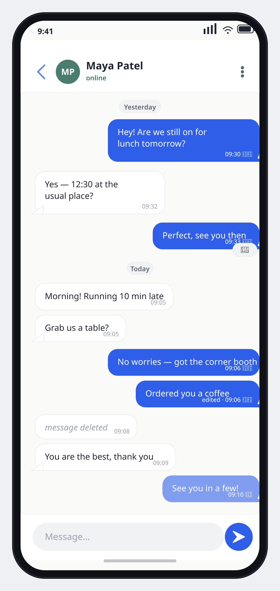
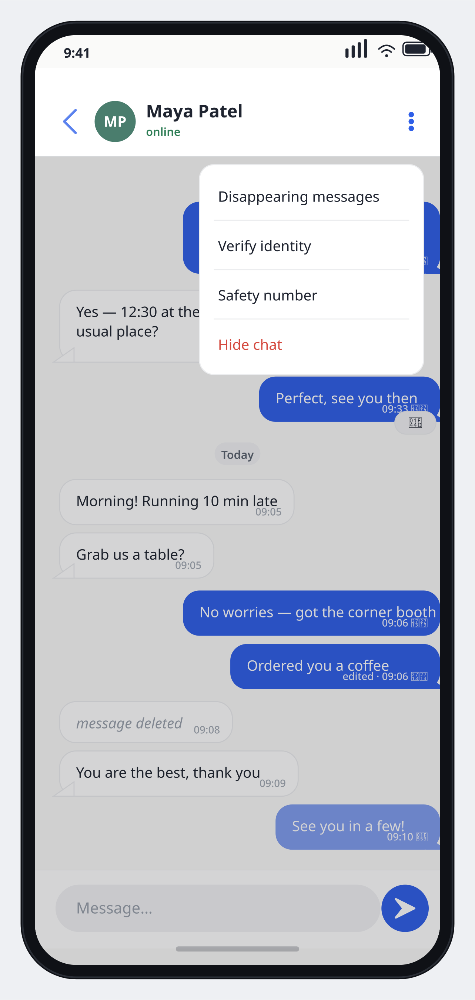
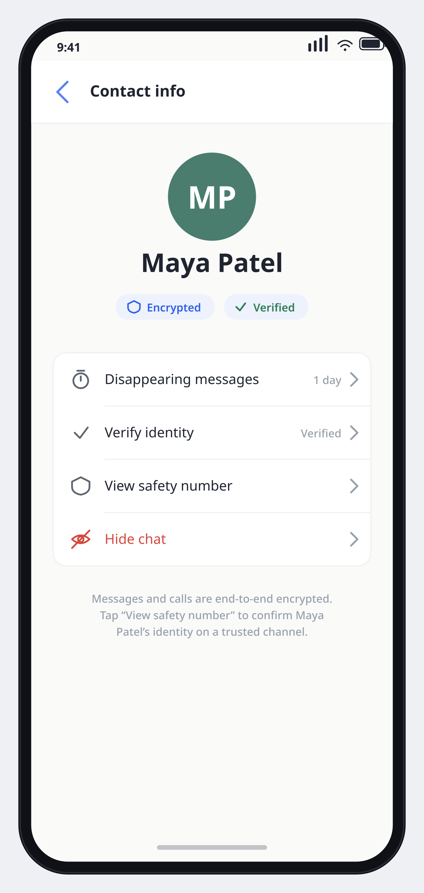
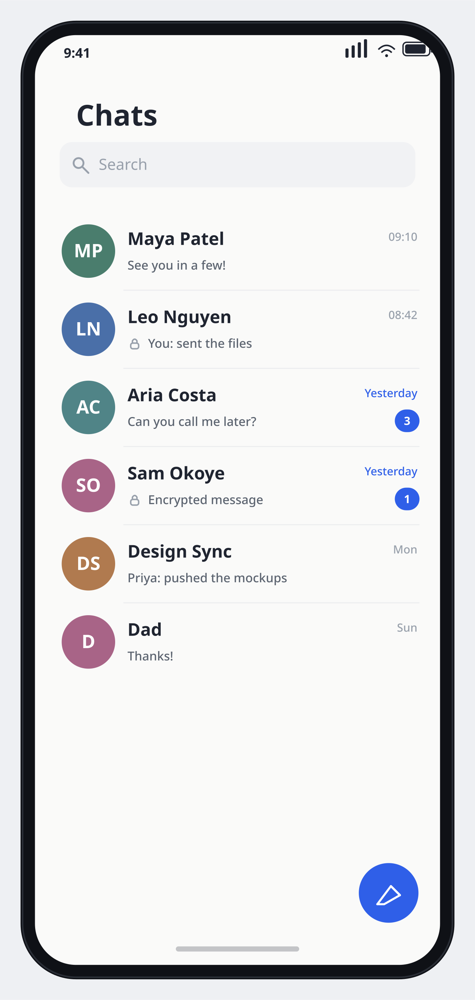
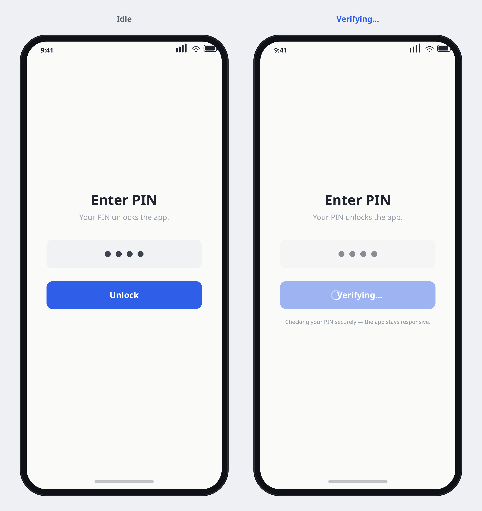
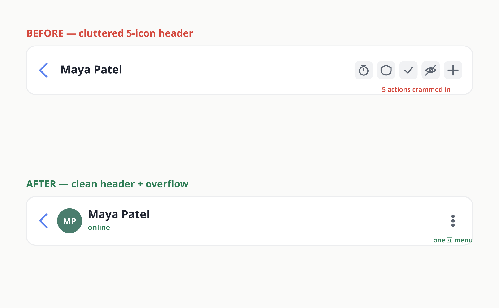

# UI Modernization — Rendered Visual Mockups

Rendered, graphical previews of the redesigned Lumin Chat (Chit-Chat) mobile screens
described in [`.kiro/specs/ui-modernization-and-setup-fix/design.md`](../../.kiro/specs/ui-modernization-and-setup-fix/design.md).

These are **pure presentational assets** — no app/production code, no `App.tsx`, and nothing
under `packages/crypto` is touched. They reuse the real light-mode palette from
[`apps/mobile/src/ui/theme.ts`](../../apps/mobile/src/ui/theme.ts) (brand blue `#2F5FE8`,
near-white bg `#FAFAF9`, charcoal text `#1F2430`, slate subtext `#5C6470`, secure green
`#2E7D55`) so the previews match the shipping app, and they mirror the `.tsx` mockups under
[`apps/mobile/src/ui/mockups/`](../../apps/mobile/src/ui/mockups).

> **In-browser gallery:** download [`index.html`](./index.html) and open it in any browser to
> see every screen rendered as styled HTML/CSS phone frames side by side (no build, no assets,
> no network needed).

---

## Conversation screen — redesigned (P2 + P3)

**P3 (declutter):** clean header — back chevron, tappable circular avatar with initials, name +
a single concise "online" status line, and one `⋮` overflow on the right (the old five-icon row
is gone). **P2 (ordering):** the thread reads as a true chronological back-and-forth (ordered by
`createdAt`, not per-direction `seq`), with a "Yesterday"/"Today" day pill, per-bubble `HH:mm`
times and `✓✓` ticks on outgoing, a `👍` reaction chip, an "edited" tag, a "message deleted"
italic placeholder, grouped consecutive bubbles, and a clean rounded composer + circular send
button.

## Conversation overflow menu (P3)

The single `⋮` menu is where the four removed header actions now live: **Disappearing messages**,
**Verify identity**, **Safety number**, and **Hide chat** (destructive, in red).

## Contact / Profile screen — new (P3)

The new home for the moved actions. Large avatar + name, `🛡 Encrypted` and `✓ Verified` badge
pills, and a grouped action list — Disappearing messages · 1 day, Verify identity · Verified,
View safety number, Hide chat — each with a chevron.

## Modern chats list (P3)

A Signal/WhatsApp-style list: "Chats" title, a search field, rows with avatar + name + preview +
time and unread pills on a couple of rows, plus a floating compose FAB.

## App-lock: idle vs. verifying (P1)

The non-freezing unlock UX. **Idle** (left) shows the PIN entry and an active "Unlock" button.
**Verifying…** (right) shows a spinner ring + disabled button while the PIN is checked — the
heavy PBKDF2 derivation runs off the JS thread, so the app stays responsive instead of freezing.

## Conversation header — before vs. after (P3)

**Before:** a cluttered header with five cramped icons to the right of the name. **After:** a
clean header (back + avatar + name + status) with a single `⋮` overflow menu.

---

### Files in this folder

| File | What it is |
| --- | --- |
| `conversation.png` / `.svg` | Redesigned conversation screen (P2 + P3) |
| `conversation-overflow.png` / `.svg` | Conversation screen with overflow menu open (P3) |
| `profile.png` / `.svg` | Contact / profile screen (P3) |
| `chats-list.png` / `.svg` | Modern chats list (P3) |
| `applock.png` / `.svg` | App-lock idle vs. verifying — non-freezing unlock (P1) |
| `header-before-after.png` / `.svg` | Header before/after comparison (P3) |
| `index.html` | Self-contained in-browser gallery (HTML/CSS phone frames) |
| `_generate.mjs` | Generator that produces the SVGs from the theme palette |

The hand-crafted **SVGs** are the source artwork (390×844 phone aspect inside a subtle frame);
the **PNGs** are rasterized from them so they embed reliably as images everywhere on GitHub.
This page embeds the PNGs above via relative links; all referenced files exist in this folder.
